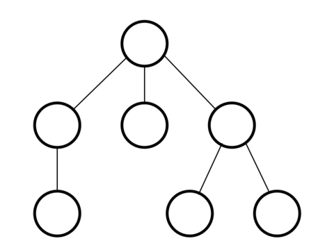
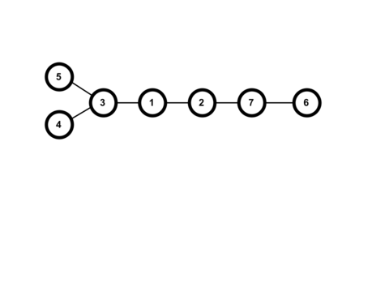
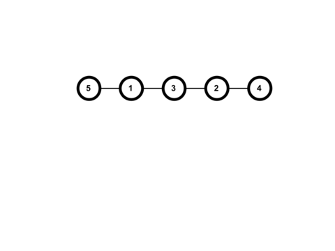

<h1 style='text-align: center;'> B. Omkar and Heavenly Tree</h1>

<h5 style='text-align: center;'>time limit per test: 2 seconds</h5>
<h5 style='text-align: center;'>memory limit per test: 256 megabytes</h5>

Lord Omkar would like to have a tree with $n$ nodes ($3 \le n \le 10^5$) and has asked his disciples to construct the tree. However, Lord Omkar has created $m$ ($\mathbf{1 \le m < n}$) restrictions to ensure that the tree will be as heavenly as possible. 

A tree with $n$ nodes is an connected undirected graph with $n$ nodes and $n-1$ edges. 
## Note

 that for any two nodes, there is exactly one simple path between them, where a simple path is a path between two nodes that does not contain any node more than once.

Here is an example of a tree: 

  A restriction consists of $3$ pairwise distinct integers, $a$, $b$, and $c$ ($1 \le a,b,c \le n$). It signifies that node $b$ cannot lie on the simple path between node $a$ and node $c$. 

Can you help Lord Omkar and become his most trusted disciple? You will need to find heavenly trees for multiple sets of restrictions. It can be shown that a heavenly tree will always exist for any set of restrictions under the given constraints.

### Input

Each test contains multiple test cases. The first line contains the number of test cases $t$ ($1 \leq t \leq 10^4$). Description of the test cases follows.

The first line of each test case contains two integers, $n$ and $m$ ($3 \leq n \leq 10^5$, $\mathbf{1 \leq m < n}$), representing the size of the tree and the number of restrictions.

The $i$-th of the next $m$ lines contains three integers $a_i$, $b_i$, $c_i$ ($1 \le a_i, b_i, c_i \le n$, $a$, $b$, $c$ are distinct), signifying that node $b_i$ cannot lie on the simple path between nodes $a_i$ and $c_i$. 

It is guaranteed that the sum of $n$ across all test cases will not exceed $10^5$.

### Output

For each test case, output $n-1$ lines representing the $n-1$ edges in the tree. On each line, output two integers $u$ and $v$ ($1 \le u, v \le n$, $u \neq v$) signifying that there is an edge between nodes $u$ and $v$. Given edges have to form a tree that satisfies Omkar's restrictions.

## Example

### Input


```text
2
7 4
1 2 3
3 4 5
5 6 7
6 5 4
5 3
1 2 3
2 3 4
3 4 5
```
### Output


```text
1 2
1 3
3 5
3 4
2 7
7 6
5 1
1 3
3 2
2 4
```
## Note

The output of the first sample case corresponds to the following tree: 

   For the first restriction, the simple path between $1$ and $3$ is $1, 3$, which doesn't contain $2$. The simple path between $3$ and $5$ is $3, 5$, which doesn't contain $4$. The simple path between $5$ and $7$ is $5, 3, 1, 2, 7$, which doesn't contain $6$. The simple path between $6$ and $4$ is $6, 7, 2, 1, 3, 4$, which doesn't contain $5$. Thus, this tree meets all of the restrictions.The output of the second sample case corresponds to the following tree: 

  

#### Tags 

#1200 #NOT OK #constructive_algorithms #trees 

## Blogs
- [All Contest Problems](../Technocup_2022_-_Elimination_Round_1.md)
- [Announcement](../blogs/Announcement.md)
- [Tutorial (en)](../blogs/Tutorial_(en).md)
