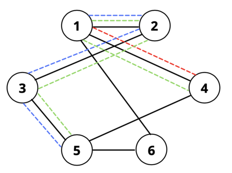
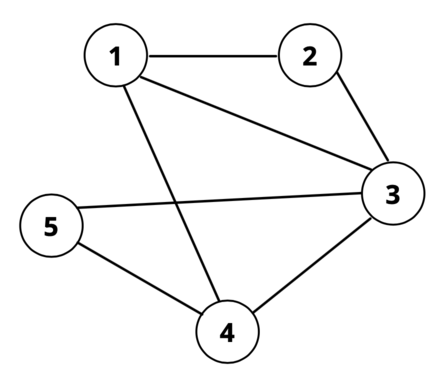

<h1 style='text-align: center;'> E. Moment of Bloom</h1>

<h5 style='text-align: center;'>time limit per test: 3 seconds</h5>
<h5 style='text-align: center;'>memory limit per test: 512 megabytes</h5>

She does her utmost to flawlessly carry out a person's last rites and preserve the world's balance of yin and yang.

Hu Tao, being the little prankster she is, has tried to scare you with this graph problem! You are given a connected undirected graph of $n$ nodes with $m$ edges. You also have $q$ queries. Each query consists of two nodes $a$ and $b$.

Initially, all edges in the graph have a weight of $0$. For each query, you must choose a simple path starting from $a$ and ending at $b$. Then you add $1$ to every edge along this path. Determine if it's possible, after processing all $q$ queries, for all edges in this graph to have an even weight. If so, output the choice of paths for each query. 

If it is not possible, determine the smallest number of extra queries you could add to make it possible. It can be shown that this number will not exceed $10^{18}$ under the given constraints.

A simple path is defined as any path that does not visit a node more than once.

An edge is said to have an even weight if its value is divisible by $2$.

#### Input

The first line contains two integers $n$ and $m$ ($2 \leq n \leq 3 \cdot 10^5$, $n-1 \leq m \leq \min{\left(\frac{n(n-1)}{2}, 3 \cdot 10^5\right)}$).

Each of the next $m$ lines contains two integers $x$ and $y$ ($1 \leq x, y \leq n$, $x\neq y$) indicating an undirected edge between node $x$ and $y$. The input will not contain self-loops or duplicate edges, and the provided graph will be connected.

The next line contains a single integer $q$ ($1 \leq q \leq 3 \cdot 10^5$).

Each of the next $q$ lines contains two integers $a$ and $b$ ($1 \leq a, b \leq n, a \neq b$), the description of each query.

It is guaranteed that $nq \leq 3 \cdot 10^5$.

#### Output

If it is possible to force all edge weights to be even, print "YES" on the first line, followed by $2q$ lines indicating the choice of path for each query in the same order the queries are given. For each query, the first line should contain a single integer $x$: the number of nodes in the chosen path. The next line should then contain $x$ spaced separated integers $p_i$ indicating the path you take ($p_1 = a, p_x = b$ and all numbers should fall between $1$ and $n$). This path cannot contain duplicate nodes and must be a valid simple path in the graph.

If it is impossible to force all edge weights to be even, print "NO" on the first line and the minimum number of added queries on the second line.

## Examples

#### Input


```text
6 7
2 1
2 3
3 5
1 4
6 1
5 6
4 5
3
1 4
5 1
4 5
```
#### Output


```text
YES
2
1 4
4
5 3 2 1
5
4 1 2 3 5
```
#### Input


```text
5 7
4 3
4 5
2 1
1 4
1 3
3 5
3 2
4
4 2
3 5
5 1
4 5
```
#### Output


```text
NO
2
```
## Note

Here is what the queries look like for the first test case (red corresponds to the 1st query, blue 2nd query, and green 3rd query): 

   Notice that every edge in the graph is part of either $0$ or $2$ colored query edges.The graph in the second test case looks like this: 

   There does not exist an assignment of paths that will force all edges to have even weights with the given queries. One must add at least $2$ new queries to obtain a set of queries that can satisfy the condition.

#### Tags 

#2200 #NOT OK #constructive_algorithms #dfs_and_similar #graph_matchings #graphs #greedy #trees 

## Blogs
- [All Contest Problems](../Technocup_2022_-_Elimination_Round_1.md)
- [Announcement](../blogs/Announcement.md)
- [Tutorial (en)](../blogs/Tutorial_(en).md)
