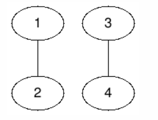
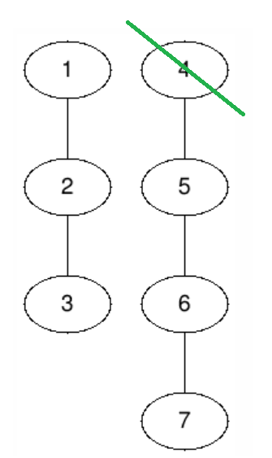
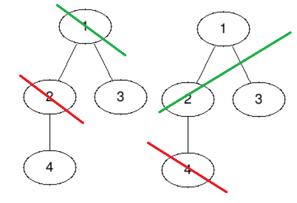
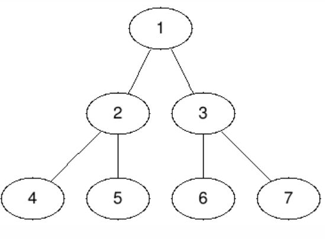

<h1 style='text-align: center;'> G. Poachers</h1>

<h5 style='text-align: center;'>time limit per test: 1.5 seconds</h5>
<h5 style='text-align: center;'>memory limit per test: 256 megabytes</h5>

Alice and Bob are two poachers who cut trees in a forest.

A forest is a set of zero or more trees. A tree is a connected graph without cycles. A rooted tree has a special vertex called the root. The parent of a node $v$ is the next vertex on the shortest path from $v$ to the root. Children of vertex $v$ are all nodes for which $v$ is the parent. A vertex is a leaf if it has no children.

In this problem we define the depth of vertex as number of vertices on the simple path from this vertex to the root. The rank of a tree is the minimum depth among its leaves.

Initially there is a forest of rooted trees. Alice and Bob play a game on this forest. They play alternating turns with Alice going first. At the beginning of their turn, the player chooses a tree from the forest. Then the player chooses a positive cutting depth, which should not exceed the rank of the chosen tree. Then the player removes all vertices of that tree whose depth is less that or equal to the cutting depth. All other vertices of the tree form a set of rooted trees with root being the vertex with the smallest depth before the cut. All these trees are included in the game forest and the game continues.

A player loses if the forest is empty at the beginning of his move.

You are to determine whether Alice wins the game if both players play optimally.

### Input

Each test contains multiple test cases. The first line contains the number of test cases $t$ ($1 \leq t \leq 5 \cdot 10^5$). Description of the test cases follows.

The first line of each test case contains a single integer $n$ ($1 \leq n \leq 5 \cdot 10^5$) — total number of vertices in the initial forest.

The second line contains $n$ integers $p_1, p_2, \ldots, p_n$ ($0 \leq p_i \leq n$) — description of the forest. If $p_i = 0$, then the $i$-th vertex is the root of a tree, otherwise $p_i$ is the parent of the vertex $i$. It's guaranteed that $p$ defines a correct forest of rooted trees.

It is guaranteed that the sum of $n$ over all test cases does not exceed $5 \cdot 10^5$.

### Output

For each test case, print "YES" (without quotes) if Alice wins, otherwise print "NO" (without quotes). You can print each letter in any case (upper or lower).

## Example

### Input


```text
4
4
0 1 0 3
7
0 1 2 0 4 5 6
4
0 1 1 2
7
0 1 1 2 2 3 3
```
### Output


```text
NO
YES
NO
YES
```
## Note

In the first test case Bob has a symmetric strategy, so Alice cannot win.



In the second test case Alice can choose the second tree and cutting depth $1$ to get a forest on which she has a symmetric strategy.



In third test case the rank of the only tree is $2$ and both possible moves for Alice result in a loss. Bob either can make the forest with a symmetric strategy for himself, or clear the forest.



In the fourth test case all leafs have the same depth, so Alice can clear the forest in one move.




#### Tags 

#2500 #NOT OK #dp #games #graphs #trees 

## Blogs
- [All Contest Problems](../Technocup_2022_-_Elimination_Round_3.md)
- [Announcement](../blogs/Announcement.md)
- [Tutorial](../blogs/Tutorial.md)
