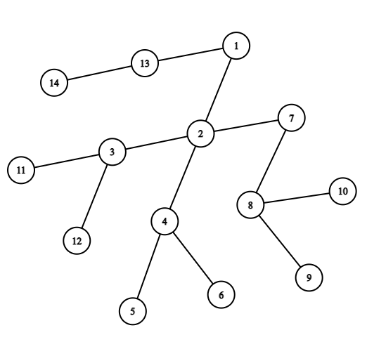
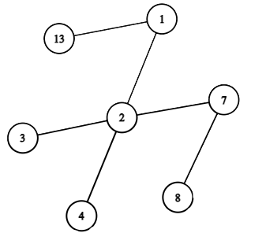

<h1 style='text-align: center;'> E. Gardener and Tree</h1>

<h5 style='text-align: center;'>time limit per test: 4 seconds</h5>
<h5 style='text-align: center;'>memory limit per test: 256 megabytes</h5>

A tree is an undirected connected graph in which there are no cycles. This problem is about non-rooted trees. A leaf of a tree is a vertex that is connected to at most one vertex.

The gardener Vitaly grew a tree from $n$ vertices. He decided to trim the tree. To do this, he performs a number of operations. In one operation, he removes all leaves of the tree.

  
## Example

 of a tree. For example, consider the tree shown in the figure above. The figure below shows the result of applying exactly one operation to the tree.

  The result of applying the operation "remove all leaves" to the tree. 
## Note

 the special cases of the operation:

* applying an operation to an empty tree (of $0$ vertices) does not change it;
* applying an operation to a tree of one vertex removes this vertex (this vertex is treated as a leaf);
* applying an operation to a tree of two vertices removes both vertices (both vertices are treated as leaves).

Vitaly applied $k$ operations sequentially to the tree. How many vertices remain?

### Input

The first line contains one integer $t$ ($1 \le t \le 10^4$) — the number of test cases. Then $t$ test cases follow.

Each test case is preceded by an empty line.

Each test case consists of several lines. The first line of the test case contains two integers $n$ and $k$ ($1 \le n \le 4 \cdot 10^5$, $1 \le k \le 2 \cdot 10^5$) — the number of vertices in the tree and the number of operations, respectively. Then $n - 1$ lines follow, each of them contains two integers $u$ and $v$ ($1 \le u, v \le n$, $u \neq v$) which describe a pair of vertices connected by an edge. It is guaranteed that the given graph is a tree and has no loops or multiple edges.

It is guaranteed that the sum of $n$ from all test cases does not exceed $4 \cdot 10^5$.

### Output

For each test case output on a separate line a single integer — the number of vertices that remain in the tree after applying $k$ operations.

## Example

### Input


```text
6

14 1
1 2
2 3
2 4
4 5
4 6
2 7
7 8
8 9
8 10
3 11
3 12
1 13
13 14

2 200000
1 2

3 2
1 2
2 3

5 1
5 1
3 2
2 1
5 4

6 2
5 1
2 5
5 6
4 2
3 4

7 1
4 3
5 1
1 3
6 1
1 7
2 1
```
### Output


```text
7
0
0
3
1
2
```
## Note

The first test case is considered in the statement.

The second test case contains a tree of two vertices. $200000$ operations are applied to it. The first one removes all two vertices, the other operations do not change the tree.

In the third test case, a tree of three vertices is given. As a result of the first operation, only $1$ vertex remains in it (with the index $2$), the second operation makes the tree empty.


#### Tags 

#1600 #NOT OK #brute_force #data_structures #dfs_and_similar #greedy #implementation #trees 

## Blogs
- [All Contest Problems](../Codeforces_Round_748_(Div._3).md)
- [Announcement](../blogs/Announcement.md)
- [Tutorial](../blogs/Tutorial.md)
