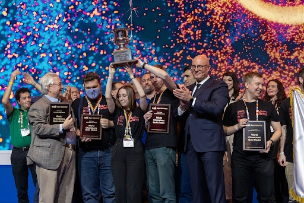
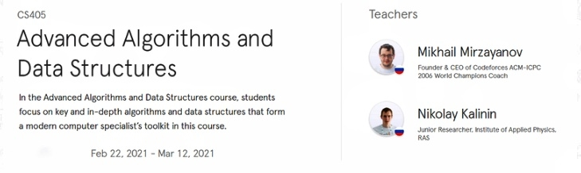

# Announcement

Hello Codeforces!

On [Sunday, October 10, 2021 at 15:05UTC+6](https://codeforces.com/https://www.timeanddate.com/worldclock/fixedtime.html?day=10&month=10&year=2021&hour=12&min=5&sec=0&p1=166) [Educational Codeforces Round 115 (Rated for Div. 2)](https://codeforces.com/contest/1598 "Educational Codeforces Round 115 (Rated for Div. 2)") will start. **Note that the start time is unusual**.

Series of Educational Rounds continue being held as [Harbour.Space University](https://codeforces.com/https://harbour.space/) initiative! You can read the details about the cooperation between [Harbour.Space University](https://codeforces.com/https://harbour.space/) and Codeforces in the [blog post](//codeforces.com/blog/entry/51208).

This round will be **rated for the participants with rating lower than 2100**. It will be held on extended ICPC rules. The penalty for each incorrect submission until the submission with a full solution is 10 minutes. After the end of the contest you will have 12 hours to hack any solution you want. You will have access to copy any solution and test it locally.

You will be given **6 or 7 problems** and **2 hours** to solve them.

The problems were invented and prepared by Alex [fcspartakm](https://codeforces.com/profile/fcspartakm "Candidate Master fcspartakm") Frolov, Mikhail [awoo](https://codeforces.com/profile/awoo "International Grandmaster awoo") Piklyaev, Max [Neon](https://codeforces.com/profile/Neon "Candidate Master Neon") Mescheryakov and me. Also huge thanks to Mike [MikeMirzayanov](https://codeforces.com/profile/MikeMirzayanov "Headquarters, MikeMirzayanov") Mirzayanov for great systems Polygon and Codeforces.

Good luck to all the participants!

Our friends at Harbour.Space also have a message for you:

*Hello once again, Codeforces!* 

*We are thrilled to congratulate our faculty member Nikolay [KAN](https://codeforces.com/profile/KAN "Legendary Grandmaster KAN") Kalinin on his first place at the ICPC World Finals, celebrated in Moscow, Russia. Years of training by Nikolai and his team from Nizhny Novgorod State University lead them to the top of the scoreboard, defeating teams from 116 other universities and becoming world champions.*

*We would also like to congratulate our future student Egor [244mhq](https://codeforces.com/profile/244mhq "Legendary Grandmaster 244mhq") Dubovik, who won the silver medal with the Belarusian State University. Egor will join our Masters in Computer Science in the coming weeks.*

*We are looking forward to seeing Nikolay again next January when he teaches his course on [Advanced Algorithms and Data Structures](https://harbour.space/computer-science/courses/advanced-algorithms-and-data-structures3-mikhail-mirzayanov?utm_source=codeforces&utm_medium=partner&utm_campaign=both_b2b) alongside Mike Mirzayanov. In this course, students focus on key and in-depth algorithms and data structures that form a modern computer specialist’s toolkit.*

*We are always excited to see Codeforces participants as our students here at Harbour.Space, so once again we’ve given a special discount (up to 70%) for the single course participation in Barcelona, Spain (travel cost and accommodation are not included).*

  [Reserve your spot →](https://codeforces.com/https://harbourspace.typeform.com/to/DpTWL4) 

*Good luck on your round, and see you next time!*

*Harbour.Space University*

**UPD:** [The editorial can be found here](Tutorial.md).

