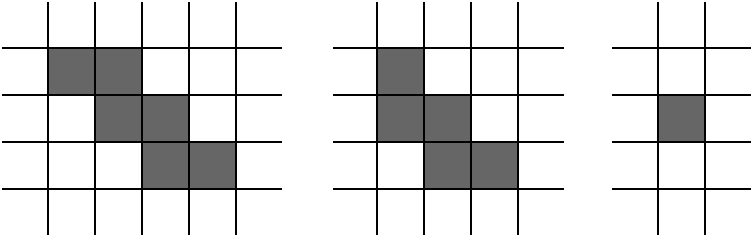

<h1 style='text-align: center;'> E. Staircases</h1>

<h5 style='text-align: center;'>time limit per test: 2 seconds</h5>
<h5 style='text-align: center;'>memory limit per test: 256 megabytes</h5>

You are given a matrix, consisting of $n$ rows and $m$ columns. The rows are numbered top to bottom, the columns are numbered left to right.

Each cell of the matrix can be either free or locked.

Let's call a path in the matrix a staircase if it: 

* starts and ends in the free cell;
* visits only free cells;
* has one of the two following structures:
	1. the second cell is $1$ to the right from the first one, the third cell is $1$ to the bottom from the second one, the fourth cell is $1$ to the right from the third one, and so on;
	2. the second cell is $1$ to the bottom from the first one, the third cell is $1$ to the right from the second one, the fourth cell is $1$ to the bottom from the third one, and so on.

In particular, a path, consisting of a single cell, is considered to be a staircase.

Here are some examples of staircases:

  Initially all the cells of the matrix are free.

You have to process $q$ queries, each of them flips the state of a single cell. So, if a cell is currently free, it makes it locked, and if a cell is currently locked, it makes it free.

Print the number of different staircases after each query. Two staircases are considered different if there exists such a cell that appears in one path and doesn't appear in the other path.

##### Input

The first line contains three integers $n$, $m$ and $q$ ($1 \le n, m \le 1000$; $1 \le q \le 10^4$) — the sizes of the matrix and the number of queries.

Each of the next $q$ lines contains two integers $x$ and $y$ ($1 \le x \le n$; $1 \le y \le m$) — the description of each query.

##### Output

Print $q$ integers — the $i$-th value should be equal to the number of different staircases after $i$ queries. Two staircases are considered different if there exists such a cell that appears in one path and doesn't appear in the other path.

## Examples

##### Input


```text
2 2 8
1 1
1 1
1 1
2 2
1 1
1 2
2 1
1 1
```
##### Output


```text
5
10
5
2
5
3
1
0
```
##### Input


```text
3 4 10
1 4
1 2
2 3
1 2
2 3
3 2
1 3
3 4
1 3
3 1
```
##### Output


```text
49
35
24
29
49
39
31
23
29
27
```
##### Input


```text
1000 1000 2
239 634
239 634
```
##### Output


```text
1332632508
1333333000
```


#### Tags 

#2100 #NOT OK #brute_force #combinatorics #data_structures #dfs_and_similar #dp #implementation #math 

## Blogs
- [All Contest Problems](../Educational_Codeforces_Round_115_(Rated_for_Div._2).md)
- [Announcement](../blogs/Announcement.md)
- [Tutorial](../blogs/Tutorial.md)
