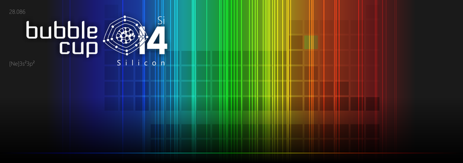

# Announcement_(en)

Hello, Codeforces!

[Microsoft Development Center Serbia](https://codeforces.com/https://www.microsoft.com/en-rs/mdcs) is thrilled to announce the finals of the **14th edition of Bubble Cup competition!** Bubble Cup is an international, **ICPC-style team contest** aimed at university and high school students.

Contest will take place on [Saturday, 9th of October at 10AM CEST](https://codeforces.com/https://www.timeanddate.com/worldclock/fixedtime.html?day=9&month=10&year=2021&hour=10&min=0&sec=0&p1=35), in online format. Winners will be announced at the closing ceremony. You can find more info on the [BubbleCup website](https://codeforces.com/https://www.bubblecup.org/).

Just like the previous editions, this final will be followed by an online mirror competition on Codeforces. Mirror will take place on the same day about an hour after the start of the finals — [Saturday, October 9, 2021 at 15:05UTC+6](https://codeforces.com/https://www.timeanddate.com/worldclock/fixedtime.html?day=9&month=10&year=2021&hour=12&min=5&sec=0&p1=166). Contest will last for **4 hours** and **ICPC rules** will be applied. It will be a competition for **teams of 1-3 members**. There will be at least eight problems.

Just like last year, the finals are divided in two "divisions", called Premier League and Rising Stars. The two contests will have most of their problems in common, but the Rising Stars competition will feature some easier tasks targeted at high school contestants.

Both of the contests will be mirrored here on Codeforces, with Premier League mapping to the Div1 contest and Rising Stars mapping to the Div2 contest. The mirror will use native Codeforces ICPC team contest rules. Each team is allowed to use **multiple computers**.

Both contests will be **unrated**, due to the format and the length of the mirror being dissimilar to the standard Codeforces rated rounds.

The problems and their solutions were created by employees and interns of [Microsoft Development Center Serbia](https://codeforces.com/https://www.microsoft.com/en-rs/mdcs): [niksmiljkovic](https://codeforces.com/profile/niksmiljkovic "Expert niksmiljkovic"), [acac97](https://codeforces.com/profile/acac97 "Pupil acac97"), [renea](https://codeforces.com/profile/renea "Expert renea"), [BubbleCup](https://codeforces.com/profile/BubbleCup "Unrated, BubbleCup"), [nikolapesic2802](https://codeforces.com/profile/nikolapesic2802 "Grandmaster nikolapesic2802"), [berke00](https://codeforces.com/profile/berke00 "Unrated, berke00"), [davidmilicevic97](https://codeforces.com/profile/davidmilicevic97 "Expert davidmilicevic97"), [ijevtic](https://codeforces.com/profile/ijevtic "Expert ijevtic"), [dj0l3](https://codeforces.com/profile/dj0l3 "Unrated, dj0l3"), [igzi](https://codeforces.com/profile/igzi "Expert igzi"), [Kole](https://codeforces.com/profile/Kole "Expert Kole"), [Vasiljko](https://codeforces.com/profile/Vasiljko "Candidate Master Vasiljko"), [pavlej](https://codeforces.com/profile/pavlej "Specialist pavlej") and me [TadijaSebez](https://codeforces.com/profile/TadijaSebez "International Grandmaster TadijaSebez").

We give our thanks to Nikolay Kalinin ([KAN](https://codeforces.com/profile/KAN "Legendary Grandmaster KAN")) and Mike Mirzayanov ([MikeMirzayanov](https://codeforces.com/profile/MikeMirzayanov "Headquarters, MikeMirzayanov")) for making these mirror contests possible and for the wonderful Codeforces and Polygon platforms. Special thanks goes to Alexandr Lyashko ([knightL](https://codeforces.com/profile/knightL "International Master knightL")) for helping out with problem testing.

You can find problems from previous finals on our Codeforces online mirror competitions:

[Bubble Cup 8 — Finals [Online Mirror]](https://codeforces.com/contest/575)

[Bubble Cup 9 — Finals [Online Mirror]](https://codeforces.com/contest/717)

[Bubble Cup X — Finals [Online Mirror]](https://codeforces.com/contest/852)

[Bubble Cup 11 — Finals [Online Mirror, Div. 1]](https://codeforces.com/contest/1045)

[Bubble Cup 11 — Finals [Online Mirror, Div. 2]](https://codeforces.com/contest/1046)

[Bubble Cup 12 — Finals [Online Mirror, Div. 1]](https://codeforces.com/contest/1218)

[Bubble Cup 12 — Finals [Online Mirror, Div. 2]](https://codeforces.com/contest/1219)

[Bubble Cup 13 — Finals [Online Mirror, Div. 1]](https://codeforces.com/contest/1423)

[Bubble Cup 13 — Finals [Online Mirror, Div. 2]](https://codeforces.com/contest/1424)

We wish good luck to all participants!

**UPD:** [Editorial](https://codeforces.com/https://bubblecup.org/Content/Media/BubbleCup2021.pdf)

