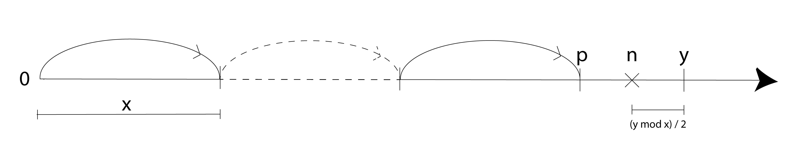

# Tutorial_(en)

Thanks for participating in my contest [](https://codeforces.com/https://emoji.gg/emoji/8771_blobheart). I hope you liked the problems. I would love to hear your feedback in the comments. 

If you find anything wrong in the editorial which is more likely to happen because I have written a rather long editorial to make you understand the solutions better, then comment below. 

Also, don't forget to upvote to pay for the editorial. See you in my next contest!

 
### [1604A - Era](https://codeforces.com/contest/1604/problem/A "Codeforces Round 752 (Div. 2)")

If $a_i \gt i$ for some position $i$, then we need to insert at least $a_i - i$ new small elements before this position. Let $m = max(0, \max\limits_{i = 1}^{n}{(a_i - i)})$. So we need at least $m$ operations. But its not hard to see that $m$ operations are enough. For example, you can insert $m$ $1$s at the beginning of the sequence. This way, all elements will be shifted by $m$ positions, and consequently, will satisfy that $a_i \le i$ for each valid $i$.

 **Code**
```cpp
#include<bits/stdc++.h>
using namespace std;
 
int main() {
  int t; cin >> t;
  while (t--) {
    int n; cin >> n;
    int ans = 0;
    for (int i = 1; i <= n; i++) {
      int k; cin >> k;
      ans = max(ans, k - i);
    }
    cout << ans << 'n';
  }
  return 0;
}
```
 
### [1604B - XOR Specia-LIS-t](https://codeforces.com/contest/1604/problem/B "Codeforces Round 752 (Div. 2)")

What happens if we split the sequence into subarrays of length $1$?. 

Yes, if $n$ is even, the bitwise XOR will be $0$ as there will be an even number of $1$s.

If $n$ is odd we can't do the same. But what if there is an index $i$ such that $a_i \ge a_{i + 1}$?

What if we use these two indices as a single subarray as it has LIS of length $1$ and take other indices as single subarrays? Yeah, again, there will be an even number of $1$s which will yield a bitwise XOR of $0$. 

What we are left with are strictly increasing sequences of odd lengths. Notice that any subarray of length $l$ has LIS of length $l$ here. So we need to find a sequence $b_1, b_2, \ldots, b_k$ such that $b_1 + b_2 + \ldots + b_k = n$ and $b_1 \oplus b_2 \oplus \ldots \oplus b_k = 0$ where $n$ is odd. Is it possible to find such a sequence? Pause and think.

Hint: think about the last bit of each $b_i$. 

If XOR is $0$, then there will be an even number of $b_i$s such that its last bit is $1$. But then the sum will be even. But here the sum $n$ is odd, which produces a contradiction.

So in the last case, it is not possible to find such a split.

 **Code**
```cpp
#include<bits/stdc++.h>
using namespace std;
 
int main() {
  ios_base::sync_with_stdio(0);
  cin.tie(0);
  int t; cin >> t;
  while (t--) {
    int n; cin >> n;
    vector<int> a(n + 1);
    bool inc = true;
    for (int i = 1; i <= n; i++) {
      cin >> a[i];
      inc &= a[i] > a[i - 1];
    }
    if (n % 2 == 0 or !inc) {
      cout << "YESn";
    }
    else {
      cout << "NOn";
    }
  }
  return 0;
}
```
 
### [1603A - Di-visible Confusion](../problems/A._Di-visible_Confusion.md "Codeforces Round 752 (Div. 1)")

Notice that we can erase $a_i$ at positions from $1$ to $i$. So for each $i$, there should be at least one integer from $2$ to $i + 1$ such that $a_i$ is not divisible by that integer. If it is not satisfied for some integer $i$, then there is no solution for sure. Otherwise, it turns out that a solution always exists. 

Why?

We can prove it by induction. Let's say it is possible to erase the prefix containing $n - 1$ elements. As $a_n$ can be erased at some position from $1$ to $n$(let's say $k$), then while erasing the prefix of $n - 1$ elements, when the prefix contains $k - 1$ elements, then $a_n$ is at the $k$-th position, so we can erase it at that position and erase the rest of the sequence accordingly.

So we just have to check for all integers $i$ from $1$ to $n$, if $a_i$ is not divisible by at least one integer from $2$ to $i + 1$. Notice that if $a_i$ is divisible by all integers from $2$ to $i + 1$, then it means that $a_i$ is divisible by $\operatorname{LCM}(2, 3, \ldots, (i+1))$. But when $i = 22$, $\operatorname{LCM}(2, 3, \ldots, 23) \gt 10^9 \gt a_i$. So for $i \ge 22$, there will always be an integer from $2$ to $i + 1$ which doesn't divide $a_i$. So we don't have to check for them. For $i \lt 22$, use bruteforce. 

Complexity: $\mathcal{O}(n + 21^2)$.

 **Code**
```cpp
#include<bits/stdc++.h>
using namespace std;
 
int main() {
  ios_base::sync_with_stdio(0);
  cin.tie(0);
  int t; cin >> t;
  while (t--) {
    int n; cin >> n;
    bool ok = true;
    for (int i = 1; i <= n; i++) {
      int x; cin >> x;
      bool found = false;
      for (int j = i + 1; j >= 2; j--) { // this loop will run not more than 22 times, in practice its much lower than that
        if (x % j) {
          found = true;
          break;
        }
      }
      ok &= found;
    }
    if (ok) {
      cout << "YESn";
    }
    else {
      cout << "NOn";
    }
  }
  return 0;
}
```
 
### [1603B - Moderate Modular Mode](../problems/B._Moderate_Modular_Mode.md "Codeforces Round 752 (Div. 1)")

If $x \gt y$, then $x + y$ works, as $(x + y) \bmod x = y \bmod x = y$ and $y \bmod (x + y) = y$.

The challenge arrives when $x \le y$. The later part of the editorial assumes that $x \le y$.

Claim $1$: $n$ can't be less than $x$.

Proof: Assume that for some $n \lt x$, $n \bmod x = y \bmod n$ is satisfied. Then $n \bmod x = n$ but $y \bmod n \lt n$. So $n \bmod x$ can't be equal to $y \bmod n$ which is a contradiction.

Claim $2$: $n$ can't be greater than $y$.

Proof: Assume that for some $n \gt y$, $n \bmod x = y \bmod n$ is satisfied. Then $n \bmod x \lt x$ but $y \bmod n = y \ge x$. So $n \bmod x$ can't be equal to $y \bmod n$ which is a contradiction.

So $n$ should be in between $x$ and $y$. But what is the exact value of $n$? Let's solve this intuitively. 

Consider a line on the $X$ axis. Imagine you are at position $0$. You will start jumping from $0$ to $y$ with a step of length $x$. So there will be a position from where if you jump one more time it will exceed $y$. This position is $p = y - y \bmod x$. From this position let's go to $y$ in exactly $2$ steps! Notice that $y - p$ is guaranteed to be even as $x$ and $y$ both are even. So we need to jump with a length of $\frac{y - p}{2}$ and we will jump to the position $t = p + \frac{y - p}{2}$. And voila! $t$ is our desired $n$ because $t \bmod x = \frac{y - p}{2}$ and $y \bmod t = (y - p) - \frac{y - p}{2} = \frac{y - p}{2}$. To be precise, $n = t = y - \frac{y \bmod x}{2}$.

Here is a cute illustration for you:

   **Code**
```cpp
#include<bits/stdc++.h>
using namespace std;
 
int main() {
  ios_base::sync_with_stdio(0);
  cin.tie(0);
  int t; cin >> t;
  while (t--) {
    int x, y; cin >> x >> y;
    if (x <= y) {
      cout << y - y % x / 2 << 'n';
    }
    else {
      cout << x + y << 'n';
    }
  }
  return 0;
}
```
 
### [1603C - Extreme Extension](../problems/C._Extreme_Extension.md "Codeforces Round 752 (Div. 1)")

Let's find out how to calculate the extreme value of an array $a$ of $n$ integers. It turns out that a greedy solution exists! 

Consider the rightmost index $i$ such that $a_i \gt a_{i + 1}$. So we must split $a_i$ into new (let's say $k$) elements $1 \le b_1 \le b_2 \le \ldots \le b_k \le a_{i+1}$ such that $b_1 + b_2 + \ldots + b_k = a_i$ . Notice that $k \ge \left\lceil \frac{a_i}{a_{i+1}} \right\rceil $ because $b_k \le a_{i+1}$. But it is always optimal to make $b_1$ as large as possible. It is not hard to see that the smaller the $k$, the bigger the $b_1$ we can achieve. So let's set $k = \left\lceil \frac{a_i}{a_{i+1}} \right\rceil$. Now, notice that $b_1 \le \left\lfloor \frac{a_i}{k} \right\rfloor$. So let's set $b_1 = \left\lfloor \frac{a_i}{k} \right\rfloor = \left\lfloor \frac{a_i}{\left\lceil \frac{a_i}{a_{i+1}} \right\rceil} \right\rfloor$. So we have performed $k - 1 = \left\lceil \frac{a_i}{a_{i+1}} \right\rceil - 1$ operations and will solve the problem analogously for the previous indices after replacing $a_i$ by $[b_1, b_2, \ldots, b_k]$. 

To sum it all up, we can calculate the extreme value in the following procedure:

* Iterator from $i = n - 1$ to $1$.
* Add $\left\lceil \frac{a_i}{a_{i+1}} \right\rceil - 1$ to the answer.
* Set $a_i = \left\lfloor \frac{a_i}{\left\lceil \frac{a_i}{a_{i+1}} \right\rceil} \right\rfloor$.

Pretty elegant! Let's call it elegant procedure from now on.

So we can calculate the extreme value of an array of $n$ integers in $\mathcal{O}{(n)}$.

To solve it for all subarrays in $\mathcal{O}{(n^2)}$, we need to fix a prefix and solve each suffix of this prefix in a total of $\mathcal{O}{(n)}$ operations. We can do that easily because the procedure to calculate the extreme values starts from the end, so we can sum up the contributions on the run.

How to solve the problem faster?

Think dp.

Let $dp(i, x)$ be the count of subarrays $a[i;j]$ such that $i \le j$ and after the elegant procedure $x$ becomes the first element of the final version of that subarray. 

We only care about the $x$s for which $dp(i, x)$ is non-zero. How many different $x$ is possible?

Well, it can be up to $10^5$, right? 

Wrong!

Let's go back to our elegant procedure once again. For the time being, let's say for all $x = 1$ to $10^5$, $dp(i + 1, x)$ is non-zero. So for each $x$, we will add $dp(i + 1, x)$ to $dp(i, \left\lfloor \frac{a_i}{\left\lceil \frac{a_i}{x} \right\rceil} \right\rfloor)$.

But there can be at most $2 \sqrt{m}$ distinct values in the sequence $\left\lfloor \frac{m}{1} \right\rfloor, \left\lfloor \frac{m}{2} \right\rfloor, \ldots, \left\lfloor \frac{m}{m} \right\rfloor$. Check [this](https://codeforces.com/https://math.stackexchange.com/questions/1069460/how-many-distinct-values-of-floorn-i-exists-for-i-1-to-n) for a proof.

So there can be $\mathcal{O}{(\sqrt{10^5})}$ distinct $x$s for which $dp(i, x)$ is non-zero. So we can solve this dp in $\mathcal{O}{(n \cdot \sqrt{10^5}})$. To optimize the space-complexity we can observe that we only need the dp values of $i + 1$. So we can use only two arrays to maintain everything. Check my solution for more clarity. 

To get the final answer, we will use the contribution technique. To be precise, for each $(i + 1, x)$ we will add $i \cdot dp(i + 1, x) \cdot (\left\lceil \frac{a_i}{a_{i+1}} \right\rceil - 1)$ to our answer and its not hard to see this. Here, $i \cdot dp(i + 1, x)$ is the number of arrays where the $i$-th element will be set to $x$ in the elegant procedure and $\left\lceil \frac{a_i}{a_{i+1}} \right\rceil - 1$ is the number of operations that will be performed for the same.

Overall time complexity will be $\mathcal{O}{(n \cdot \sqrt{10^5}})$ and space complexity will be $\mathcal{O}(n)$.

 **Code**
```cpp
#include<bits/stdc++.h>
using namespace std;
 
const int N = 1e5 + 9, mod = 998244353;
vector<int> v[2];
int dp[2][N];
int a[N];
int32_t main() {
  ios_base::sync_with_stdio(0);
  cin.tie(0);
  int t; cin >> t;
  while (t--) {
    int n; cin >> n;
    for (int i = 1; i <= n; i++) {
      cin >> a[i];
    }
    long long ans = 0;
    for (int i = n; i >= 1; i--) {
      int k = i & 1;
      v[k].push_back(a[i]);
      dp[k][a[i]] = 1;
      int last = a[i];
      for (auto x: v[k ^ 1]) {
        int y = dp[k ^ 1][x];
        int split = (a[i] + x - 1) / x;
        int st = a[i] / split;
        ans += 1LL * (split - 1) * y * i;
        dp[k][st] += y;
        if (last != st) {
          v[k].push_back(st), last = st;
        }
      }
      for (auto x: v[k ^ 1]) dp[k ^ 1][x] = 0;
      v[k ^ 1].clear();
      ans %= mod;
    }
    cout << ans << 'n';
    for (auto x: v[0]) dp[0][x] = 0;
    for (auto x: v[1]) dp[1][x] = 0;
    v[0].clear(); v[1].clear();
  }
  return 0;
}
```
 
### [1603D - Artistic Partition](../problems/D._Artistic_Partition.md "Codeforces Round 752 (Div. 1)")

For now, let $c(l, r)$ denote the number of integer pairs $(i, j)$ such that $l \le i \lt j \le r$ (instead of $i \le j$) and $\operatorname{gcd}(i, j) \ge l$. So we can add $n$ to $f(n, k)$ in the end.

We can construct a straightforward dp where $f(n, k) = \min\limits_{i = 1}^{n}{(f(i - 1, k - 1)+c(i, n))}$. As a straightforward implementation of $c(l, r)$ takes $\mathcal{O}(n^2 \log_2 n)$ time, the total complexity of finding $f(n, k)$ will be $\mathcal{O}(n^5 \log_2 n)$ which is quite shameful.

Let's see how to do better.

Tiny Observation: $c(x, 2 \cdot x - 1) = 0$. It's easy to see why it holds.

Cute Observation: $f(n, k) = 0$ when $k \gt \log_2 n$. 

Proof: Let $L = \log_2 n$. Following the tiny observation, we can split the numbers as $[1, 1], [2, 3], [4, 7], \ldots, [2^{L - 1}, 2^L - 1], [2^L, n]$ without spending a single penny.

Now we can solve $f(n, k)$ in $\mathcal{O}(n^4 \log_2^2 n)$ which is still shameful.

So we just have to find $f(n, k)$ for $1 \le n \le 10^5$ and $1 \le k \le 17$.

Let's optimize the calculation for $c(l, r)$ .

$$c(l, r) = \sum\limits_{i=l}^{r}\sum\limits_{j=i+1}^{r}{[\gcd(i, j) \ge l]}$$ $$=\sum\limits_{k=l}^{r}\sum\limits_{i=l}^{r}\sum\limits_{j=i+1}^{r}{[\gcd(i, j) = k]}$$ $$=\sum\limits_{k=l}^{r}\sum\limits_{i=l, k | i}^{r}\sum\limits_{j=i+1, k | j}^{r}{[\gcd(i, j) = k]}$$ $$=\sum\limits_{k=l}^{r}\sum\limits_{i=1}^{\left\lfloor \frac{r}{k} \right\rfloor}\sum\limits_{j=i+1}^{\left\lfloor \frac{r}{k} \right\rfloor}{[\gcd(i \cdot k, j \cdot k) = k]}$$ $$=\sum\limits_{k=l}^{r}\sum\limits_{i=1}^{\left\lfloor \frac{r}{k} \right\rfloor}\sum\limits_{j=i+1}^{\left\lfloor \frac{r}{k} \right\rfloor}{[\gcd(i, j) = 1]}$$ $$=\sum\limits_{k=l}^{r}\sum\limits_{i=1}^{\left\lfloor \frac{r}{k} \right\rfloor}{\phi(i)}$$ $$=\sum\limits_{k=l}^{r}{p(\left\lfloor \frac{r}{k} \right\rfloor)}$$ Here, $p(x) = \sum\limits_{i=1}^{x}{\phi(i)}$. We can calculate $p(x)$ for all $x \le n$ in $\mathcal{O}(n \log_2 n)$ and calculate $c(l, r)$ in $\mathcal{O}(n)$. So currently we can solve our problem in $\mathcal{O}(n^3)$ which is still not to be proud of.

But notice that there can be at most $2 \sqrt{m}$ distinct values in the sequence $\left\lfloor \frac{m}{1} \right\rfloor, \left\lfloor \frac{m}{2} \right\rfloor, \ldots, \left\lfloor \frac{m}{m} \right\rfloor$. Check [this](https://codeforces.com/https://math.stackexchange.com/questions/1069460/how-many-distinct-values-of-floorn-i-exists-for-i-1-to-n) for a proof. So we can calculate $c(l, r)$ in $\mathcal{O}(\sqrt{n})$ which improves our solution to $\mathcal{O}(n^2 \sqrt{n})$.

But notice that as $c(l, r) =\sum\limits_{k=l}^{r}{p(\left\lfloor \frac{r}{k} \right\rfloor)}$ we can precalculate the suffix sums for each $r=1$ to $n$ over all distinct values of $\left\lfloor \frac{r}{k} \right\rfloor$ and then calculate $c(l, r)$ in $\mathcal{O}(1)$. This preprocessing will take $\mathcal{O}(n \sqrt{n})$ time and $\mathcal{O}(n \sqrt{n})$ memory. That means we can solve our problem $\mathcal{O}(n^2 + n\sqrt{n})$ which is promising.

Critical Observation: $c(l, r)$ satisfies quadrangle inequality, that is $c(i,k)+c(j,l)\le c(i,l)+c(j,k)$ for $i\le j \le k \le l$. 

Proof: Let $f(i, j, r) =\sum\limits_{k=i}^{j}{p(\left\lfloor \frac{r}{k} \right\rfloor)}$. Here, $$c(i, l) + c(j, k)= f(i, l, l) + f(j, k, k)$$ $$= (f(i, j - 1, l) + f(j, l, l)) + (f(i, k, k) - f(i, j - 1, k))$$ $$=f(i, j - 1, l) + c(j, l) + c(i, k) - f(i, j - 1, k)$$ $$= c(i, k) + c(j, l) + f(i, j - 1, l) - f(i, j - 1, k)$$ But clearly $f(i, j - 1, l) \ge f(i, j - 1, k)$ as $l \ge k$. So $c(i,k)+c(j,l)\le c(i,l)+c(j,k)$.

You can learn more about quadrangle inequality and how it is useful from [here](https://codeforces.com/blog/entry/86306). Read it because I won't describe why it helps us here.

This suggests that we can solve this problem using [Divide and Conquer DP](https://codeforces.com/https://cp-algorithms.com/dynamic_programming/divide-and-conquer-dp.html) or [1D1D DP](https://codeforces.com/https://robert1003.github.io/2020/02/29/dp-opt-knuth.html#d1d) which will optimize our $\mathcal{O}(n^2)$ part to $\mathcal{O}(n \log_2^2 n)$.

To solve for multiple queries we can just precalculate $f(n, k)$ for $1 \le n \le 10^5$ and $1 \le k \le 17$. 

Overall complexity: $\mathcal{O}(n \log_2^2 n + n\sqrt{n})$ where $n = 10^5$.

This problem can also be solved using Divide and Conquer DP and by calculating $c(l, r)$ in $\mathcal{O}(\sqrt{r-l})$ in each level which runs pretty fast in practice (for $n = 5 \cdot 10^5$, it takes less than 3s) but I don't have a rigorous upper bound on the time complexity. Check out my solution for more clarity.

 **Code (1D1D DP)**
```cpp
#include<bits/stdc++.h>
using namespace std;
 
const int N = 1e5 + 9;
const long long inf = 1e12;
using ll = long long;
int phi[N];
void totient() {
  for (int i = 1; i < N; i++) phi[i] = i;
  for (int i = 2; i < N; i++) {
    if (phi[i] == i) {
      for (int j = i; j < N; j += i) phi[j] -= phi[j] / i;
    }
  }
}
ll a[N], s1[N][320], s2[N][320];
int root[N];
ll c(int l, int r) {
  if (l > r) return inf;
  ll ans = 0;
  if (r / l <= root[r]) {
    return s1[r][r / l] - a[r / l] * (l - 1 - r / ((r / l) + 1));
  }
  else {
    return s2[r][l];
  }
  return ans;
}
ll dp[N][17];
int32_t main() {
  ios_base::sync_with_stdio(0);
  cin.tie(0);
  totient();
  for (int i = 1; i < N; i++) {
    a[i] = a[i - 1] + phi[i];
  }
  for (int i = 1; i < N; i++) {
    root[i] = 0;
    for (int j = 1; j * j <= i; j++) {
      s1[i][j] = s1[i][j - 1] + a[j] * (i / j - i / (j + 1));
      root[i] = j;
    }
    s2[i][i / (root[i] + 1) + 1] = s1[i][root[i]];
    for (int j = i / (root[i] + 1); j >= 1; j--) {
      s2[i][j] = s2[i][j + 1] + a[i / j];
    }
  }
  int n = 100000;
  dp[0][0] = 0;
  for (int i = 1; i <= n; i++) {
    dp[i][0] = inf;
  }
  for (int k = 1; (1 << k) <= n; k++) {
    dp[0][k] = 0;
    vector<pair<int, int> > v; // (start pos, best j)
    v.push_back(make_pair(0, 0));
    for (int x = 1; x <= n; x++) {
      int j = (--lower_bound(v.begin(), v.end(), make_pair(x + 1, 0)))->second;
      dp[x][k] = dp[j][k - 1] + c(j + 1, x);
      for (int i = (int)v.size() - 1; i >= 0; i--) {
        int y = v[i].first, oldj = v[i].second;
        if (y > x && dp[x][k - 1] + c(x + 1, y) < dp[oldj][k - 1] + c(oldj + 1, y)) v.pop_back();
        else {
          int l = y + 1, r = n + 1;
          while (l < r) {
            int mid = (l + r) / 2;
            if (dp[x][k - 1] + c(x + 1, mid) < dp[oldj][k - 1] + c(oldj + 1, mid)) r = mid;
            else l = mid + 1;
          }
          if (r != n + 1) v.push_back(make_pair(r, x));
          break;
        }
      }
      if (v.size() == 0) v.push_back(make_pair(0, x));
    }
  }
  int q; cin >> q;
  while (q--) {
    int n, k; cin >> n >> k;
    if (k >= 20 or (1 << k) > n) {
      cout << n << 'n';
    }
    else {
      cout << dp[n][k] << 'n';
    }
  }
  return 0;
}
```
 **Code (D&C DP)**
```cpp
#include<bits/stdc++.h>
using namespace std;
 
const int N = 1e5 + 9;
const long long inf = 1e12;
using ll = long long;
int phi[N];
void totient() {
  for (int i = 1; i < N; i++) phi[i] = i;
  for (int i = 2; i < N; i++) {
    if (phi[i] == i) {
      for (int j = i; j < N; j += i) phi[j] -= phi[j] / i;
    }
  }
}
ll a[N];
ll c(int l, int r) {
  if (l > r) return inf;
  ll ans = 0;
  for (int i = l, last; i <= r; i = last + 1) {
    last = r / (r / i);
    int x = 0;
    if (i >= l) x = last - i + 1;
    else if (last >= l) x = last - l + 1;
    ans += a[r / i] * x;
  }
  return ans;
}
ll dp[N][17];
void yo(int i, int l, int r, int optl, int optr) {
  if(l > r) return;
  int mid = (l + r) / 2;
  dp[mid][i] = inf;
  int opt = optl;
  ll cost = c(min(mid, optr) + 1, mid);
  for(int k = min(mid, optr); k >= optl ; k--) {
    ll cc = dp[k][i - 1] + cost;
    if (cc <= dp[mid][i]) {
      dp[mid][i] = cc;
      opt = k;
    }
    if (k <= mid) {
      if (cost == inf) cost = a[mid / k];
      else cost += a[mid / k];
    }
  }
  yo(i, l, mid - 1, optl, opt);
  yo(i, mid + 1, r, opt, optr);
}
int32_t main() {
  ios_base::sync_with_stdio(0);
  cin.tie(0);
  totient();
  for (int i = 1; i < N; i++) {
    a[i] = a[i - 1] + phi[i];
  }
  int n = 100000;
  dp[0][0] = 0;
  for (int i = 1; i <= n; i++) {
    dp[i][0] = inf;
  }
  for(int i = 1; i <= n; i++) dp[i][1] = 1LL * i * (i + 1) / 2;
  for(int i = 2; i <= 16; i++) yo(i, 1, n, 1, n);
  int q; cin >> q;
  while (q--) {
    int n, k; cin >> n >> k;
    if (k >= 20 or (1 << k) > n) {
      cout << n << 'n';
    }
    else {
      cout << dp[n][k] << 'n';
    }
  }
  return 0;
}
```
 
### [1603E - A Perfect Problem](../problems/E._A_Perfect_Problem.md "Codeforces Round 752 (Div. 1)")

Let's go deeper into the properties of perfect sequences.

Observation $1$: If a sorted sequence $a_1, a_2, \ldots, a_n$ is perfect then all its permutations are also perfect.

Actually, it's very easy to see that as the order doesn't matter. So we will work on the sorted version of the sequence.

Observation $2$: The sorted sequence $a_1, a_2, \ldots, a_n$ is perfect iff all its subarrays are good. 

Proof: Let's fix the $\min$ and $\max$ of a subsequence. As $\min \cdot \max$ is fixed, the worst case happens when we insert as many elements as possible in this subsequence which are in between $\min$ and $\max$ as we are comparing $\min \cdot \max$ with the sum, and the worst case is a subarray of this sorted sequence!

Now we will go one step further.

Observation $3$: The sorted sequence $a_1, a_2, \ldots, a_n$ is perfect iff all its prefixes are good.

Proof: The condition essentially means that $a_1 \cdot a_i \ge a_1 + a_2 + \ldots +a_i$ for all $1 \le i \le n$. Imagine that its true. Now we will prove that the sequence is perfect. Consider a subarray $[i; j]$. $a_i \cdot a_j \ge a_1 \cdot a_j$ $\ge a_1 + a_2 + \ldots + a_j$ $\ge a_i + a_{i+1} + \ldots +a_j$. That means all subarrays are good. And following observation $2$, it indicates that the sequence is perfect. And it is necessary that all the prefixes should be good because they are subarrays after all which proves the iff condition.

Now let's exploit the fact that all $a_i$ are $\le n+1$.

Let's remind again that we are considering the sorted sequences for now.

Observation $4$: $a_k \ge k$ is required for any $k$.

Proof: If $a_k < k$, $a_1 + a_2 + \ldots + a_k \ge a_1 + a_1 + \ldots + a_1 \ge a_1 \cdot k \gt a_1 \cdot a_k$ (as $k \gt a_k$) which violates the good condition.

Observation $5$: If $a_k = k$, then all $a_i = k$ for $i \le k$.

Proof: $a_1 \cdot a_k = a_1 \cdot k \ge a_1 + a_2 + \ldots + a_k$. This means $(a_1 - a_1) + (a_2 - a_1) + \ldots + (a_k - a_1) \le 0$. But as all $a_i \ge a_1$, this can only happen when all $a_i = a_1$. But as $a_k = k$, consequently, all $a_i$ should be $k$.

So $a_n$ can be either $n$ or $n+1$. If $a_n=n$ then according to observation $5$ there is only one such sequence. From now on, let's consider $a_n = n + 1$.

So $a_1 \cdot (n + 1) \ge a_1 + a_2 + \ldots a_n$. But this formulation is a bit hard to work on. So now we will make a move which I would like to call a programmer move. That is, the equation is equivalent to $(a_1 - a_1) + (a_2 - a_1) + \ldots + (a_n - a_1) \le a_1$.

Following observation $3$, its necessary that $a_1 \cdot a_i \ge a_1 + a_2 + \ldots + a_i$ for all $i$.

Observation $6$: if $a_n=n+1$ and $a_i \ge i+1$, then the prefix $a_1, a_2, \ldots, a_i$ is automatically good if the whole sorted sequence $a_1, a_2, \ldots, a_n$ is good.

Proof: If the whole sequence is good then, $(a_1 - a_1) + (a_2 - a_1) + \ldots + (a_n - a_1) \le a_1$. Now, $(a_1 - a_1) + (a_2 - a_1) + \ldots + (a_i - a_1) \le (a_1 - a_1) + (a_2 - a_1) + \ldots + (a_n - a_1) \le a_1$. So, $a_1+a_2+\ldots+a_i \le a_1 \cdot (i+1) \le a_1 \cdot a_i$ So the prefix is good!

Let's recap that $a_i \ge i$ is required(observation $4$), if $a_i \ge i + 1$, then $a_1, a_2, \ldots, a_i$ is automatically good (observation $6$) and $a_i = i$ is only possible when $i = a_1$(observation $5$).

So the necessary and sufficient conditions for the sorted sequence $a$ to be perfect assuming $a_n = n + 1$ are - 

* For $i \le a_1$, $a_1 \le a_i \le n + 1$
* For $i \gt a_1$, $i + 1 \le a_i \le n + 1$
* $(a_1 - a_1) + (a_2 - a_1) + \ldots + (a_n - a_1) \le a_1$

Notice that we need the answer considering all such sequences, not only sorted sequences, but it is not hard to track that using basic combinatorics. So let's fix the smallest number $a_1$ and subtract $a_1$ from everything. So we need to count the number of sequences $b_1, b_2, \ldots, b_n$ such that -

1. $0 \le b_i \le n + 1 - a_1$
2. $b_1 + b_2 + \ldots b_n \le a_1$
3. There is at least $1$ number $\ge n+1-a_1$, at least $2$ numbers $\ge n-a_1$, $\ldots$, at least $n - a_1$ numbers $\ge 2$ (this condition is basically the intuition of when $i \le a_1$, $a_1 \le a_i \le n + 1$ and when $i \gt a_1$, $i + 1 \le a_i \le n + 1$).

Let's formulate a dp in top-down manner. We will choose $b_i$ going from $n+1-a_1$ to $0$. Let $\operatorname{dp}(i, sum, k) =$ number of sequences when we already chose $i$ elements, the total sum of the selected elements $= sum$ and we will select $k$ now. So if we choose $cnt$ numbers of $k$, then the transition is something like $\operatorname{dp}(i, sum, k)$ += $\frac{\operatorname{dp}(i + cnt, sum + cnt \cdot k, k - 1)}{cnt!}$. And at the base case, when $i=n$, return $n!$. The factorial terms are easy to make sense of because we are considering all perfect sequences, not only sorted ones. Check my solution for more clarity.

This dp will take $\mathcal{O}(n^4 \cdot \log_2 n)$ for each $a_1$ ($\log_2 n$ term is for harmonic series sum as $cnt \le \frac{a_1}{k}$) yielding a total of $\mathcal{O}(n^5 \cdot \log_2 n)$.

Observation $7$: If $a_1 \lt n - 2 \cdot \sqrt{n}$, then no perfect sequences are possible.

Proof: Assume that $a_1 \lt n - 2 \cdot \sqrt{n}$, or $n - a_1 \gt 2 \cdot \sqrt{n}$, or $n - a_1 \gt 2 \cdot \sqrt{n}$. But because of the condition $3$, there will be at least at least $1$ number $\ge n - 2 \cdot \sqrt{n} + 2$, at least $2$ numbers $\ge n - 2 \cdot \sqrt{n} + 1$, $\ldots$, at least $n - 2 \cdot \sqrt{n} + 1$ numbers $\ge 2$. But that clearly means that $b_1 + b_2 + \ldots b_n \gt n + 1 \gt a_1$ which is a contradiction.

So we need to traverse $\mathcal{O}(\sqrt{n})$ $a_1$s which also means in the dp $k$ is also $\mathcal{O}(\sqrt{n})$. So the total time complexity will be $\mathcal{O}(n^3 \sqrt{n} \log_2 n)$ or faster but with very low constant that it will work instantly!

Phew, such a long editorial. I need to take a break and explore the world sometimes...

 **Code**
```cpp
#include<bits/stdc++.h>
using namespace std;
 
const int N = 205;
int mod;
 
int power(long long n, long long k) {
  int ans = 1 % mod; n %= mod; if (n < 0) n += mod;
  while (k) {
    if (k & 1) ans = (long long) ans * n % mod;
    n = (long long) n * n % mod;
    k >>= 1;
  }
  return ans;
}
int dp[N][N][40], fac[N], ifac[N];
int vis[N][N][40];
int n, a1;
/*
number of solutions to the equation b1 + b2 + ... bn <= a1
s.t. 0<=bi<=n+1-a1 
and there is at least 1 number >= n + 1 - a1, 
at least 2 numbers >= (n - a1), ..., at least (n - a1) numbers >= 2
*/
int yo(int i, int sum, int k) { // k <= 2 * sqrt(n)
  if (i == n) return fac[n];
  if (k == 0) return 1LL * fac[n] * ifac[n - i] % mod;
  if (vis[i][sum][k] == a1) return dp[i][sum][k];
  vis[i][sum][k] = a1;
  int &ans = dp[i][sum][k];
  ans = 0;
  int r = (a1 - sum) / k;
  for (int cnt = r; cnt >= 0; cnt--) {
    if (k > 1 and i + cnt < n - a1 + 1 - k + 1) continue;
    ans += 1LL * yo(i + cnt, sum + cnt * k, k - 1) * ifac[cnt] % mod;
    ans %= mod;
  }
  return ans;
}
int32_t main() {
  ios_base::sync_with_stdio(0);
  cin.tie(0);
  cin >> n >> mod;
  fac[0] = 1;
  ifac[0] = 1;
  for (int i = 1; i < N; i++) {
    fac[i] = 1LL * fac[i - 1] * i % mod;
    ifac[i] = power(fac[i], mod - 2);
  }
  int ans = 0;
  int lim = 2 * sqrt(n) + 1;
  for (a1 = max(1, n - lim); a1 <= n; a1++) {
    ans += yo(0, 0, n + 1 - a1);
    ans %= mod;
  }
  ans %= mod;
  cout << ans << 'n';
  return 0;
}
```
 
### [1603F - October 18, 2017](../problems/F._October_18,_2017.md "Codeforces Round 752 (Div. 1)")

Idea: [user:YouKn0wWho], [user:Alpha_Q], [user:antontrygubO_o]

Thanks to Anton for writing editorial for this problem.

When $x = 0$, we need to count the number of sequences $(a_1, a_2, \ldots, a_n)$, such that the $a_i$s are linearly independent. Clearly, for $n>k$ there are no such sequences, and for $n \le k$, the answer is $(2^k-1)\cdot(2^k-2)\cdot \ldots \cdot (2^k - 2^{n-1})$, as $a_i$ can be any element not generated by the elements $a_1, a_2, \ldots, a_{i-1}$, and they generate exactly $2^{i-1}$ elements.

Now, let's deal with the case $x>0$. It's easy to see that the exact value of $x$ doesn't matter here, it's easy to construct a bijection between such sequences for this problem and such sequences for the case $x = 1$, by change of basis from the one which has $x$ as the first element to one which has $1$ as the first element. So from now on $x = 1$.

We will show that the answer for given $n, k$ is $$(2^k)^n \cdot 2^{k-1} - (2^{k-1})^n \cdot (2^{k-1}-1)\cdot 2^{k-2} + (2^{k-2})^n \cdot (2^{k-1}-1)(2^{k-2}-1)\cdot 2^{k-3} \ldots$$ 

More generally, it's 

$$\sum_{i = 0}^{k}((-1)^i \cdot (2^{k-i})^n \cdot \prod_{j = 0}^{i-1} (2^{k-j-1}-1) 2^{k-i-1} )$$

This is easy to calculate in $O(k + \log{n})$, by calculating prefix products $P_i = \prod_{j = 0}^{i-1} (2^{k-j-1}-1)$ in $O(k)$, and finding $2^n$ in $O(\log{n})$ and its powers in $O(k)$. Now, let's prove the formula.

It's possible to prove the formula by some inclusion-exclusion arguments, but here we will present a bit more combinatorial approach. Let's just look at $(2^{k-i})^n \cdot \prod_{j = 0}^{i-1} (2^{k-j-1}-1) 2^{k-i-1}$ and find some combinatorial interpretation for it. 

Let's consider a linear space of dimension $t$ (with $2^t$ elements), containing $1$. Consider all its subspaces of dimension $t-1$. Firstly, how many of them are there? Exactly $2^t-1$, each corresponding to the only nonzero element of the orthogonal complement of the subspace. It's easy to see that exactly $2^{t-1}-1$ of them will contain $1$, and other $2^{t-1}$ won't.

Then, there is a natural representation of the number $\prod_{j = 0}^{i-1} (2^{k-j-1}-1) 2^{k-i-1}$ — it's the number of sequences of spaces $(S_0, S_1, S_2, \ldots, S_{i-1}, S_i)$, where:

* $S_0$ is the whole space of our problem, of dimension $k$,
* For $j$ from $1$ to $i-1$, $S_j$ is a subspace of $S_{j-1}$ of dimension $k-j$, containing $1$.
* $S_i$ is a subspace of $S_{i-1}$ of dimension $k-i$, not containing $1$.

Then, $(2^{k-i})^n \cdot \prod_{j = 0}^{i-1} (2^{k-j-1}-1) 2^{k-i-1}$ is the number of sequences $(S_0, S_1, S_2, \ldots, S_{i-1}, S_i, a)$, where sets $S$ are described as above, and all elements of $a$ lie in $S_i$ (as there are $2^{k-i}$ ways to choose each of them).

This starts to resemble what we need... As in such structure, space generated by $a$ won't be able to contain $1$, and it's exactly the kind of arrays we are interested in.

So, we want to show that the actual number of arrays from the statement is equal to the number of tuples $(S_0, S_1, S_2, \ldots, S_{i-1}, S_i, a)$, where the tuple is counted with a plus sign for even $i$ and with a minus sign for odd $i$. 

It's enough to prove that each array $a$ will be counted exactly once this way (meaning that it will be in tuples taken with plus one more time than in tuples taken with a minus). Fine, let's consider an array $a$ such that subspace spanned by it doesn't contain $1$ and look at the sequences of sets $(S_0, S_1, S_2, \ldots, S_{i-1}, S_i)$ such that $a$ is contained in $S_i$. If the subspace generated by $a$ is $T$, we just need all spaces to contain $T$. If size of $T$ is $t$, there is a bijection between such sequences and sequences $(S_0, S_1, S_2, \ldots, S_{i-1}, S_i)$, where 

* $S_0$ is the space orthogonal to subspace $T$, of dimension $k-t$,
* For $j$ from $1$ to $i-1$, $S_j$ is a subspace of $S_{j-1}$ of dimension $k-t-j$, containing $1$.
* $S_i$ is a subspace of $S_{i-1}$ of dimension $k-t-i$, not containing $1$.

But the number of such sequences for a fixed $i$ is precisely $\prod_{j = 0}^{i-1} (2^{k-t-j-1}-1) \cdot 2^{k-t-i-1}$! So, we need to show that the sum of this (with correspondent signs) over $i$ from $0$ to $n-t$ is $1$. Let's replace $n-t$ by $n$, we need to show that $$\sum_{i = 0}^k ((-1)^i \cdot 2^{k-i-1} \cdot \prod_{j = 0}^{i-1}(2^{k-j-1}-1) ) = 1$$

This is easy to prove by induction, as after moving $2^{k-1}$ to the right side it's equivalent to $$\sum_{i = 1}^k ((-1)^i \cdot 2^{k-i-1} \cdot \prod_{j = 0}^{i-1}(2^{k-j-1}-1) ) = (1 - 2^{k-1})$$, and we can cancel $(1 - 2^{k-1})$ from both sides and get the same equation, but now for $k-1$.

 **Code**
```cpp
#include<bits/stdc++.h>
using namespace std;
 
const int N = 1e7 + 9, mod = 998244353;
template <const int32_t MOD>
struct modint {
  int32_t value;
  modint() = default;
  modint(int32_t value_) : value(value_) {}
  inline modint<MOD> operator + (modint<MOD> other) const { int32_t c = this->value + other.value; return modint<MOD>(c >= MOD ? c - MOD : c); }
  inline modint<MOD> operator - (modint<MOD> other) const { int32_t c = this->value - other.value; return modint<MOD>(c <    0 ? c + MOD : c); }
  inline modint<MOD> operator * (modint<MOD> other) const { int32_t c = (int64_t)this->value * other.value % MOD; return modint<MOD>(c < 0 ? c + MOD : c); }
  inline modint<MOD> & operator += (modint<MOD> other) { this->value += other.value; if (this->value >= MOD) this->value -= MOD; return *this; }
  inline modint<MOD> & operator -= (modint<MOD> other) { this->value -= other.value; if (this->value <    0) this->value += MOD; return *this; }
  inline modint<MOD> & operator *= (modint<MOD> other) { this->value = (int64_t)this->value * other.value % MOD; if (this->value < 0) this->value += MOD; return *this; }
  inline modint<MOD> operator - () const { return modint<MOD>(this->value ? MOD - this->value : 0); }
  modint<MOD> pow(uint64_t k) const { modint<MOD> x = *this, y = 1; for (; k; k >>= 1) { if (k & 1) y *= x; x *= x; } return y; }
  modint<MOD> inv() const { return pow(MOD - 2); }  // MOD must be a prime
  inline modint<MOD> operator /  (modint<MOD> other) const { return *this *  other.inv(); }
  inline modint<MOD> operator /= (modint<MOD> other)       { return *this *= other.inv(); }
  inline bool operator == (modint<MOD> other) const { return value == other.value; }
  inline bool operator != (modint<MOD> other) const { return value != other.value; }
  inline bool operator < (modint<MOD> other) const { return value < other.value; }
  inline bool operator > (modint<MOD> other) const { return value > other.value; }
};
template <int32_t MOD> modint<MOD> operator * (int64_t value, modint<MOD> n) { return modint<MOD>(value) * n; }
template <int32_t MOD> modint<MOD> operator * (int32_t value, modint<MOD> n) { return modint<MOD>(value % MOD) * n; }
template <int32_t MOD> istream & operator >> (istream & in, modint<MOD> &n) { return in >> n.value; }
template <int32_t MOD> ostream & operator << (ostream & out, modint<MOD> n) { return out << n.value; }
 
using mint = modint<mod>;
 
mint pw[N];
mint genius(int n, int k) {
  if (k == 0) return 1;
  vector<mint> c(k, 0), d(k + 1, 0);
  d[k] = 1;
  for (int i = k - 1; i >= 0; i--) {
    c[i] = pw[i] * d[i + 1];
    d[i] = (pw[i] - 1) * d[i + 1];
  }
  mint ans = 0, pwn = mint(2).pow(n), cur = 1;
  for (int i = 0; i < k; i++) {
    ans += ((k - 1 - i) & 1 ? mod - 1 : 1) * c[i] * cur;
    cur *= pwn;
  }
  return ans;
}
mint f(int n, int k) {
  if (k == 0 or n > k) return 0;
  mint ans = 1;
  for (int i = 0; i < n; i++) {
    ans *= pw[k] - pw[i];
  }
  return ans;
}
int32_t main() {
  ios_base::sync_with_stdio(0);
  cin.tie(0);
  pw[0] = 1;
  for (int i = 1; i < N; i++) {
    pw[i] = pw[i - 1] * 2;
  }
  int t; cin >> t;
  while (t--) {
    int n, k, x; cin >> n >> k >> x;
    if (x) {
      cout << genius(n, k) << 'n';
    }
    else {
      cout << f(n, k) << 'n';
    }
  }
  return 0;
}
```
