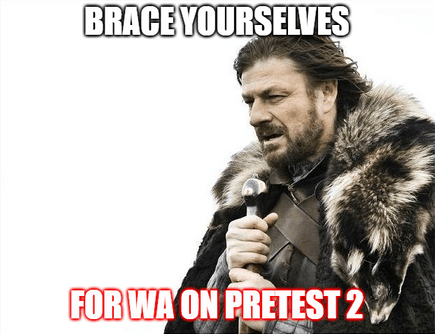

# announcement_(en)

Henlo Codeforces!

We are very glad to invite you to the [Codeforces Round 754 (Div. 2)](https://codeforces.com/contest/1605 "Codeforces Round 754 (Div. 2)"), which will be held on [Friday, November 12, 2021 at 20:35UTC+6](https://codeforces.com/https://www.timeanddate.com/worldclock/fixedtime.html?day=12&month=11&year=2021&hour=17&min=35&sec=0&p1=166). This round will be rated for participants with a rating less than 2100. For higher rated participants, we challenge you to solve problem F ;)

All the problems were authored and prepared by [Ashishgup](https://codeforces.com/profile/Ashishgup "Grandmaster Ashishgup"), [the_hyp0cr1t3](https://codeforces.com/profile/the_hyp0cr1t3 "Master the_hyp0cr1t3"), [ExplodingFreeze](https://codeforces.com/profile/ExplodingFreeze "Master ExplodingFreeze") and me. We have tried our best to create an interesting problemset with clear statements. Hope you enjoy the round :D

You will be given 6 problems and 2 hours to solve them.

We would like to thank:

 * [antontrygubO_o](https://codeforces.com/profile/antontrygubO_o "Legendary Grandmaster antontrygubO_o") for his amazing coordination and help in improving our problems.
* Our army of testers: [Um_nik](https://codeforces.com/profile/Um_nik "Legendary Grandmaster Um_nik"), [244mhq](https://codeforces.com/profile/244mhq "Legendary Grandmaster 244mhq"), [Monogon](https://codeforces.com/profile/Monogon "Grandmaster Monogon"), [_runtimeTerror_](https://codeforces.com/profile/_runtimeTerror_ "Grandmaster _runtimeTerror_"), [Jeel_Vaishnav](https://codeforces.com/profile/Jeel_Vaishnav "Grandmaster Jeel_Vaishnav"), [AmShZ](https://codeforces.com/profile/AmShZ "Grandmaster AmShZ"), [errorgorn](https://codeforces.com/profile/errorgorn "International Grandmaster errorgorn"), [ijxjdjd](https://codeforces.com/profile/ijxjdjd "Master ijxjdjd"), [Utkarsh.25dec](https://codeforces.com/profile/Utkarsh.25dec "Master Utkarsh.25dec"), [Dragnoid99](https://codeforces.com/profile/Dragnoid99 "Master Dragnoid99"), [yash_daga](https://codeforces.com/profile/yash_daga "International Master yash_daga"), [Vivek1998299](https://codeforces.com/profile/Vivek1998299 "Master Vivek1998299"), [taran_1407](https://codeforces.com/profile/taran_1407 "Master taran_1407"), [MagentaCobra](https://codeforces.com/profile/MagentaCobra "Master MagentaCobra"), [Retired_cherry](https://codeforces.com/profile/Retired_cherry "Candidate Master Retired_cherry"), [sinus_070](https://codeforces.com/profile/sinus_070 "Candidate Master sinus_070"), [AC_007](https://codeforces.com/profile/AC_007 "Candidate Master AC_007"), [talibmohd](https://codeforces.com/profile/talibmohd "Candidate Master talibmohd"), [KahanHai](https://codeforces.com/profile/KahanHai "Expert KahanHai"), [Dragonado](https://codeforces.com/profile/Dragonado "Expert Dragonado"), [Submit_Galactic_Algo](https://codeforces.com/profile/Submit_Galactic_Algo "Expert Submit_Galactic_Algo"), [KeyurJain](https://codeforces.com/profile/KeyurJain "Expert KeyurJain"), [tvcv901](https://codeforces.com/profile/tvcv901 "Specialist tvcv901"), [ekanshi](https://codeforces.com/profile/ekanshi "Specialist ekanshi"), [Jellyman102](https://codeforces.com/profile/Jellyman102 "Specialist Jellyman102"), [jimmy18](https://codeforces.com/profile/jimmy18 "Specialist jimmy18"), [inferno14](https://codeforces.com/profile/inferno14 "Pupil inferno14") for testing the round and providing valuable feedback.
* [MikeMirzayanov](https://codeforces.com/profile/MikeMirzayanov "Headquarters, MikeMirzayanov") for the Codeforces and Polygon platforms.

 **Good luck!**

Here's the scoring distribution of the round:

500−1000−1500−2000−2500−3500

**UPD**: [Editorial is out](tutorial_(en).md)

Also, congratulations to the winners.

**Div 1 + 2**: 

 1. [SSRS_](https://codeforces.com/profile/SSRS_ "International Grandmaster SSRS_")
2. [Vercingetorix](https://codeforces.com/profile/Vercingetorix "Grandmaster Vercingetorix")
3. [MatikaneTannhauser](https://codeforces.com/profile/MatikaneTannhauser "Unrated, MatikaneTannhauser")
4. [codinglunch](https://codeforces.com/profile/codinglunch "Candidate Master codinglunch")
5. [hank55663](https://codeforces.com/profile/hank55663 "International Grandmaster hank55663")

**Div 2**: 

 1. [MatikaneTannhauser](https://codeforces.com/profile/MatikaneTannhauser "Unrated, MatikaneTannhauser")
2. [codinglunch](https://codeforces.com/profile/codinglunch "Candidate Master codinglunch")
3. [huyinghao0706](https://codeforces.com/profile/huyinghao0706 "Candidate Master huyinghao0706")
4. [QuietBeautifulThoughts](https://codeforces.com/profile/QuietBeautifulThoughts "Newbie QuietBeautifulThoughts")
5. [MyBotDear](https://codeforces.com/profile/MyBotDear "Unrated, MyBotDear")
