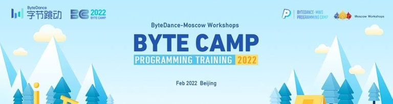

# Announcement_(en)

Hello, Codeforces community!

I'm glad to invite you to Codeforces Round #758 (Div.1 + Div. 2), which will be held on [Saturday, December 11, 2021 at 16:05UTC+6](https://codeforces.com/https://www.timeanddate.com/worldclock/fixedtime.html?day=11&month=12&year=2021&hour=13&min=5&sec=0&p1=166). The round will be rated for both divisions. Note the **unusual start time**.

The problems were taken (mostly) from the ByteDance — Moscow Workshops Online Contest, which is happening at the same time. Tasks from the Online Contest are prepared by [TadijaSebez](https://codeforces.com/profile/TadijaSebez "International Grandmaster TadijaSebez") and [oversolver](https://codeforces.com/profile/oversolver "Master oversolver"), additional tasks brought to you by [Um_nik](https://codeforces.com/profile/Um_nik "Legendary Grandmaster Um_nik") and [gen](https://codeforces.com/profile/gen "Master gen"). We are very thankful to the testers: [Monogon](https://codeforces.com/profile/Monogon "Grandmaster Monogon"), [74TrAkToR](https://codeforces.com/profile/74TrAkToR "Grandmaster 74TrAkToR"), [AmShZ](https://codeforces.com/profile/AmShZ "International Grandmaster AmShZ"), [DeadlyCritic](https://codeforces.com/profile/DeadlyCritic "Master DeadlyCritic"), [errorgorn](https://codeforces.com/profile/errorgorn "International Grandmaster errorgorn"), [oolimry](https://codeforces.com/profile/oolimry "Master oolimry") and [icypiggy](https://codeforces.com/profile/icypiggy "Grandmaster icypiggy") for their time and great feedback. Also big thanks to authors of other problems of the Online Contest [snarknews](https://codeforces.com/profile/snarknews "Unrated, snarknews") and [teraqqq](https://codeforces.com/profile/teraqqq "Grandmaster teraqqq") for cooperation, Bytedance instructors [jqdai0815](https://codeforces.com/profile/jqdai0815 "Legendary Grandmaster jqdai0815"), [Syloviaely](https://codeforces.com/profile/Syloviaely "Legendary Grandmaster Syloviaely"), [Gromah](https://codeforces.com/profile/Gromah "International Grandmaster Gromah"), [Claris](https://codeforces.com/profile/Claris "Grandmaster Claris") for testing and reviewing the Bytedance online contest, the contest coordinator [antontrygubO_o](https://codeforces.com/profile/antontrygubO_o "International Grandmaster antontrygubO_o") for the great help in setting up that round and [MikeMirzayanov](https://codeforces.com/profile/MikeMirzayanov "Headquarters, MikeMirzayanov") for testlib.h, Polygon and Codeforces.

ByteDance is a global technology company operating a range of platforms that allow people across languages, cultures, and geographies to create, discover and connect. ByteDance has partnered with Moscow Workshops and Codeforces to organize a top-tier and exclusive training camp for the International Collegiate Programming Contest. The upcoming Programming Camp will be held in Beijing from February 17th to 23th, 2022.

 

ByteDance — Moscow Workshops Online Contest is an opportunity to participate as teams onsite in this camp. Due to COVID-19 restrictions, mainly teams from China can participate onsite this year. For the international teams, the opportunity of online participation is considered.

You can find more information about this training camp at [https://programcamp.bytedance.com/.](https://codeforces.com/https://programcamp.bytedance.com/.)

**UPD:** The scoring distribution is **250 — 750 — 1000 — 1500 — 2000 — 2500 — 2750.**

**UPD 2:** [Editorial](Tutorial_(en).md)

