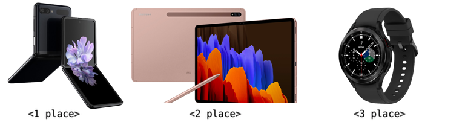

# Announcement

 Hi, Codeforces!

We are **[DELTIX](https://codeforces.com/https://deltix.io/)**. Founded in 2005, DELTIX is one of the market leaders in software development for financial research and products for systematic and algorithmic trading. In 2020 DELTIX joined the EPAM family. Our mission is to turn promising ideas into breakthrough products fast.

We are experts in:

 * aggregation, storage, and processing large volumes of time-series data
* data modeling
* testing and deployment of quantitative models

In our team we value such skills as:

 * knowledge of algorithms
* high-performance coding
* low latency data streams processing

We are excited to announce that we have released [TimeBase Web Admin Community Edition](https://codeforces.com/https://github.com/epam/TimebaseWS).

[More about DELTIX](https://codeforces.com/https://deltix.io/) 

Throughout the year, once per quarter, we will be inviting you to join DELTIX rounds at Codeforces. Today, we are excited to welcome you to the third installment of our rounds (joined Div1 и Div2) [Deltix Round, Autumn 2021 (open for everyone, rated, Div. 1 + Div. 2)](https://codeforces.com/contest/1609), that will start on [Sunday, November 28, 2021 at 20:35UTC+6](https://codeforces.com/https://www.timeanddate.com/worldclock/fixedtime.html?day=28&month=11&year=2021&hour=17&min=35&sec=0&p1=166). It is an open and rated round for both divisions. 

We have prepared the following trophies for you: 

**1st place:** Samsung Galaxy Z Flip3  
**2nd place:** Samsung Galaxy Tab S7+  
**3rd place:** Samsung Galaxy Watch4  
**1-100 places:** branded t-shirts

Another 100 t-shirts will be distributed randomly between participants outside the top-100 but within the top-1000 and who participated in rated Codeforces rounds before.

Problems, except the last one, have been prepared by members of our team: [Vladik](https://codeforces.com/profile/Vladik "Master Vladik"), [4llower](https://codeforces.com/profile/4llower "Candidate Master 4llower") and [AleXman111](https://codeforces.com/profile/AleXman111 "Candidate Master AleXman111").

We would like to say a word of appreciation to:

 * [KAN](https://codeforces.com/profile/KAN "Legendary Grandmaster KAN") and [budalnik](https://codeforces.com/profile/budalnik "International Grandmaster budalnik") for the round management
* extra thanks to [budalnik](https://codeforces.com/profile/budalnik "International Grandmaster budalnik") for creating one of the problems
* all the testers: [Sugar_fan](https://codeforces.com/profile/Sugar_fan "Legendary Grandmaster Sugar_fan"), [244mhq](https://codeforces.com/profile/244mhq "Legendary Grandmaster 244mhq"), [Geothermal](https://codeforces.com/profile/Geothermal "International Grandmaster Geothermal"), [andrew](https://codeforces.com/profile/andrew "Grandmaster andrew"), [aSmallTyphoon](https://codeforces.com/profile/aSmallTyphoon "Master aSmallTyphoon"), [_Time_Lord_](https://codeforces.com/profile/_Time_Lord_ "Master _Time_Lord_"), [Hec](https://codeforces.com/profile/Hec "Master Hec"), [GustavoMG](https://codeforces.com/profile/GustavoMG "Master GustavoMG"), [phattd](https://codeforces.com/profile/phattd "Master phattd"), [ptd](https://codeforces.com/profile/ptd "International Master ptd"), [kartel](https://codeforces.com/profile/kartel "Master kartel"), [mtw](https://codeforces.com/profile/mtw "International Master mtw"), [avoronoi](https://codeforces.com/profile/avoronoi "Candidate Master avoronoi"), [fixikmila](https://codeforces.com/profile/fixikmila "Candidate Master fixikmila"), [kartikeyasri23](https://codeforces.com/profile/kartikeyasri23 "Expert kartikeyasri23"), [Whiplash99](https://codeforces.com/profile/Whiplash99 "Expert Whiplash99"), [Ghazoo](https://codeforces.com/profile/Ghazoo "Expert Ghazoo"), [Jon](https://codeforces.com/profile/Jon "Expert Jon"), [asitnikoff](https://codeforces.com/profile/asitnikoff "Expert asitnikoff"), [Zayadi](https://codeforces.com/profile/Zayadi "Expert Zayadi"), [Ahmad7_7](https://codeforces.com/profile/Ahmad7_7 "Specialist Ahmad7_7"), [Omar_Elaraby](https://codeforces.com/profile/Omar_Elaraby "Specialist Omar_Elaraby"), [Kart](https://codeforces.com/profile/Kart "Specialist Kart"), [Java](https://codeforces.com/profile/Java "Specialist Java") and [anegelytor](https://codeforces.com/profile/anegelytor "Specialist anegelytor").
* and also [MikeMirzayanov](https://codeforces.com/profile/MikeMirzayanov "Headquarters, MikeMirzayanov") for Codeforces and Polygon systems

We will offer participants 8 problems and 150 minutes to solve them. We wish everybody good luck and high ratings!

Fill out a short contact form if you are interested in employment opportunities or would like to speak with recruiters or members of our team.

  [Contact Form →](https://codeforces.com/userForm/23fd00ae786e67ed) **UPD:** The scoring distribution is **500 — 1000 — **1500** — **2000** — 2750 — 3000 — 3250 — 3750**.

Thank you all for participating! ([editorial](Tutorial_(en).md))

Congratulations to the winners:  
1. [tourist](https://codeforces.com/profile/tourist "Legendary Grandmaster tourist")  
2. [gop2024](https://codeforces.com/profile/gop2024 "Legendary Grandmaster gop2024")  
3. [xtqqwq](https://codeforces.com/profile/xtqqwq "Legendary Grandmaster xtqqwq")  
4. [Maksim1744](https://codeforces.com/profile/Maksim1744 "Legendary Grandmaster Maksim1744")  
5. [VivaciousAubergine](https://codeforces.com/profile/VivaciousAubergine "Legendary Grandmaster VivaciousAubergine")  
6. [maroonrk](https://codeforces.com/profile/maroonrk "Legendary Grandmaster maroonrk")  
7. [jiangly](https://codeforces.com/profile/jiangly "Legendary Grandmaster jiangly")  
8. [Rewinding](https://codeforces.com/profile/Rewinding "Legendary Grandmaster Rewinding")  
9. [QAQAutoMaton](https://codeforces.com/profile/QAQAutoMaton "Legendary Grandmaster QAQAutoMaton")  
10. [PubabaOnO](https://codeforces.com/profile/PubabaOnO "International Grandmaster PubabaOnO") 

We were especially delighted with the result [tourist](https://codeforces.com/profile/tourist "Legendary Grandmaster tourist"), who was able to solve all 8 problems, congratulations!

