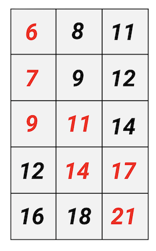
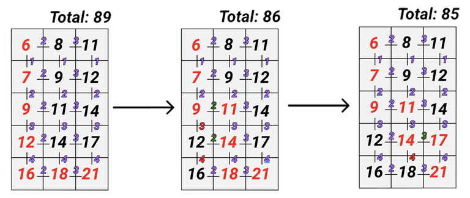

# Tutorial_(en)

### [1609A - Divide and Multiply](../problems/A._Divide_and_Multiply.md "Deltix Round, Autumn 2021 (open for everyone, rated, Div. 1 + Div. 2)")

First we divide all numbers by $2$, while they're divisible and calculate $k$, the number of successful divisions. Next we notice that to maximize the sum we need to multiply $2^k$ by the largest number remaining in the array after the described operations.

**Prepared by** [Vladik](https://codeforces.com/profile/Vladik "Master Vladik").  
**Solution:** [137274527](https://codeforces.com/contest/1609/submission/137274527 "Submission 137274527 by Vladik")

 
### [1609B - William the Vigilant](../problems/B._William_the_Vigilant.md "Deltix Round, Autumn 2021 (open for everyone, rated, Div. 1 + Div. 2)")

Notice that the answer to this problem is the number of substrings "abc"

Before starting to process queries let's count the number of substrings "abc" in the initial string. Next, notice that changing a character on position $pos$ can only remove one substring "abc" and add only one substring "abc". To check if either of those changes occurred we only need to look at characters no more than two positions away from $pos$ and see if substring "abc" appeared (or disappeared) there.

**Prepared by** [AleXman111](https://codeforces.com/profile/AleXman111 "Candidate Master AleXman111").  
**Solution:** [137274647](https://codeforces.com/contest/1609/submission/137274647 "Submission 137274647 by Vladik")

 
### [1609C - Complex Market Analysis](../problems/C._Complex_Market_Analysis.md "Deltix Round, Autumn 2021 (open for everyone, rated, Div. 1 + Div. 2)")

Note that the product of $n$ natural numbers is a prime number if, and only if, $n - 1$ of these numbers equal to one and one number is prime.

Next, let's group all of our numbers into groups which are ones. It's important that these groups are separated by a prime numbers. If the current number is neither a one nor a prime, it means we stop building a group for the current index.

Let's say we now have $p$ of these groups, then for each $i < p$ we must add product $p_i \cdot p_{i + 1}$, where $p_i$ is the number of ones in group $i$. Also a group of ones doesn't necessarily have to be connected to the subsequent group of ones, so to get the answer we must take into the account their product with the next prime (if there is one) and the previous prime (if there is one) for this group.

**Prepared by** [AleXman111](https://codeforces.com/profile/AleXman111 "Candidate Master AleXman111").  
**Solution:** [137274769](https://codeforces.com/contest/1609/submission/137274769 "Submission 137274769 by Vladik")

 
### [1609D - Social Network](../problems/D._Social_Network.md "Deltix Round, Autumn 2021 (open for everyone, rated, Div. 1 + Div. 2)")

Note that the conditions form a collection of disjoint sets. Consider two situations: 

1. The next condition connects two previously unconnected sets: then we will simply unite.
2. The next condition connects two previously connected sets: this case allows us to "postpone" an edge to use it as we like.

The second observation is that inside a set, the most advantageous construction for us has the shape of a star (a star is a graph, wherefrom one vertex there is an edge to all the others in this set). It remains not to forget about the deferred ribs. We can use them to connect some sets. The most profitable solution would be to connect sets with maximum sizes. The constraints of the problem make it possible to do this by a simple traversal over the sets in the order of sorting by the number of vertices in them.

Note that it was possible to solve the problem for more complex constraints using a tree of segments or two set<>, but this was not required in this problem.

**Prepared by** [4llower](https://codeforces.com/profile/4llower "Candidate Master 4llower").  
**Solution with** O(n⋅log(n)): [137274837](https://codeforces.com/contest/1609/submission/137274837 "Submission 137274837 by Vladik") 

 
### [1609E - William The Oblivious](../problems/E._William_The_Oblivious_.md "Deltix Round, Autumn 2021 (open for everyone, rated, Div. 1 + Div. 2)")

To solve this problem we will use a segment tree. Let's maintain the following informaton for each segment: $dp_{node, mask}$ stores the minimal number of characters that have to be replaced to make the string only contain subsequences equal to $mask$.

Next let's define what $mask$ is. Let the first bit of the mask correspond to subsequence $a$, the second bit correspond to subsequence $b$, the third bit correspond to subsequence $c$, the fourth bit correspond to subsequence $ab$, the fifth bit correspond to subsequence $bc$. Then $mask$ contains those subsequences, which have a number corresponding to the number of 1 bits in them.

Let's define the value $merge(leftMask, rightMask)$ as a resulting mask which contains the subsequences from both masks and the subsequences that are created as a result of their merge.

Then for a new node $node$ and for all masks $mask$ we can define $dp_{node, mask}$ as the minimal among all values $dp_{leftChild, leftMask} + dp_{rightChild, rightMask}$, where $leftChild$ and $rightChild$ are the left and right child nodes of the $node$ in the segment tree and $leftMask$ and $rightMask$ are masks for which $merge(leftMask, rightMask) = mask$.

The final answer is the minimal among all $dp_{1, mask}$.

**Prepared by** [AleXman111](https://codeforces.com/profile/AleXman111 "Candidate Master AleXman111").  
**Solution:** [137274954](https://codeforces.com/contest/1609/submission/137274954 "Submission 137274954 by Vladik")

 
### [1609F - Interesting Sections](../problems/F._Interesting_Sections.md "Deltix Round, Autumn 2021 (open for everyone, rated, Div. 1 + Div. 2)")

We will use Divide & Conquer algorithm.

Let $f(l, r)$ be the answer to the problem on the subsegment $l\ldots r$. Let's notice, that if $l = r$, then $f(l, r) = 1$, otherwise $f(l, r) = f(l, m) + f(m + 1, r) + f'(l, r)$, where $m = \frac{r + l}{2}$ and $f'(l, r)$ equals to the number of subsegments passing the check, which have left bound ranged from $l$ to $m$ (inclusively) and right bound ranged from $m+1$ to $r$ (inclusively).

Let's see how to calculate $f'(l, r)$. Let $max(l, r)$ be equal to maximum on the subsegment $l \ldots r$ and $min(l, r)$ be equal to minimum on the subsegment $l \ldots r$. Let's suppose that the maximal value of the chosen segment is in the left half (the case when the maximal value is in the right half is similar to this one). Now, let's iterate over the left bound $L$ of the segment, maintaining a maximal value of numbers in the left half (in other words, a maximal value on the segment $L\ldots m$). If we iterate over possible $L$-s in descending order, it is possible to maintain a pointer at all possible right bounds in the right half (notice that we want to maintain the greatest $R\\_{max}$ such that $max(m + 1, R\\_{max}) \le max(L, m)$). Now that we know the maximum, we know the number of bits equal to $1$ that binary representations of maximum and minimum contain. It's only left to find the number of right bounds $R'$ such that: 

* $m + 1 \le R' \le R\\_{max}$
* $min(L, R')$ has the same number of bits equal to $1$ as $max(L, m)$.

For every prefix of the right half let's calculate the minimum on it, in other words, $min(m + 1, pref)$, for every $pref$ such that $m + 1 \le pref \le r$. Notice that we can maintain an array $cnt_x$, which for every $x$ stores the number of right bounds, for which the binary representation of prefix minimum has exactly $x$ bits equal to $1$. The only case left unconsidered is when the minimum is in the left half. Let's notice that if we iterate over $L$-s in descending order, we don't increase the minimum in the left half, which means that we can create a pointer for it in the right half, maintaining such minimal $R\\_{min}$, that $min(m + 1, R\\_{min}) \le min(L, m)$. 

It turns out that $R\\_{min} - (m + 1)$ segments have maximum and minimum in the left half, and we know how to find those segments, and we just need to check if the binary representations of maximum and minimum of such segments have equal numbers of bits equal to $1$. In all other cases we want to calculate the number of right bounds on the segment $R\\_{min}\ldots R\\_{max}$, for which the prefix minimum has the same number of bits equal to $1$ as $max(L, m)$. It can be done if we maintain the array $cnt_x$ for the subsegment $R\\_{min} \ldots R\\_{max}$.

If we initially calculate the number of bits equal to $1$ for every number, then we will get a solution in $O(n \cdot \log n + n \cdot \log max\\_a)$.

[1609G - A Stroll Around the Matrix](../problems/G._A_Stroll_Around_the_Matrix.md)

Let's try to solve the problem without asking for changes. Note that in the matrix constructed in this way for the move from (i, j) it is always profitable to go to the cell with the smallest number. This can be seen more clearly in the matrix of the first test case:

This allows you to solve the problem with complexity O(n+m), but this is not enough for a complete solution. Let's introduce two new arrays of the difference between the adjacent elements of the arrays dai=ai+1−ai and dbi=bi+1−bi.

Note that our greedy decision turns right out of the cell (i,j), when dai>dbj. For clarity, below is an illustration of the turns:

Each time such a turn to the right in the cell (i,j) decreases our total sum by (dai−dbj)+(dai+1−dbj)+⋯+(dan−1−dbj)=(∑n−1t=idat)−dbj⋅(n−i). Which is actually equivalent to the sum of dai−dbj for all dai>dbj.

Such a sum can be considered by recognizing for each i by a binary search the last dbj for which the expression dai>dbj is true. This allows us to solve the problem in O(n⋅log(m)) using the prefix sums of the db array.

Now let's get back to change requests. Because the size of the da array is small enough, then we can change the values of its elements by a simple. To store the db array, you will need to use a segment tree supporting the following operations:  
- Adding a number at the suffix (since we are working with an array db, not b, then all elements will change by one number equal to the step of the arithmetic progression).  
- Sum of array numbers on array prefix so far elementi<X. (dai will act as X).

**Prepared by** [Vladik](https://codeforces.com/profile/Vladik "Master Vladik").  
**Total complexity:** O(q⋅n⋅log(m)).

 
### [1609H - Pushing Robots](../problems/H._Pushing_Robots.md "Deltix Round, Autumn 2021 (open for everyone, rated, Div. 1 + Div. 2)")

First of all, it should be noted, that one iteration of the described algorithm of robots' movements can be implemented in $O(n)$ time. For example, using stack.

Let's consider moments of time that are multiple of $k$. And segments of time between such two consecutive moments of time. Consider two adjacent robots. It can be proved that if these two robots touched each other during a segment of time $[k \cdot t, k \cdot (t + 1)]$ ($1 < t$), then they will touch each other during any succeeding segment of time $[k \cdot t', k \cdot (t' + 1)]$ ($t < t'$). One thing that may change in the future is that the left robot will be blocked from moving to the left, or the right robot will be blocked from moving to the right. Robots just will become closer to each other after such a change. It's also possible that the left robot will be blocked from moving to the right, or the right robot from moving to the left. But then they are touching.

Similarly, if after $k$ seconds distance between two robots decreases, then it will continue decreasing until they touch during some segment of time. And if two robots touch during a segment of time, then the distance between them after this segment of time will be less than or equal to the distance between them before this segment.

Let's simulate the first $k$ seconds, and then another $k$ seconds. Let's look at pairs of adjacent robots. 

* If the distance between two robots increased or didn't change, skip this pair.
* If the distance between two robots decreased.
	+ If the distance is $\le k \cdot 2 + 1$, then robots may touch during the next segment. So, let's simulate the next $k$ seconds again.
	+ Otherwise, let distance be $d$ and it decreased by $s$ during the last segment of time. Then, during the next $\lfloor\frac{d - k \cdot 2 - 1}{s}\rfloor$ segments of time it will continue decreasing with the same speed ($s$ units per $k$ seconds). So we can skip these segments of time, and simulate the next after them.

Let's choose the minimum segment of time that should be simulated. Let's skip all till this segment of time, and simulate it. Then again choose the minimum segment of time till which we can skip simulation.

It can be proved that there will be simulated $O(n \cdot k)$ segments of time overall. This is due to the fact that there're no more than $O(k)$ decreases of the distance between two adjacent robots, after which we will do the simulation.

In order to answer questions, let's also simulate segments of time that contain moments of time of questions.

Total time complexity is $O(n \cdot k \cdot (n \cdot k + q))$.

**Prepared by** [budalnik](https://codeforces.com/profile/budalnik "International Grandmaster budalnik").

