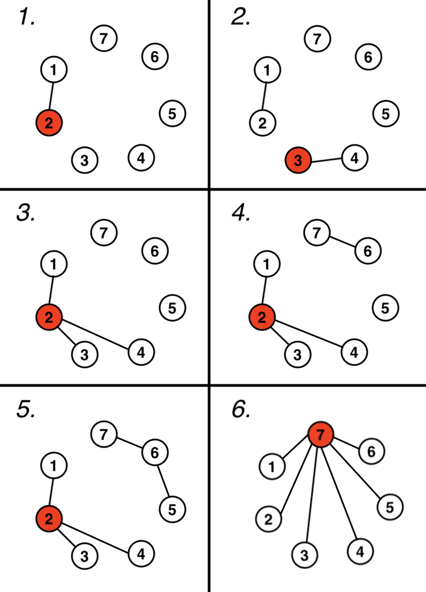

<h1 style='text-align: center;'> D. Social Network</h1>

<h5 style='text-align: center;'>time limit per test: 2 seconds</h5>
<h5 style='text-align: center;'>memory limit per test: 256 megabytes</h5>

  William arrived at a conference dedicated to cryptocurrencies. Networking, meeting new people, and using friends' connections are essential to stay up to date with the latest news from the world of cryptocurrencies.

The conference has $n$ participants, who are initially unfamiliar with each other. William can introduce any two people, $a$ and $b$, who were not familiar before, to each other. 

William has $d$ conditions, $i$'th of which requires person $x_i$ to have a connection to person $y_i$. Formally, two people $x$ and $y$ have a connection if there is such a chain $p_1=x, p_2, p_3, \dots, p_k=y$ for which for all $i$ from $1$ to $k - 1$ it's true that two people with numbers $p_i$ and $p_{i + 1}$ know each other.

For every $i$ ($1 \le i \le d$) William wants you to calculate the maximal number of acquaintances one person can have, assuming that William satisfied all conditions from $1$ and up to and including $i$ and performed exactly $i$ introductions. The conditions are being checked after William performed $i$ introductions. The answer for each $i$ must be calculated independently. It means that when you compute an answer for $i$, you should assume that no two people have been introduced to each other yet.

#### Input

The first line contains two integers $n$ and $d$ ($2 \le n \le 10^3, 1 \le d \le n - 1$), the number of people, and number of conditions, respectively.

Each of the next $d$ lines each contain two integers $x_i$ and $y_i$ ($1 \le x_i, y_i \le n, x_i \neq y_i$), the numbers of people which must have a connection according to condition $i$.

#### Output

#### Output

 $d$ integers. $i$th number must equal the number of acquaintances the person with the maximal possible acquaintances will have, if William performed $i$ introductions and satisfied the first $i$ conditions.

## Examples

#### Input


```text
7 6
1 2
3 4
2 4
7 6
6 5
1 7
```
#### Output


```text
1
1
3
3
3
6
```
#### Input


```text
10 8
1 2
2 3
3 4
1 4
6 7
8 9
8 10
1 4
```
#### Output


```text
1
2
3
4
5
5
6
8
```
## Note

The explanation for the first test case:

In this explanation, the circles and the numbers in them denote a person with the corresponding number. The line denotes that William introduced two connected people. The person marked with red has the most acquaintances. These are not the only correct ways to introduce people.

  

#### Tags 

#1600 #NOT OK #dsu #graphs #greedy #implementation #trees 

## Blogs
- [All Contest Problems](../Deltix_Round,_Autumn_2021_(open_for_everyone,_rated,_Div._1_+_Div._2).md)
- [Announcement](../blogs/Announcement.md)
- [Tutorial (en)](../blogs/Tutorial_(en).md)
