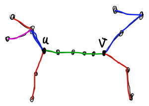

# Tutorial_(en)


### [1610A - Anti Light's Cell Guessing](../problems/A._Anti_Light's_Cell_Guessing.md "Codeforces Global Round 17")

Idea: [Anti-Light](https://codeforces.com/profile/Anti-Light "Expert Anti-Light"), Preparation: [DeadlyCritic](https://codeforces.com/profile/DeadlyCritic "Master DeadlyCritic")

 **Hints****Hint 1**ans≤2

 **Hint 2**If n=1 and m=1 then ans=0. [](https://codeforces.com/https://emoji.gg/emoji/5500-thosewhoknow)

 **Solution**
### [1610A - Anti Light's Cell Guessing](../problems/A._Anti_Light's_Cell_Guessing.md "Codeforces Global Round 17")

$\mathcal Complete\;\mathcal Solution$:

$\textbf{I encourage you to read the Hints and Assumptions before reading this.}$

Let's say the answer is $ans$. If $n == 1$ and $m == 1$, then there's only one cell, so we don't need any more information, and the hidden cell is that single cell. So for this scenario $ans = 0$.

If exactly one of $n$ or $m$ equals $1$, then it's trivial that the answer is greater than $0$. Also if we choose the cell $(1, 1)$, we can find the hidden cell. So for this case $ans = 1$.

Now assume $2 \le n$ and $2 \le m$, if you choose $(1, 1)$ and $(n, 1)$ then let's say the distance from $(1, 1)$ to the hidden cell is $b_1$ and the distance from $(n, 1)$ to the hidden cell is $b_2$. Then if the hidden cell is $(i, j)$ then $b_1 = i-1 + j-1$ and $b_2 = n-i + j-1$ so $b_1+b_2 = n-1 + 2j-2$ so we can find $j$. After finding $j$ we can find $i$ using $b_1 = i-1+j-1$. So the answer is at most $2$.

Now we proof $2 \le ans$, trivially $0 < ans$, but why $ans \ne 1$?. Assume someone chose a cell $(i, j)$ and they could distinguish all the $n \cdot m$ possible hidden cells. It's easy to see that at least $3$ of the $4$ cells $(i, j-1)$, $(i+1, j)$, $(i-1, j)$ and $(i, j+1)$ exist in the table, but their distance from $(i, j)$ is $1$ for all $4$ of them, so we can't distinguish them, so $ans = 2$.

Time complexity: $\mathcal{O}(1)$

 **Implementation**
```cpp
#include <bits/stdc++.h>
 
using namespace std;
 
int main()
{
    ios::sync_with_stdio(false);
    cin.tie();
    cout.tie();
    
    int t;
    cin >> t;
    while(t--){
        int n, m;
        cin >> n >> m;
        if(n == 1 && m == 1){
            cout << "0n";
        }
        else if(min(n, m) == 1){
            cout << "1n";
        }
        else cout << "2n";
    }
}

```
### [1610B - Kalindrome Array](../problems/B._Kalindrome_Array.md "Codeforces Global Round 17")

Idea: [Davoth](https://codeforces.com/profile/Davoth "Master Davoth"), [Keshi](https://codeforces.com/profile/Keshi "Grandmaster Keshi"), Preparation: [AmShZ](https://codeforces.com/profile/AmShZ "Grandmaster AmShZ"), [Keshi](https://codeforces.com/profile/Keshi "Grandmaster Keshi")

 **Hint**For an integer x we can determine whether or not it's possible to make the array palindrome by removing some of the elements equal to x.

We claim that it is possible iff removing all appearances of x makes the array palindrome.

Imagine we made the array palindrome by removing some of the elements equal to x. It's obvious that after removing the rest of the elements equal to x the array remains palindrome.

 **Solution**Read the Hints and Assumptions before reading this. 

### [1610B - Kalindrome Array](../problems/B._Kalindrome_Array.md "Codeforces Global Round 17")

If the array is already a palindrome the answer is Yes. Otherwise, let's find the minimum $i$ that $a_i \neq a_{n + 1 - i}$.

We can prove that we have to remove either $a_i$ or $a_{n + 1 - i}$ in order the make the array palindrome.

Imagine it's possible to make the array palindrome by removing all appearances of $x$. $x \neq a_i, a_{n + 1 - i}$

The number of appearances of $x$ before $i$ is equal to the number of appearances of $x$ after $n + 1 - i$. So in order to make the array palindrome, $a_i$ must be equal to $a_{n + 1 - i}$.

So we just have to check if the array will be palindrome after removing all appearances of $a_i$ or after removing all appearances of $a_{n + 1 - i}$.

Time complexity: $\mathcal{O}(n)$

 **Implementation**
```cpp
//khodaya khodet komak kon
# include <bits/stdc++.h>
 
using namespace std;
 
typedef long long                                        ll;
typedef long double                                      ld;
typedef pair <int, int>                                  pii;
typedef pair <pii, int>                                  ppi;
typedef pair <int, pii>                                  pip;
typedef pair <pii, pii>                                  ppp;
typedef pair <ll, ll>                                    pll;
 
# define A                                               first

# define B                                               second

# define endl                                            'n'

# define sep                                             ' '

# define all(x)                                          x.begin(), x.end()

# define kill(x)                                         return cout << x << endl, 0

# define SZ(x)                                           int(x.size())

# define lc                                              id << 1

# define rc                                              id << 1 | 1

# define fast_io                                         ios::sync_with_stdio(0);cin.tie(0); cout.tie(0);
 
ll power(ll a, ll b, ll md) {return (!b ? 1 : (b & 1 ? a * power(a * a % md, b / 2, md) % md : power(a * a % md, b / 2, md) % md));}
 
const int xn = 2e5 + 10;
const int xm = - 20 + 10;
const int sq = 320;
const int inf = 1e9 + 10;
const ll INF = 1e18 + 10;
const ld eps = 1e-15;
const int mod = 998244353;
const int base = 257;
 
int qq, n, m, a[xn], b[xn];
bool ans;
 
void check(int x){
	m = 0;
	for (int i = 1; i <= n; ++ i)
		if (a[i] != x)
			b[++ m] = a[i];
	for (int i = 1; i <= m; ++ i)
		if (b[i] != b[m + 1 - i])
			return;
	ans = true;
}
 
int main(){
	fast_io;
 
	cin >> qq;
	while (qq --){
		cin >> n, ans = true;
		for (int i = 1; i <= n; ++ i)
			cin >> a[i];
		for (int i = 1; i <= n; ++ i){
			if (a[i] != a[n + 1 - i]){
				ans = false;
				check(a[i]);
				check(a[n + 1 - i]);
				break;
			}
		}
		if (ans)
			cout << "YES" << endl;
		else
			cout << "NO" << endl;
	}
 
	return 0;
}

```
### [1610C - Keshi Is Throwing a Party](../problems/C._Keshi_Is_Throwing_a_Party.md "Codeforces Global Round 17")

Idea: [Keshi](https://codeforces.com/profile/Keshi "Grandmaster Keshi"), Preparation: [Keshi](https://codeforces.com/profile/Keshi "Grandmaster Keshi")

 **Hints****Hint 1**Let ans be the answer. For any i≤ans it's possible to invite exactly i people, and for any i>ans it's not possible to invite exactly i people.

Because removing 1 person from the party doesn't make anyone unhappy. So if we can invite p1,p2,…,pk, we also can invite p1,p2,…,pk−1.

 **Hint 2**We use binary search to find the maximum i that it's possible to invite exactly i people.

Assume we want to invite x people. If there are i people poorer than person v, there are x−1−i people richer than him. i≤bv and x−1−i≤av so x−1−av≤i≤bv.

 **Solution**Read the Hints and Assumptions before reading this. 

### [1610C - Keshi Is Throwing a Party](../problems/C._Keshi_Is_Throwing_a_Party.md "Codeforces Global Round 17")

Take a look at this greedy approach.

Let $p_i$ be the $i$-th poorest invited person.($p_i < p_{i + 1}$)

Find the poorest person $v$ that $x - 1 - a_v \le 0 \le b_v$. We will invite this person so $p_1 = v$.

For each $2 \le i \le x$ find the poorest person $v$ that $v > p_{i - 1}$ and $x - 1 - a_v \le i - 1 \le b_v$ this means that person $v$ can be the $i$-th poorest invited person.

Imagine we fail to find $x$ people but there is a way to do so. The solution chooses $s_1, s_2, \ldots, s_x$.

for each $i$ we chose the minimum $p_i$ possible, therefor $p_i \le s_i$. But if our algorithm fails there must exist an index $i$ that $p_i > s_i$.

So our algorithm is correct.

Time complexity: $\mathcal{O}(n\log n)$

 **Implementation**
```cpp
//In the name of God
#include <bits/stdc++.h>
using namespace std;
 
typedef int ll;
typedef pair<ll, ll> pll;
 
const ll maxn = 2e5 + 100;
const ll mod = 1e9 + 7;
const ll inf = 1e9;
 
#define fast_io ios::sync_with_stdio(false);cin.tie(0);cout.tie(0);
#define file_io freopen("input.txt", "r+", stdin);freopen("output.txt", "w+", stdout);
#define pb push_back
#define Mp make_pair
#define F first
#define S second
#define Sz(x) ll((x).size())
#define all(x) (x).begin(), (x).end()
 
ll q, n, a[maxn], b[maxn];
 
bool ok(ll x){
	ll c = 0;
	for(ll i = 0; i < n; i++){
		if(x - 1 - a[i] <= c && c <= b[i]) c++;
	}
	return c >= x;
}
 
int main(){
    fast_io;
    
    cin >> q;
    while(q--){
        cin >> n;
        for(ll i = 0; i < n; i++){
        	cin >> a[i] >> b[i];
    	}
    	ll l = -1, r = n + 1, mid;
    	while(r - l > 1){
    		mid = (l + r) >> 1;
    		if(ok(mid)) l = mid;
    		else r = mid;
    	}
    	cout << l << "n";
    }
    return 0;
}
```
### [1610D - Not Quite Lee](../problems/D._Not_Quite_Lee.md "Codeforces Global Round 17")

Idea: [DeadlyCritic](https://codeforces.com/profile/DeadlyCritic "Master DeadlyCritic"), Preparation: [DeadlyCritic](https://codeforces.com/profile/DeadlyCritic "Master DeadlyCritic")

 **Hints****Hint 1**First you should be able to check if an array c of size k is good or not.

 **Hint 2**If you choose some initial sequences ti for all ci that satisfy the first property, then you can reach any other set of sequences that satisfy the first property. Now you should check if a set of sequences exist that are reachable from your initial sequences and satisfy the second property or not.

 **Hint 3**If you do it correctly, and choose initial sequences such that i-th sequence starts from 0 and ends with ci−1 then you should end up with the following equaion : x1c1+x2c2+…+xkck=−∑ci(ci−1)2. If this equation has an answer (x1,x2,…,xk) then c is good, otherwise it's not.

 **Hint 4**That equation has an answer if and only if g=gcd(c1,c2,…,ck) divides ci(ci−1)2, this is not useful for the main problem in this state, try to go more in-depth.

 **Hint 5**I will frequently use the fact that if y is odd and divides x, then y divides x2, and if y is even then y2 divides x2.

 **Solution**
### [1610D - Not Quite Lee](../problems/D._Not_Quite_Lee.md "Codeforces Global Round 17")

$\mathcal Complete\;\mathcal Solution$:

$\textbf{I encourage you to read the Hints and Assumptions before reading this.}$

Assume we have an array $c$ of length $k$, need to know if it's good or not. We can choose an initial sequence $t_i$ for all $1 \le i \le k$, then slide them (in other words, choose an index $i$ and increase or decrease all the elements in the $i$-th sequence, keep doing this as many times as you need) that way we can reach any other possible set of sequences that satisfy the first property, so it doesn't matter what we choose as initial sequences, because from any set of $k$ sequences that satisfy the first property, we can reach any other such set of $k$ sequences.

After that, if $\displaystyle \sum_{i = 1}^k sum_i = s$, we want to find such $x_i$-s that $\displaystyle \sum_{i=1}^kx_ic_i = -su $ so after sliding $i$-th sequence $|x_i|$ times to the right(or left if $x_i$ is negative) for all $i$, we will have a set of sequences that satisfy both the properties.

Now to do that, one can prove if $\displaystyle gcd(c_1, c_2, \ldots, c_k) = g$, then if $g$ divides $s$, the array is good, otherwise it's not (I won't prove it because it's quite well-known and easy).

If we choose the initial sequences such that the $i$-th sequence starts from $0$ and ends with $c_i-1$, then $\displaystyle s = \sum_{i=1}^k \frac{c_i(c_i-1)}2$. Now we want $g$ to divide $s$. If $g$ is odd, then it will always divide $s$ because it divides $\frac{c_i}2$. From now on we assume $g$ to be even.

One can prove that if $2^l$ divides $g$ and $0 < l$ is maximum such integer, then $\frac g{2^l}$ (which is odd) divides all $\frac{c_i}2$, so $s$ is divisible by $\frac g{2^l}$. So we should only check if $2^l$ also divides $s$ or not.

If $2^{l+1}$ divides some $c_i$, then $2^l$ divides $\frac{c_i(c_i-1)}2$ for that $i$ as well. Also if $2^{l+1}$ doesn't divide $c_i$, we knew that $2^l$ divides $c_i$ (because $2^l$ divides $g$ and $g$ divides $c_i$) so $2^{l-1}$ divides $\frac{c_i}2$ but $2^l$ doesn't, also $c_i-1$ is odd. So $\frac{c_i(c_i-1)}2$ has a reminder equal to $2^{l-1}$ modulo $2^l$. All the other terms $\frac{c_i(c_i-1)}2$ were divisible by $2^l$ except these, so if the number of such $c_i$-s is even, then their reminders sum up to $0$ modulo $2^l$ then $c$ is good, and not otherwise.

To solve the actual problem, we can fix $l$, maximum power of 2 that divides $g$, now we only care about how many $c_i$-s are divisible by $2^l$ (let's say $x$ such $c_i$-s, also if $x < 2$ then we should skip this $l$ because we need at least $2$ such $c_i$-s to have an array with that $l$), and how many are divisible by $2^{l+1}$ (let's say $y$ such $c_i$-s).

Now there are $2^x$ possible subsequences such that $2^l$ divides $g$ (including the empty subsequence), but some of them may have an odd number of $c_i$-s not divisible by $2^{l+1}$, it's easy to see that half of them have an even number of such $c_i$-s, still, for $2^y$ of them, $2^{l+1}$ divides $g$ as well (which is not what we want. Also includes the empty subsequence). So we have $2^{x-1}-2^y$ subsequences with that $l$ (doesn't include the empty subsequence).

Then we sum up this for all possible $l$, also don't forget to count $l=0$ separately (i.e. $g$ is odd).

Time complexity: $\mathcal{O}(nlog(10^9))$

 **Implementation**
```cpp
//In The Name of God
//I usually forget about the previous line...

#include <bits/stdc++.h>

#define IOS ios::sync_with_stdio(0), cin.tie(), cout.tie();

using namespace std;

typedef long long ll;

const int maxBt = 30;
const int mod = 1e9+7;

int cnt[maxBt];

int slv(){
    int n;
    cin >> n;

    int a[n];
    for(int i = 0; i < n; i++){
        cin >> a[i];
    }

    int to[n+1]; //powers of 2

    to[0] = 1;
    for(int i = 1; i <= n; i++){
        to[i] = to[i-1]*2 % mod;
    }

    for(int i = 0; i < n; i++){
        int x = 0;
        for(int k = 0; k < maxBt; k++){
            if(a[i] & 1)break;
            a[i] >>= 1;
            x++;
        }
        cnt[x]++;
    }

    int ans = to[n] - to[n-cnt[0]] + mod;
    if(ans >= mod)ans -= mod;

    int y = n-cnt[0];

    for(int l = 1; l < maxBt; l++){
        int x = y;
        y -= cnt[l];
        if(x-y < 2)continue;
        int delta = to[x-1]-to[y]+mod;
        if(delta >= mod)delta -= mod;
        ans += delta;
        if(ans >= mod)ans -= mod;
    }

    return ans;
}


signed main(){
    IOS

    cout << slv() << 'n';

}
```
### [1610E - AmShZ and G.O.A.T.](../problems/E._AmShZ_and_G.O.A.T..md "Codeforces Global Round 17")

Idea: [AmShZ](https://codeforces.com/profile/AmShZ "Grandmaster AmShZ"), Preparation: [AmShZ](https://codeforces.com/profile/AmShZ "Grandmaster AmShZ")

 **Hints****Hint 1**Firstly we prove that if array c (ci≤ci+1) of length k is terrible, c has a terrible subsequence of length 3.

If there exists an index i≥2 that ci+1−ci<ci−c1, sequence {c1,ci,ci+1} is terrible. Otherwise we can prove that c⌈k2⌉≤AVG which is in contraction to the fact that c is terrible.

 **Hint 2**We want to find the longest good subsequence of a.

Let b1,b2,…,bk be values of a good subsequence. For every i≥2 we have bi+1≥2⋅bi−b1.

Let's fix the first element of the subsequence to be as.

 **Solution**Read the Hints and Assumptions before reading this. 

### [1610E - AmShZ and G.O.A.T.](../problems/E._AmShZ_and_G.O.A.T..md "Codeforces Global Round 17")

We build the longest good subsequence starting with $a_s$ greedily step by step.

In each step we add the smallest possible element to the subsequence. If the last element is $a_k$, we have to find the minimum $i$ that $i > k$ and $a_i \ge 2 \cdot a_k - a_s$. (using lower_bound)

Assume $b_1 \neq b_2$, then $k < \log(a_n))$. Because for each $i$, $b_{i + 1} \ge 2 \cdot b_i - b_1$ then $b_{i + 1} - b_1 \ge 2 \cdot b_i - 2 \cdot b_1$ then $b_{i + 1} - b_1 \ge 2 \cdot (b_i - b_1)$.

And for cases that $b_1 = b_2$, $ + cnt_i$. ($cnt_i$ being the number of occurrences of element $i$)

So for each $i$ that $a_i \neq a_{i - 1}$ we do the above greedy approach. We don't need to do it for indices that $a_i = a_{i - 1}$ since adding $a_{i - 1}$ to the longest subsequence starting from $a_i$ doesn't make it bad.

Time complexity is $\log(n) \cdot \displaystyle\sum_{a_i \neq a_{i - 1}}{cnt_i + \log(a_n)} \le \log(n) \cdot \left( n \cdot \log(a_n) + \displaystyle\sum_{a_i \neq a_{i - 1}}{cnt_i} \right) \le \log(n) \cdot (n \cdot \log(a_n) + n)$.

The overall time complexity will be $\mathcal{O}(n \cdot \log n \cdot \log a_n)$

 **Implementation**
```cpp
//khodaya khodet komak kon
# include <bits/stdc++.h>

using namespace std;

const int xn = 2e5 + 10;

int qq, n, a[xn], ans, res, ptr;
 
int main(){
	ios::sync_with_stdio(0);cin.tie(0); cout.tie(0);

	cin >> qq;
	while (qq --){
		cin >> n, ans = 0;
		for (int i = 1; i <= n; ++ i)
			cin >> a[i];
		for (int i = 1; i <= n; ++ i){
			if (a[i] == a[i - 1])
				continue;
			res = 0, ptr = i;
			while (ptr <= n)
				ptr = lower_bound(a + ptr + 1, a + n + 1, 2 * a[ptr] - a[i]) - a, ++ res;
			ans = max(ans, res);
		}
		cout << n - ans << "n";
	}

	return 0;
}
```
### [1610F - Mashtali: a Space Oddysey](../problems/F._Mashtali:_a_Space_Oddysey.md "Codeforces Global Round 17")

Idea: [AliShahali1382](https://codeforces.com/profile/AliShahali1382 "International Grandmaster AliShahali1382"), Preparation: [AliShahali1382](https://codeforces.com/profile/AliShahali1382 "International Grandmaster AliShahali1382")

 **Hint**Let's call cv as the sum of weights of all edges connected to vertex v.

It's obvious that when cv is even, v would never be Oddysey.

Here we propose an algorithm to make all vertices with odd cv Oddysey.

 **Solution**Read the Hints and Assumptions before reading this. 

### [1610F - Mashtali: a Space Oddysey](../problems/F._Mashtali:_a_Space_Oddysey.md "Codeforces Global Round 17")

If there is a vertex $v$ connected to its neighbors $x$ and $y$ with same edge weights, we delete these edges and add a new edge between $x$ and $y$. So the number of edges decreases by 1.

Now we solve the problem for our new graph recurrently.

Then we check whether the assigned direction is from $x$ to $y$ or from $y$ to $x$. In the first case, we should delete this edge and add a directional edge from $x$ to $v$ and from $v$ to $y$. Otherwise, after deleting the edge we add a directional edge from $y$ to $v$ and from $v$ to $x$.

After these changes, for every $v$, $d^+(v) - d^-(v)$ will not change.

However if there is no such vertex, the graph contains some paths and cycles in which the weight of each path and cycle is 1 or 2 every other one.

So we can direct edges of each cycle to produce a directed cycle and do the same thing for edges of each path in order to make a directed path.

By doing this, every $v$ with odd $c_v$ will become Oddysey.

 **Implementation**
```cpp
#include <bits/stdc++.h>
#pragma GCC optimize ("O2,unroll-loops")
 
using namespace std;
typedef long long ll;
typedef long double ld;
typedef pair<int, int> pii;
typedef pair<ll, ll> pll;
#define all(x) x.begin(), x.end()
#define pb push_back
#define SZ(x) ((int)x.size())
#define kill(x) return cout<<x<<'n', 0;
 
const int inf=1000000010;
const ll INF=100000000000000100LL;
const int mod=1000000007;
const int MAXN=300010, LOG=19;
 
int n, m, mm, k, u, v, x, y, t, a, b;
int U[MAXN], V[MAXN], W[MAXN], ans[MAXN];
int deg[MAXN], parr[MAXN][3], mark[MAXN];
vector<int> G[MAXN][3], E[MAXN];
vector<pii> G2[MAXN];
 
inline void orient(int i, int u){
	if (u==U[i]){
		ans[i]=1;
		deg[U[i]]-=W[i];
		deg[V[i]]+=W[i];
	}
	else{
		ans[i]=2;
		deg[U[i]]+=W[i];
		deg[V[i]]-=W[i];
	}
}
 
void MergePath(int i, int w){
	mm++;
	int v=i;
	while (1){
		while (SZ(G[v][w]) && mark[G[v][w].back()]) G[v][w].pop_back();
		if (G[v][w].empty()) break ;
		int i=G[v][w].back();
		assert(!mark[i]);
		mark[i]=1;
		E[mm].pb(i);
		int u=(U[i]^V[i]^v);
		parr[u][w]^=1;
		parr[v][w]^=1;
		v=u;
	}
	if (E[mm].empty()){
		mm--;
		return ;
	}
	G2[i].pb({v, mm});
	G2[v].pb({i, -mm});
}
void dfs(int v){
	while (SZ(G2[v]) && mark[abs(G2[v].back().second)]) G2[v].pop_back();
	if (G2[v].empty()) return ;
	int u=G2[v].back().first, id=G2[v].back().second;
	if (id<0){
		id*=-1;
		reverse(all(E[id]));
	}
	mark[id]=1;
	for (int i:E[id]){
		orient(i, v);
		v^=V[i]^U[i];
	}
	assert(v==u);
	dfs(u);
}
 
int main(){
	ios_base::sync_with_stdio(false);cin.tie(0);cout.tie(0);
	cin>>n>>m;
	for (int i=0; i<m; i++){
		cin>>U[i]>>V[i]>>W[i];
		parr[U[i]][W[i]]^=1;
		parr[V[i]][W[i]]^=1;
		G[U[i]][W[i]].pb(i);
		G[V[i]][W[i]].pb(i);
	}
	int sum=0;
	for (int i=1; i<=n; i++) sum+=parr[i][1];
	for (int i=1; i<=n; i++) for (int w:{1, 2}) if (parr[i][w]) MergePath(i, w);
	for (int i=1; i<=n; i++) for (int w:{1, 2}) MergePath(i, w);
 
	for (int i=0; i<m; i++){
		assert(mark[i]);
		mark[i]=0;
	}
	for (int i=1; i<=n; i++) if (SZ(G2[i])&1) dfs(i);
	for (int i=1; i<=n; i++) dfs(i);
 
	cout<<sum<<"n";
	for (int i=0; i<m; i++) cout<<ans[i]; cout<<"n";
 
	return 0;
}
```
### [1610G - AmShZ Wins a Bet](../problems/G._AmShZ_Wins_a_Bet.md "Codeforces Global Round 17")

Idea: [AmShZ](https://codeforces.com/profile/AmShZ "Grandmaster AmShZ"), [Keshi](https://codeforces.com/profile/Keshi "Grandmaster Keshi"), Preparation: [AmShZ](https://codeforces.com/profile/AmShZ "Grandmaster AmShZ"), [Keshi](https://codeforces.com/profile/Keshi "Grandmaster Keshi"), [alireza_kaviani](https://codeforces.com/profile/alireza_kaviani "International Grandmaster alireza_kaviani"), [AliShahali1382](https://codeforces.com/profile/AliShahali1382 "International Grandmaster AliShahali1382")

 **Hints****Hint 1**We can prove that there exists a way to achieve the lexicographically minimum by removing some balanced substrings. (A sequence of brackets is called balanced if one can turn it into a valid math expression by adding characters "+" and "1".)

We will remove some pairs of indices. If there is a pair that we don't remove all the characters between them, by using that character instead of one the initial ones the answer either stays the same or becomes lexicographically smaller.

Because if the character in between is "(", changing the pair is like moving a "(" closer to the front of the outcome which will make it smaller. And if it's ")", changing the pair is like moving a ")" farther from the front of the outcome which will make it smaller.

 **Hint 2**For each i find the shortest non-empty balanced substring that starts in index i. Let the length of this substring be l. Set nxti as i+l, or i if no such substring exists.

For each i we either keep the i-th character or remove every character in [i,nxti) interval.

Imagine we somehow store the answer for each suffix. Then ansi=min(si+ansi+1,ansnxti).

 **Solution**Read the Hints and Assumptions before reading this. 

### [1610G - AmShZ Wins a Bet](../problems/G._AmShZ_Wins_a_Bet.md "Codeforces Global Round 17")

Make a rooted tree. Each suffix has a node and except for the root, each node belongs to a suffix. Each edge has a character written on it. "(" or ")"

The answer for each suffix can be obtained by moving up from it's node to the root and concatenating the characters. (kind of like an upside-down Trie)

Now we need to be able to compare answers of two suffixes.

For each node $v$ and for each $i \le \log(n)$ store hash of the path of $v$ to it's $2^i$-th ancestor in $h[v][i]$.

In order to compare two nodes $v$ and $u$, find the smallest $i$ that the $i$-th character of them differ. Then we can determine which one is lexicographically smaller. And we use binary lifting to find that $i$.

The root of the tree is called node $n + 1$.

* Iterate $i$ in decreasing order.
* Assign node $i + 1$ to be the parent of node $i$.
* If currently $ans_i < ans_{nxt_i}$, assign $nxt_i$'s parent to be $i$'s parent with the same edge character as $nxt_i$. (You could also make $nxt_i$ to present both of them. In order to do this, for each suffix you need to store which node is storing it's answer.)

And then you have calculate the answer by moving up the tree.

Time complexity: $\mathcal{O}(n\log n)$

 **Implementation**
```cpp
//In the name of God
#include <bits/stdc++.h>
using namespace std;
 
typedef long long ll;
typedef pair<ll, ll> pll;
 
const ll maxn = 3e5 + 100;
const ll lg = 20;
const ll mod = 1e9 + 7;
const ll inf = 1e18;
 
#define fast_io ios::sync_with_stdio(false);cin.tie(0);cout.tie(0);
#define file_io freopen("input.txt", "r+", stdin);freopen("output.txt", "w+", stdout);
#define pb push_back
#define Mp make_pair
#define F first
#define S second
#define Sz(x) ll((x).size())
#define all(x) (x).begin(), (x).end()
 
ll n, par[maxn][lg], h[maxn][lg], ls[maxn + maxn], ps[maxn], nxt[maxn], a[maxn], d[maxn], p[maxn];
string s;
 
ll check(ll v, ll u){
	for(ll i = lg; i--;){
		if(d[v] < (1 << i) || d[u] < (1 << i)) continue;
		if(h[v][i] == h[u][i]){
			v = par[v][i];
			u = par[u][i];
		}
	}
	if(d[v] == 0) return 1;
	return (h[v][0] < h[u][0]);
}
 
int main(){
	fast_io;
	p[0] = 1;
	for(ll i = 1; i < maxn; i++){
		p[i] = p[i - 1] * 2 % mod;
	}
    
	cin >> s;
	n = Sz(s);
	s = ' ' + s;
	for(ll i = 1; i <= n; i++){
		ps[i] = ps[i - 1] + (s[i] == '(' ? 1 : -1);
	}
	for(ll i = n + 1; i > 0; i--){
		nxt[i] = i;
		if(s[i] == '(' && ls[ps[i - 1] + maxn]){
			nxt[i] = ls[ps[i - 1] + maxn];
		}
		ls[ps[i - 1] + maxn] = i;
	}
	a[n + 1] = n + 1;
	for(ll i = n; i > 0; i--){
		par[i][0] = a[i + 1];
		h[i][0] = (s[i] == '(' ? 0 : 1);
		d[i] = d[par[i][0]] + 1;
		for(ll j = 1; j < lg; j++){
			if(d[i] < (1 << j)) break;
			par[i][j] = par[par[i][j - 1]][j - 1];
			h[i][j] = (h[i][j - 1] * p[(1 << (j - 1))] + h[par[i][j - 1]][j - 1]) % mod;
		}
		a[i] = i;
		if(check(a[nxt[i]], i)){
			a[i] = a[nxt[i]];
		}
	}
	ll v = a[1];
	while(v != n + 1){
		cout << (h[v][0] ? ')' : '(');
		v = par[v][0];
	}
	cout << "n";
 
    return 0;
}

```
### [1610H - Squid Game](../problems/H._Squid_Game.md "Codeforces Global Round 17")

Idea: [Tet](https://codeforces.com/profile/Tet "Candidate Master Tet"), [AliShahali1382](https://codeforces.com/profile/AliShahali1382 "International Grandmaster AliShahali1382"), Preparation: [AliShahali1382](https://codeforces.com/profile/AliShahali1382 "International Grandmaster AliShahali1382")

 **Solution**
### [1610H - Squid Game](../problems/H._Squid_Game.md "Codeforces Global Round 17")

A player gets eliminated iff $(x_i, y_i)$ is a cross-edge while rooting the tree from where Mashtali sits. we say a vertex is marked if Mashtali choses it in a move.

Lets solve the problem in polynomial time. First, lets fix one of the marked vertices and root the tree from it. Then all cross-edges are already covered and we have a set of back-edges to cover. Then, we can use this greedy approach: At each step, take the lowest uncovered back-edge and mark the second highest vertex in its path.(the highest one is either $x_i$ or $y_i$ which is not allowed) You can prove its correct using the fact that there is no lower back-edges, so if we mark a higher vertex all vertices that were marked before, are marked now.

So far the complexity is smth like $O(n^3)$. But we can use fenwick-tree to check whether an edge is covered or not. Which leads to a $O(n^2 \cdot log(n))$ solution.

Now, let's forget about fixing one of the moves! let's just make the tree rooted at $1$, ignore all cross-edges, and do the previous solution. Finally, check if there is an uncovered cross-edge. If so, just put a token on $1$.

Now, why is that correct? if all cross-edges are covered, everything is ok. So we just need to show we need more marked vertices if a cross-edge is uncovered. If that happens, it means all our tokens are either in subtree of $x_i$ or in subtree of $y_i$. Since we put our tokens at highest possible nodes, there is no vertex that would mark the cross-edge and a back-edge with it. So, we need to mark at least one more vertex and the root, suffice. time complexity: $O(n \cdot log(n))$

 **Implementation**
```cpp
#include <bits/stdc++.h>
#pragma GCC optimize ("O2,unroll-loops")
 
using namespace std;
typedef long long ll;
typedef long double ld;
typedef pair<int, int> pii;
typedef pair<pii, int> piii;
typedef pair<ll, ll> pll;
#define debug(x) cerr<<#x<<'='<<(x)<<endl;
#define debugp(x) cerr<<#x<<"= {"<<(x.first)<<", "<<(x.second)<<"}"<<endl;
#define debug2(x, y) cerr<<"{"<<#x<<", "<<#y<<"} = {"<<(x)<<", "<<(y)<<"}"<<endl;
#define debugv(v) {cerr<<#v<<" : ";for (auto x:v) cerr<<x<<' ';cerr<<endl;}
#define all(x) x.begin(), x.end()
#define pb push_back
#define SZ(x) ((int)x.size())
#define kill(x) return cout<<x<<'n', 0;
 
const int inf=1000000010;
const ll INF=100000000000000100LL;
const int mod=1000000007;
const int MAXN=300010, LOG=19;
 
int n, m, k, u, v, x, y, t, a, b, ans;
int par[LOG][MAXN], h[MAXN], P[MAXN];
int stt[MAXN], fnt[MAXN], timer=1;
int fen[MAXN];
vector<int> G[MAXN], vec[MAXN], out;
 
int GetPar(int v, int k){
	for (int i=0; k; i++) if (k&(1<<i)){
		k^=(1<<i);
		v=par[i][v];
	}
	return v;
}
inline void add(int pos, int val){
	for (; pos<MAXN; pos+=pos&-pos) fen[pos]+=val;
}
inline int get(int pos){
	int res=0;
	for (; pos; pos-=pos&-pos) res+=fen[pos];
	return res;
}
inline int get2(int v){ return get(fnt[v]-1)-get(stt[v]-1);}
void dfs(int node){
	stt[node]=timer++;
	for (int v:G[node]) dfs(v);
	fnt[node]=timer;
}
 
int main(){
	ios_base::sync_with_stdio(false);cin.tie(0);cout.tie(0);
	cin>>n>>m;
	for (int i=2; i<=n; i++){
		cin>>par[0][i];
		G[par[0][i]].pb(i);
		h[i]=h[par[0][i]]+1;
		for (int j=1; j<LOG; j++)
			par[j][i]=par[j-1][par[j-1][i]];
	}
	dfs(1);
	while (m--){
		cin>>x>>y;
		if (h[x]>h[y]) swap(x, y);
		if (par[0][y]==x) kill(-1)
		vec[x].pb(y);
	}
	iota(P+1, P+n+1, 1);
	sort(P+1, P+n+1, [](int i, int j){ return h[i]>h[j];});
	vector<pii> crossE;
	for (int i=1; i<=n; i++){
		int x=P[i];
		for (int y:vec[x]){
			if (h[x]==h[y]){
				crossE.pb({x, y});
				continue ;
			}
			int yy=GetPar(y, h[y]-h[x]-1);
			if (par[0][yy]!=x){
				crossE.pb({x, y});
				continue ;
			}
			if (get2(yy)-get2(y)) continue ;
			ans++;
			out.pb(yy);
			add(stt[yy], +1);
		}
	}
	for (pii p:crossE){
		int x=p.first, y=p.second;
		if (get2(x)+get2(y)<ans) continue ;
		out.pb(1);
		ans++;
		break ;
	}
	cout<<ans<<"n";
 
	return 0;
}
```
### [1610I - Mashtali vs AtCoder](../problems/I._Mashtali_vs_AtCoder.md "Codeforces Global Round 17")

Idea: [AliShahali1382](https://codeforces.com/profile/AliShahali1382 "International Grandmaster AliShahali1382"), Preparation: [AliShahali1382](https://codeforces.com/profile/AliShahali1382 "International Grandmaster AliShahali1382")

 **Solution**
### [1610I - Mashtali vs AtCoder](../problems/I._Mashtali_vs_AtCoder.md "Codeforces Global Round 17")

First, please read the atcoder editorial for the $k=1$ case. Now, I just say how to calculate the grundy for greater $k$ and prove later:

Lets color all vertices that lie on the path between a pair of pinned vertices as black.(And others as white) Now, lets call an edge black if it connects two black vertices, And call an edge gray if it connects a black vertex to a white one. Now: $grundy = \text{xor of grundy of all gray edges xor parity of number of black edges}$. And that can be calculated when a new pinned vertex is added, move to the root and re-color all white edges as black.

complexity: $O(n)$

And the proof: We should prove that all lesser grundies are reachable and the grundy itself is not. The second one is easier. You either remove a white/gray edge, in which case the grundy changes because exactly one of the gray edges, changes its grundy. Otherwise, we remove a black edge, in which case you can show the parity of grundy changes(this one is easy to prove and left for the reader).

Now to prove all lesser grundies are achievable: First, If there was an even number of black edges, we can see our game as NIM on grundies of white edges. Also, If the lesser grundy we want is differs in the current grundy in not only the 0'th bit, Again we can choose one of the gray edges and perform our move in its subtree. So, we have odd number of black edges and we want to remove a black edge such that **even** number of black edges remain(note that some black edges may turn into white and gray ones.) And $\text{xor of grundy of gray edges in result tree = xor of grundies of gray edges in original tree}$. You can see that proving this suffice.

Imagine we have proved for $k=2$ case. For $3 \le k$ we use induction on $k$. If there was a pinned vertex with more than 1 black neighbour, We can cut the tree from that vertex(decompose edges to some components with this vertex appearing in all of them) and use induction on the independent components. Otherwise, the pinned vertices are leaves of the subtree of black vertices. (And we have at least $3$ leaves.)

lets decompose black edges to maximal paths such that the middle vertices of each path each have exactly $2$ black neighbours. (In other words, lets say we merge black vertices of degree $2$. now each merged edge is one of our paths.) Also note that by decomposing, we dont ignore the gray edge subtrees! For each gray edge we assign it to its black vertex from arbitrary path.(A black vertex could appear in more than one path.)

Since we have an odd number of black edges over-all, There is a path of odd length. Lets take a random odd path and call it special.(Let $u, v$ be its endpoints.)

  Here a sample subtree of black vertices is drawn. Adjacent edges that belong to same path have same color, And for example the green path is special.  Now, we solve the $k=2$ case on the $uv$ path. It removes a black edge and splits the tree into two components. Use induction on both trees. So, we can imagine vertices $u$ and $v$ are pinned after cutting the edge! And, while solving the $k=2$ case on $uv$ path, we had the same condition. This shows that if an edge on the $uv$ path has our condition only on this path, It also suffice for what we wanted to prove!

So, the only thing that remains to prove is the $k=2$ case.

 **Implementation**
```cpp
#include <bits/stdc++.h>
#pragma GCC optimize ("O2,unroll-loops")
//#pragma GCC optimize("no-stack-protector,fast-math")
//#pragma GCC target("sse,sse2,sse3,ssse3,sse4,popcnt,abm,mmx,avx,tune=native")
 
using namespace std;
typedef long long ll;
typedef long double ld;
typedef pair<int, int> pii;
typedef pair<pii, int> piii;
typedef pair<ll, ll> pll;
#define debug(x) cerr<<#x<<'='<<(x)<<endl;
#define debugp(x) cerr<<#x<<"= {"<<(x.first)<<", "<<(x.second)<<"}"<<endl;
#define debug2(x, y) cerr<<"{"<<#x<<", "<<#y<<"} = {"<<(x)<<", "<<(y)<<"}"<<endl;
#define debugv(v) {cerr<<#v<<" : ";for (auto x:v) cerr<<x<<' ';cerr<<endl;}
#define all(x) x.begin(), x.end()
#define pb push_back
#define SZ(x) ((int)x.size())
#define kill(x) return cout<<x<<'n', 0;
 
const int inf=1000000010;
const ll INF=100000000000000100LL;
const int mod=1000000007;
const int MAXN=300010, LOG=20;
 
int n, m, k, u, v, x, y, t, a, b, ans;
int par[MAXN], dp[MAXN], dead[MAXN];
vector<int> G[MAXN];
 
void dfs(int node){
	for (int v:G[node]) if (v!=par[node]){
		par[v]=node;
		dfs(v);
		dp[node]^=dp[v]+1;
	}
}
 
int main(){
	ios_base::sync_with_stdio(false);cin.tie(0);cout.tie(0);
	//freopen("input.txt", "r", stdin);
	//freopen("output.txt", "w", stdout);
	cin>>n;
	for (int i=1; i<n; i++){
		cin>>u>>v;
		G[u].pb(v);
		G[v].pb(u);
	}
	dfs(1);
	ans=dp[1];
	cout<<1+(ans==0);
	dead[1]=1;
	for (int i=2; i<=n; i++){
		vector<int> vec;
		int v=i;
		while (!dead[v]){
			vec.pb(v);
			dead[v]=1;
			v=par[v];
		}
		reverse(all(vec));
		for (int v:vec){
			// Kill v
			ans^=dp[v]+1;
			ans^=dp[v];
			ans^=1;
		}
		cout<<1+(ans==0);
	}
	cout<<"n";
 
	return 0;
}
```
