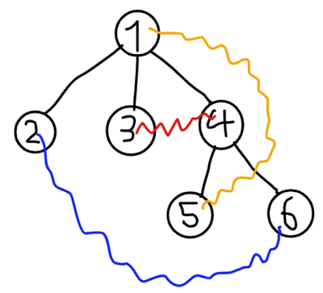

<h1 style='text-align: center;'> H. Squid Game</h1>

<h5 style='text-align: center;'>time limit per test: 2 seconds</h5>
<h5 style='text-align: center;'>memory limit per test: 256 megabytes</h5>

After watching the new over-rated series Squid Game, Mashtali and Soroush decided to hold their own Squid Games! Soroush agreed to be the host and will provide money for the winner's prize, and Mashtali became the Front Man!

$m$ players registered to play in the games to win the great prize, but when Mashtali found out how huge the winner's prize is going to be, he decided to kill eliminate all the players so he could take the money for himself!

Here is how evil Mashtali is going to eliminate players:

There is an unrooted tree with $n$ vertices. Every player has $2$ special vertices $x_i$ and $y_i$.

In one operation, Mashtali can choose any vertex $v$ of the tree. Then, for each remaining player $i$ he finds a vertex $w$ on the simple path from $x_i$ to $y_i$, which is the closest to $v$. If $w\ne x_i$ and $w\ne y_i$, player $i$ will be eliminated.

Now Mashtali wondered: "What is the minimum number of operations I should perform so that I can remove every player from the game and take the money for myself?"

Since he was only thinking about the money, he couldn't solve the problem by himself and asked for your help!

#### Input

The first line contains $2$ integer $n$ and $m$ $(1 \le n, m \le 3 \cdot 10^5)$ — the number of vertices of the tree and the number of players.

The second line contains $n-1$ integers $par_2, par_3, \ldots, par_n$ $(1 \le par_i < i)$ — denoting an edge between node $i$ and $par_i$.

The $i$-th of the following $m$ lines contains two integers $x_i$ and $y_i$ $(1 \le x_i, y_i \le n, x_i \ne y_i)$ — the special vertices of the $i$-th player.

#### Output

Print the minimum number of operations Mashtali has to perform.

If there is no way for Mashtali to eliminate all the players, print $-1$.

## Examples

#### Input


```text
6 3
1 1 1 4 4
1 5
3 4
2 6
```
#### Output


```text
2
```
#### Input


```text
5 3
1 1 3 3
1 2
1 4
1 5
```
#### Output


```text
-1
```
## Note

Explanation for the first sample:

  In the first operation, Mashtali can choose vertex $1$ and eliminate players with colors red and blue. In the second operation, he can choose vertex $6$ and eliminate the player with orange color. In the second sample, Mashtali can't eliminate the first player.


#### Tags 

#3100 #NOT OK #data_structures #dfs_and_similar #greedy #trees 

## Blogs
- [All Contest Problems](../Codeforces_Global_Round_17.md)
- [Announcement (en)](../blogs/Announcement_(en).md)
- [Tutorial (en)](../blogs/Tutorial_(en).md)
