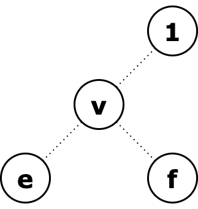
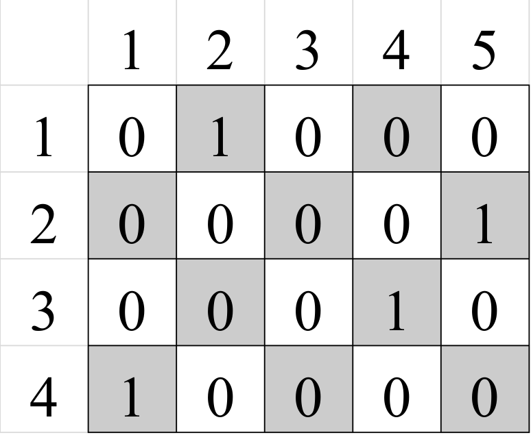
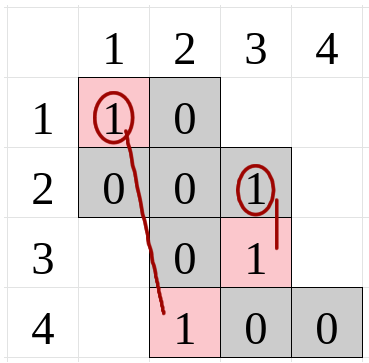

# Tutorial_(en)

[1611A - Make Even](../problems/A._Make_Even.md "Codeforces Round 756 (Div. 3)")

Idea: [MisterGu](https://codeforces.com/profile/MisterGu "Unrated, MisterGu")

 **Tutorial**
### [1611A - Make Even](../problems/A._Make_Even.md "Codeforces Round 756 (Div. 3)")

If the number is already even, then nothing needs to be done, so the answer in this case is 0.

Now let's recall the divisibility by 2: a number is divisible by 2 if and only if its last digit is divisible by 2.

It follows that if there are no even digits in our number, then the answer is -1.

Let's take a look at our operation. What is going on? The first digit always changes with the digit numbered l. In particular, when we reverse the entire number, the first digit is swapped with the last. Note that no other digit, except for the first one at the current moment, can't be the last.

Therefore, you can do this: if the first digit of a number is divisible by 2, then we reverse the whole number. The first digit will become the last, and the number will become even. Therefore, you only need to do one operation.

Now, what if the first digit of a number is odd? In this case, we can find the first even digit in the number (let it be at position x), and reverse the prefix of length x (in one operation). Now the first digit of our number has become even, and we can use the previous case (one more operation). Thus, we will do only 2 operations.

 **Solution**
```cpp
#include<bits/stdc++.h>
 
using namespace std;
 
int main() {
    int t;
    cin >> t;
    while(t--) {
        string n;
        cin >> n;
        if((n.back() - '0') % 2 == 0) {
            cout << "0n";
            continue;
        }
        if((n[0] - '0') % 2 == 0) {
            cout << "1n";
            continue;
        }
        int count_2 = count(n.begin(), n.end(), '2');
        int count_4 = count(n.begin(), n.end(), '4');
        int count_6 = count(n.begin(), n.end(), '6');
        int count_8 = count(n.begin(), n.end(), '8');
        if(count_2 > 0 || count_4 > 0 || count_6 > 0 || count_8 > 0) {
            cout << "2n";
            continue;
        }
        cout << "-1n";
    }
    return 0;
}
```
[1611B - Team Composition: Programmers and Mathematicians](../problems/B._Team_Composition:_Programmers_and_Mathematicians.md "Codeforces Round 756 (Div. 3)")

Idea: [MikeMirzayanov](https://codeforces.com/profile/MikeMirzayanov "Headquarters, MikeMirzayanov")

 **Tutorial**
### [1611B - Team Composition: Programmers and Mathematicians](../problems/B._Team_Composition:_Programmers_and_Mathematicians.md "Codeforces Round 756 (Div. 3)")

If necessary, change the values of a and b so that a≤b is always true. Consider two cases.

1. Let a≤a+b4. Then:

4a≤a+b, 3a≤b.

This means that the set b is at least 3 times larger than a, and we can form a teams of the form (1,3), where one participant will be a programmer and three will be mathematicians.

2. Let a+b4≤a. Then assume that b=a+d. Let's substitute this value into the inequality:

2a+d4≤a, 2a+d≤4a

d≤2a, d2≤a

Then we compose d2 commands of the form (1,3). Since making such a command decreases the value of d by 2. The new value a′=a−d2, b′=a′+d−2∗(d2). The condition a′≤b′ still holds. Then make a′2 commands of the form (2,2).

The total number of commands is a′2+d2=2∗a′+2∗d4=2∗a−d+2∗d4=a+(a+d)4=a+b4. That's what we wanted to get. 

 **Solution**
```cpp
#include <bits/stdc++.h>
 
using namespace std;
using ll = long long;
 
void solve() {
    ll a, b;
    cin >> a >> b;
    cout << min(min(a, b), (a + b) / 4) << 'n';
}
 
int main() {
    int t;
    cin >> t;
    for (int i = 0; i < t; ++i) {
        solve();
    }
    return 0;
}
```
[1611C - Polycarp Recovers the Permutation](../problems/C._Polycarp_Recovers_the_Permutation.md "Codeforces Round 756 (Div. 3)")

Idea: [MikeMirzayanov](https://codeforces.com/profile/MikeMirzayanov "Headquarters, MikeMirzayanov")

 **Tutorial**
### [1611C - Polycarp Recovers the Permutation](../problems/C._Polycarp_Recovers_the_Permutation.md "Codeforces Round 756 (Div. 3)")

The maximum element is always added last, so if it is not in the first or last position, then there is no answer.

Let us prove that if the permutation has its maximum element in the first or last position, then after $n$ actions we can get an expanded permutation. Indeed, the maximum element will be added last at the desired end, and all the others will be added in reverse order.

Then, if the answer exists, it is sufficient to simply unfold the permutation.

 **Solution**
```cpp
#include <bits/stdc++.h>
 
using namespace std;
 
#define forn(i, n) for (int i = 0; i < int(n); i++)
 
int main() {
    int t;
    cin >> t;
    forn(tt, t) {
        int n;
        cin >> n;
        vector<int> a(n);
        forn(i, n)
            cin >> a[i];
        if (a[0] != n && a[n - 1] != n)
            cout << -1 << endl;
        else {
            for (int i = n - 1; i >= 0; i--)
                cout << a[i] << " ";
            cout << endl;
        }
    }
}
```
[1611D - Weights Assignment For Tree Edges](../problems/D._Weights_Assignment_For_Tree_Edges.md "Codeforces Round 756 (Div. 3)")

Idea: [MikeMirzayanov](https://codeforces.com/profile/MikeMirzayanov "Headquarters, MikeMirzayanov")

 **Tutorial**
### [1611D - Weights Assignment For Tree Edges](../problems/D._Weights_Assignment_For_Tree_Edges.md "Codeforces Round 756 (Div. 3)")

Consider the cases when it is impossible to form a given permutation $p$:

1. The first vertex in the permutation is not the root of the tree. For root $u$ it is true that $dist[u]=0$. For any other vertex $i$ the value of $dist[i]$ will be positive, since there is at least one edge of positive weight on the path to it.

2. The distance to the child is less than to the parent. In a rooted tree there is exactly one path from the root to any vertex $i$, and it goes through its parent $b_i$, so it must always be true $dist[b[i]] < dist[i]$.

Let us start filling the array $dist$, where $dist[p[1]] = 0$. Consider a vertex $p[i]$, ($2 \le p[i] \le n$). The vertex whose distance at the current time is maximal is $p[i - 1]$. Then $dist[p[i]]$ is at least $dist[p[i - 1]] + 1$. We assign a value to $dist[i]$, remembering to check that $dist[b[i]]$ has already been counted.

After counting all $dist[i]$ values, we can output the lengths of the edges: $w[i] = dist[i] - dist[b[i]]$.

 **Solution**
```cpp
#include <bits/stdc++.h>
 
using namespace std;
 
void solve(){
    int n;
    cin >> n;
    vector<int> b(n + 1), p(n + 1), dist(n + 1, -1);
 
    for(int i = 1; i <= n; i++)
        cin >> b[i];
    for(int i = 1; i <= n; i++)
        cin >> p[i];
 
    if (b[p[1]] != p[1]){
        cout << -1 << 'n';
        return;
    }
 
    dist[p[1]] = 0;
    for(int i = 2; i <= n; i++){
        if(dist[b[p[i]]] == -1){
            cout << -1 << 'n';
            return;
        }
        dist[p[i]] = dist[p[i - 1]] + 1;
    }
 
    for(int i = 1; i <= n; i++) {
        cout << dist[i] - dist[b[i]] << ' ';
    }
    cout << 'n';
}
 
int main() {
    int t;
    cin >> t;
    while(t-- > 0) {
        solve();
    }
}
```
[1611E1 - Escape The Maze (easy version)](../problems/E1._Escape_The_Maze_(easy_version).md "Codeforces Round 756 (Div. 3)")

Idea: [Vladosiya](https://codeforces.com/profile/Vladosiya "Expert Vladosiya")

 **Tutorial**
### [1611E1 - Escape The Maze (easy version)](../problems/E1._Escape_The_Maze_(easy_version).md "Codeforces Round 756 (Div. 3)")

First, we need to understand when it is not possible to get to some exit $e$. Let's fix a friend who is at the vertex $f$ and try to understand if he can interfere with us. The paths from $1$ to $e$ and from $f$ to $e$ have a common part, let it start at the vertex $v$. Then, if the path from $f$ to $v$ is not more than from $1$ to $v$, it can prevent us from reaching this exit by blocking the vertex $v$. Since the path from $v$ to $e$ is common, the previous condition is equivalent to the condition that the path from $f$ to $e$ is not greater than from $1$ to $e$. Note that if there is more than one such vertex $e$, then $f$ can overlap each of them, simply by going as close to the root as possible.

  Thus, Vlad can win if there is such a leaf (which, by condition, exits) for which the distance to the root is less than the distance to any of the friends.

By running a breadth-first search at the same time from each vertex with a friend, we can find the shortest distance to any friend from each vertex and by running from the root — the distance to the root. Now let's just go through all the leaves and check if there is one among them that the distance to the root is less.

We can also run from the vertices with friends and from the root at the same time, assigning them different colors, then the color will correspond to what is closer: the root or some friend. this solution is attached to the tutorial.

There is also another solution, which is a simplified version of the one we will use in E2.

 **Solution**
```cpp
//
// Created by Vlad on 16.11.2021.
//
 
#include <bits/stdc++.h>
 
#define int long long
#define mp make_pair
#define x first
#define y second
#define all(a) (a).begin(), (a).end()
#define rall(a) (a).rbegin(), (a).rend()
 
typedef long double ld;
typedef long long ll;
 
using namespace std;
 
mt19937 rnd(143);
 
const int inf = 1e10;
const int M = 998244353;
const ld pi = atan2(0, -1);
const ld eps = 1e-4;
 
void solve() {
    int n, k;
    cin >> n >> k;
    vector<int> color(n, -1);
    deque<int> q;
    for(int i = 0; i < k; ++i){
        int x;
        cin >> x;
        color[--x] = 0;
        q.push_back(x);
    }
    color[0] = 1;
    q.push_back(0);
    vector<vector<int>> g(n);
    for(int i = 0; i < n - 1; ++i){
        int u, v;
        cin >> u >> v;
        g[--u].push_back(--v);
        g[v].push_back(u);
    }
    while(!q.empty()){
        int v = q.front();
        q.pop_front();
        for(int u: g[v]){
            if(color[u] == -1){
                color[u] = color[v];
                q.push_back(u);
            }
        }
    }
    for(int v = 1; v < n; ++v){
        if(g[v].size() == 1 && color[v] == 1){
            cout << "YES";
            return;
        }
    }
    cout << "NO";
}
 
bool multi = true;
 
signed main() {
    int t = 1;
    if (multi) {
        cin >> t;
    }
    for (; t != 0; --t) {
        solve();
        cout << "n";
    }
    return 0;
}
```
[1611E2 - Escape The Maze (hard version)](../problems/E2._Escape_The_Maze_(hard_version).md "Codeforces Round 756 (Div. 3)")

Idea: [Vladosiya](https://codeforces.com/profile/Vladosiya "Expert Vladosiya")

 **Tutorial**
### [1611E2 - Escape The Maze (hard version)](../problems/E2._Escape_The_Maze_(hard_version).md "Codeforces Round 756 (Div. 3)")

Let's learn how to find an answer for the subtree rooted in vertex $v$. At first, it is obvious from E1 tutorial that if the nearest to $v$ vertex with a friend from this subtree is no further from it than the root of the entire tree from $v$, then the answer for the entire subtree is $1$ since a friend can come to $v$ and catch Vlad in it not allowing him to go to any leaf of this subtree. Else we will find the answer leaning on its children. If a solution does not exist for at least one child, then it does not exist for the entire subtree, because after reaching $v$ Vlad will be able to go to such child and reach any exit. Otherwise, the answer for $v$ is the sum of the answers of its children, since we need to beat it in each subtree to win, and for each subtree, we have found the minimum answer.

 **Solution**
```cpp
#include <bits/stdc++.h>
 
#define int long long
#define mp make_pair
#define x first
#define y second
#define all(a) (a).begin(), (a).end()
#define rall(a) (a).rbegin(), (a).rend()
 
/*#pragma GCC optimize("Ofast")
#pragma GCC optimize("no-stack-protector")
#pragma GCC optimize("unroll-loops")
#pragma GCC target("sse,sse2,sse3,ssse3,popcnt,abm,mmx,tune=native")
#pragma GCC optimize("fast-math")
*/
typedef long double ld;
typedef long long ll;
 
using namespace std;
 
mt19937 rnd(143);
 
const int inf = 1e10;
const int M = 998244353;
const ld pi = atan2(0, -1);
const ld eps = 1e-4;
 
vector<vector<int>> sl;
vector<int> nearest;
 
int count(int v, int dist, int p = -1){
    bool children = true;
    int s = 0;
    for(int u: sl[v]){
        if(u == p) continue;
        int c = count(u, dist + 1, v);
        if(c < 0) children = false;
        nearest[v] = min(nearest[v], nearest[u] + 1);
        s += c;
    }
    if(nearest[v] <= dist) return 1;
    if(s == 0 || !children) return -1;
    return s;
}
 
void solve() {
    int n, k;
    cin >> n >> k;
    sl.assign(n, vector<int>(0));
    nearest.assign(n, n);
    for(int i = 0; i < k; ++i){
        int x;
        cin >> x;
        --x;
        nearest[x] = 0;
    }
    for(int i = 1; i  < n; ++i){
        int u, v;
        cin >> u >> v;
        --u, --v;
        sl[u].emplace_back(v);
        sl[v].emplace_back(u);
    }
    cout << count(0, 0);
}
 
bool multi = true;
 
signed main() {
    //freopen("in.txt", "r", stdin);
    //freopen("in.txt", "w", stdout);
    /*ios_base::sync_with_stdio(false);
    cin.tie(nullptr);
    cout.tie(nullptr);*/
    int t = 1;
    if (multi) {
        cin >> t;
    }
    for (; t != 0; --t) {
        solve();
        cout << "n";
    }
    return 0;
}
```
[1611F - ATM and Students](../problems/F._ATM_and_Students.md "Codeforces Round 756 (Div. 3)")

Idea: [Gol_D](https://codeforces.com/profile/Gol_D "Candidate Master Gol_D"), [MikeMirzayanov](https://codeforces.com/profile/MikeMirzayanov "Headquarters, MikeMirzayanov")

 **Tutorial**
### [1611F - ATM and Students](../problems/F._ATM_and_Students.md "Codeforces Round 756 (Div. 3)")

At first glance, this is a standard problem for ST (Segment Tree). Let's solve the problem in that way.

First, we find the prefix sums of the $a$ array and store them in $p$. Let's build an ST on the prefix array and store the min in it.

For each index $l$ $(1 \le l \le n)$, we'll make a query in ST and will find such a minimum index $r$ ($ l \le r $) that the sum on the subsegment $ [l, r] $ of the array $a$ and $ s $ will be negative, in other words $s + (p [r] -p [l-1]) \lt 0$ or $s - p [l-1] \lt -p [r]$, the sum of s is obtained and the subsegment $[l, r)$ of the array $a$ will be non-negative, in other words, $s + (p [r-1] - p [l-1]) \ge 0$. Accordingly, the correct response to the request will be $l$ and $r-1$. Of all such pairs of indices $l$ and $r-1$, we take such that the distance between them is maximal. If for all pairs $l == r$, then the answer is $-1$.

The hardest part here is the querys. Actually, here's a query that returns $r-1$ for index $l$ or $-1$ if $l == r$:


```cpp
int lower_bound_s(int v, int tl, int tr) {  
    if (tr < l || (tl == tr && s - p[l - 1] < -segment_tree[v])) {  
        return -1;  
    }  
    if (tl == tr || -segment_tree[v] <= s - p[l - 1]) {  
        return tr;  
    }  
    int m = (tl + tr) / 2;  
	  
    if (m < l) {  
        return lower_bound_s(2 * v + 1, m + 1, tr);  
    }  
    if (s - p[l - 1] < -segment_tree[2 * v]) {  
        return lower_bound_s(2 * v, tl, m);  
    }  
    int res = lower_bound_s(2 * v + 1, m + 1, tr);  
    return (res == -1) ? m : res;  
}  

```
Btw, after each request for $l$ do not forget to change in ST the element that corresponds to $p[l]$ to MAX_INT, so that it does not interfere with us.

Time complexity is $O(n \cdot log(n))$.

 **Solution**
```cpp
#include <bits/stdc++.h>

using namespace std;

typedef long long ll;

#define forn(i, n) for (int i = 0; i < int(n); i++)

vector<ll> t, a;
ll s, tl;

const ll MAX = 1'000'000'000'000'000LL;

void build(int v, int l, int r) {
	if (l == r)
		t[v] = a[l];
	else {
		int m = (l + r) / 2;
		build (v * 2, l, m);
		build (v * 2 + 1, m + 1, r);
		t[v] = min(t[v * 2], t[v * 2 + 1]);
	}
}

void update(int v, int l, int r) {
	if (l == r)
		t[v] = MAX;
	else {
		int m = (l + r) / 2;
		if (tl <= m)
			update(v * 2, l, m);
		else
			update(v * 2 + 1, m + 1, r);
		t[v] = min(t[v * 2], t[v * 2 + 1]);
	}
}

int lower_bound_s(int v, int l, int r) {
	if (r < tl || (l == r && s < -t[v])) {
		return -1;
	}
    if (l == r || -t[v] <= s) {
        return r;
    }
	int m = (l + r) / 2;

	if (m < tl) {
        return lower_bound_s(2 * v + 1, m + 1, r);
	}
	if (s < -t[2 * v]) {
        return lower_bound_s(2 * v, l, m);
	}
	int res = lower_bound_s(2 * v + 1, m + 1, r);
	return (res == -1) ? m : res;
}


int main() {
    int tests;
    cin >> tests;
    forn(tt, tests) {
        int n;
        cin >> n >> s;
        t = vector<ll>(4 * n);
        a = vector<ll>(n);
        forn(i, n) {
            cin >> a[i];
        }
        for (int i = 1; i < n; ++i) {
            a[i] += a[i - 1];
        }
        build(1, 0, n - 1);
        int first = -1, second = -2;
        for (tl = 0; tl < n; ++tl) {
            int v = lower_bound_s(1, 0, n - 1);
            if (v != -1 && v - tl > second - first) {
                first = tl + 1;
                second = v + 1;
            }
            s -= a[tl];
            if (tl != 0) s += a[tl - 1];
            update(1, 0, n - 1);
        }
        if (first == -1) {
            cout << -1;
        } else {
            cout << first << " " << second;
        }
        cout << endl;
    }
}
```
[1611G - Robot and Candies](../problems/G._Robot_and_Candies.md "Codeforces Round 756 (Div. 3)")

Idea: [MikeMirzayanov](https://codeforces.com/profile/MikeMirzayanov "Headquarters, MikeMirzayanov")

 **Tutorial**
### [1611G - Robot and Candies](../problems/G._Robot_and_Candies.md "Codeforces Round 756 (Div. 3)")

Note first that we can solve the two subtasks independently if we consider the coloring as on a chessboard, since at any move of the robot the parity of $x + y$ does not change.

Now replace the moves $(x+1, y-1)$, $(x+1, y+1)$ with moves $(x+1, y)$, $(x+1, y+1)$ respectively. This can be done because we simply shifted the rows by some value, with the Robot walking on the same cells it walked on in the original board.

Let's look at the even numbered (gray) cells:

  Changed field   Then we'll go through the columns from left to right, keeping the minimum(by size) set of cells the Robot should be in. Then the transition to the next column will be as follows. Go through the cells from bottom to top, which contain the candy. For each cell, find the closest cell of our set (find the Robot) that is above the current cell. Then we change the square from the set to the current square. If there is no robot for the square in the array, then we need to increase the answer by $1$ and add the robot to our current square (you can think of it as adding the robot to the very top square in the column and getting all the candies that were above).

In the picture, the red circles indicate the cells where we will put the robot as needed. The pink cells mean that this cell is contained in the set.

The final asymptotic depends on the implementation (you can use a set as data structure, or you can use a vector with two pointers): $O(n*m*log(n))$ and $O(n*m)$, respectively.

 **Solution**
```cpp
#include <bits/stdc++.h>
 
using namespace std;
 
#define forn(i, n) for (int i = 0; i < int(n); i++)
#define sz(v) (int)v.size()
 
const int N = 1e6 + 50;
string a[N];
 
int n,m;
int ans;
 
void solve(int sum0) {
    vector<int> v;
    for (int sum = sum0, ad = 0, pref = 0; sum < n + m; sum += 2, ad++) {
        vector<int> cur;
        int li = max(0, sum - m + 1), ri = min(n - 1, sum);
        if (li > ri) continue;
 
        for (int i = li; i <= ri; i++) {
            int j = sum - i;
 
            if (a[i][j] == '1')
                cur.emplace_back(i);
        }
 
        while (pref != sz(v) && v[pref] + ad > ri) {
            pref++;
        }
        for (int i = pref; i < sz(v); i++) {
            int new_val = v[i];
            while (!cur.empty() && cur.back() - ad >= v[i]) {
                new_val = max(new_val, cur.back() - ad);
                cur.pop_back();
            }
            v[i] = new_val;
        }
        if (!cur.empty()) {
            v.emplace_back(cur.back() - ad);
            ans++;
        }
    }
}
 
int main() {
    int t;
    cin >> t;
 
    forn(tt, t) {
        cin >> n >> m;
 
        forn(i, n) {
            string s; 
            cin >> a[i];
        }
 
        ans = 0;
        solve(0);
        solve(1);
        
        cout << ans << 'n';
    }
}
```
