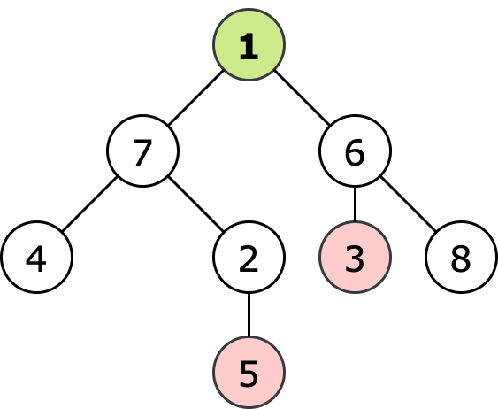
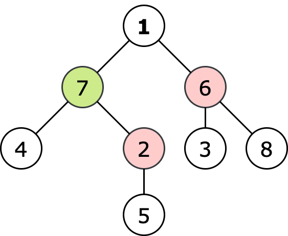
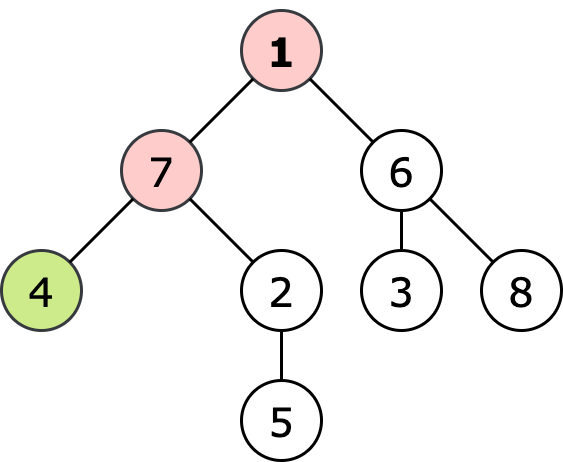

<h1 style='text-align: center;'> E1. Escape The Maze (easy version)</h1>

<h5 style='text-align: center;'>time limit per test: 2 seconds</h5>
<h5 style='text-align: center;'>memory limit per test: 256 megabytes</h5>

The only difference with E2 is the question of the problem..

Vlad built a maze out of $n$ rooms and $n-1$ bidirectional corridors. From any room $u$ any other room $v$ can be reached through a sequence of corridors. Thus, the room system forms an undirected tree.

Vlad invited $k$ friends to play a game with them.

Vlad starts the game in the room $1$ and wins if he reaches a room other than $1$, into which exactly one corridor leads.

Friends are placed in the maze: the friend with number $i$ is in the room $x_i$, and no two friends are in the same room (that is, $x_i \neq x_j$ for all $i \neq j$). Friends win if one of them meets Vlad in any room or corridor before he wins.

For one unit of time, each participant of the game can go through one corridor. All participants move at the same time. Participants may not move. Each room can fit all participants at the same time. 

Friends know the plan of a maze and intend to win. Vlad is a bit afraid of their ardor. Determine if he can guarantee victory (i.e. can he win in any way friends play).

In other words, determine if there is such a sequence of Vlad's moves that lets Vlad win in any way friends play.

### Input

The first line of the input contains an integer $t$ ($1 \le t \le 10^4$) — the number of test cases in the input. The input contains an empty string before each test case.

The first line of the test case contains two numbers $n$ and $k$ ($1 \le k < n \le 2\cdot 10^5$) — the number of rooms and friends, respectively.

The next line of the test case contains $k$ integers $x_1, x_2, \dots, x_k$ ($2 \le x_i \le n$) — numbers of rooms with friends. All $x_i$ are different.

The next $n-1$ lines contain descriptions of the corridors, two numbers per line $v_j$ and $u_j$ ($1 \le u_j, v_j \le n$) — numbers of rooms that connect the $j$ corridor. All corridors are bidirectional. From any room, you can go to any other by moving along the corridors.

It is guaranteed that the sum of the values $n$ over all test cases in the test is not greater than $2\cdot10^5$.

### Output

Print $t$ lines, each line containing the answer to the corresponding test case. The answer to a test case should be "YES" if Vlad can guarantee himself a victory and "NO" otherwise.

You may print every letter in any case you want (so, for example, the strings "yEs", "yes", "Yes" and "YES" will all be recognized as positive answers).

## Example

### Input


```text
4

8 2
5 3
4 7
2 5
1 6
3 6
7 2
1 7
6 8

3 1
2
1 2
2 3

3 1
2
1 2
1 3

3 2
2 3
3 1
1 2
```
### Output


```text
YES
NO
YES
NO
```
## Note

In the first test case, regardless of the strategy of his friends, Vlad can win by going to room $4$. The game may look like this:

  The original locations of Vlad and friends. Vlad is marked in green, friends — in red.   Locations after one unit of time.   End of the game. 
## Note

 that if Vlad tries to reach the exit at the room $8$, then a friend from the $3$ room will be able to catch him.


#### Tags 

#1700 #NOT OK #dfs_and_similar #greedy #shortest_paths #trees #two_pointers 

## Blogs
- [All Contest Problems](../Codeforces_Round_756_(Div._3).md)
- [Announcement](../blogs/Announcement.md)
- [Tutorial (en)](../blogs/Tutorial_(en).md)
