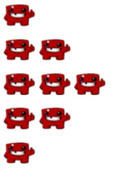

<h1 style='text-align: center;'> C. Chat Ban</h1>

<h5 style='text-align: center;'>time limit per test: 2 seconds</h5>
<h5 style='text-align: center;'>memory limit per test: 512 megabytes</h5>

You are a usual chat user on the most famous streaming platform. Of course, there are some moments when you just want to chill and spam something.

More precisely, you want to spam the emote triangle of size $k$. It consists of $2k-1$ messages. The first message consists of one emote, the second one — of two emotes, ..., the $k$-th one — of $k$ emotes, the $k+1$-th one — of $k-1$ emotes, ..., and the last one — of one emote.

For example, the emote triangle for $k=3$ consists of $5$ messages:

  Of course, most of the channels have auto moderation. Auto moderator of the current chat will ban you right after you spam at least $x$ emotes in succession (you can assume you are the only user in the chat). Now you are interested — how many messages will you write before getting banned? Or maybe you will not get banned at all (i.e. will write all $2k-1$ messages and complete your emote triangle successfully)? 
## Note

 that if you get banned as a result of writing a message, this message is also counted.

You have to answer $t$ independent test cases.

### Input

The first line of the input contains one integer $t$ ($1 \le t \le 10^4$) — the number of test cases. The next $t$ lines describe test cases.

The only line of the test case contains integers $k$ and $x$ ($1 \le k \le 10^9; 1 \le x \le 10^{18}$).

### Output

For each test case, print the number of messages you will write before getting banned for the corresponding values $k$ and $x$.

## Example

### Input


```text
7
4 6
4 7
1 2
3 7
2 5
100 1
1000000000 923456789987654321
```
### Output


```text
3
4
1
4
3
1
1608737403
```
## Note

Let's analyze the test cases of the example.

1. In the first test case, you write three messages containing $1$, $2$ and $3$ emotes respectively, and since $1 + 2 + 3 \ge 6$, you get banned after that.
2. In the second test case, you write four messages containing $1$, $2$, $3$ and $4$ emotes respectively, and since $1 + 2 + 3 + 4 \ge 7$, you get banned after that.
3. In the third test case, you write one message containing exactly $1$ emote. It doesn't get you banned, since $1 < 2$, but you have already finished posting your emote triangle. So you wrote one message successfully.
4. In the fourth test case, you write four messages containing $1$, $2$, $3$ and $2$ emotes respectively, and since $1 + 2 + 3 + 2 \ge 7$, you get banned after that.
5. In the fifth test case, you write three messages containing $1$, $2$ and $1$ emote respectively. It doesn't get you banned, since $1 + 2 + 1 < 5$, but you have already finished posting your emote triangle. So you wrote three messages successfully.
6. In the sixth test case, since $x = 1$, you get banned as soon as you send your first message.
7. The seventh test case is too large to analyze, so we'll skip it.


#### Tags 

#1300 #NOT OK #binary_search #math 

## Blogs
- [All Contest Problems](../Educational_Codeforces_Round_117_(Rated_for_Div._2).md)
- [Announcement](../blogs/Announcement.md)
- [Tutorial](../blogs/Tutorial.md)
