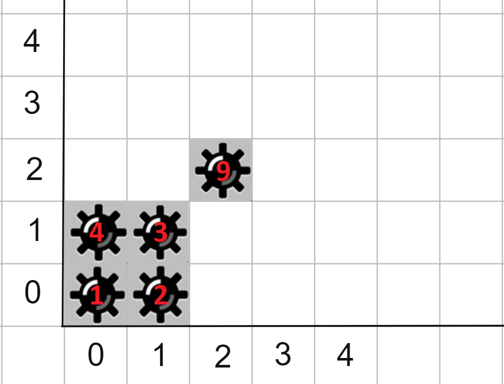
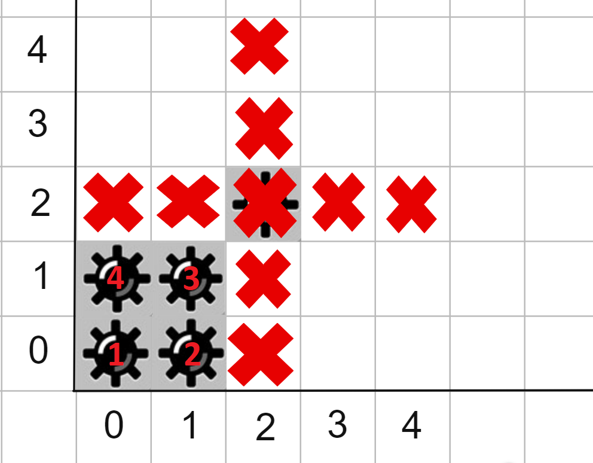

<h1 style='text-align: center;'> G. Unusual Minesweeper</h1>

<h5 style='text-align: center;'>time limit per test: 2 seconds</h5>
<h5 style='text-align: center;'>memory limit per test: 256 megabytes</h5>

Polycarp is very fond of playing the game Minesweeper. Recently he found a similar game and there are such rules.

There are mines on the field, for each the coordinates of its location are known ($x_i, y_i$). Each mine has a lifetime in seconds, after which it will explode. After the explosion, the mine also detonates all mines vertically and horizontally at a distance of $k$ (two perpendicular lines). As a result, we get an explosion on the field in the form of a "plus" symbol ('+'). Thus, one explosion can cause new explosions, and so on.

Also, Polycarp can detonate anyone mine every second, starting from zero seconds. After that, a chain reaction of explosions also takes place. Mines explode instantly and also instantly detonate other mines according to the rules described above.

Polycarp wants to set a new record and asks you to help him calculate in what minimum number of seconds all mines can be detonated.

### Input

The first line of the input contains an integer $t$ ($1 \le t \le 10^4$) — the number of test cases in the test.

An empty line is written in front of each test suite.

Next comes a line that contains integers $n$ and $k$ ($1 \le n \le 2 \cdot 10^5$, $0 \le k \le 10^9$) — the number of mines and the distance that hit by mines during the explosion, respectively.

Then $n$ lines follow, the $i$-th of which describes the $x$ and $y$ coordinates of the $i$-th mine and the time until its explosion ($-10^9 \le x, y \le 10^9$, $0 \le timer \le 10^9$). It is guaranteed that all mines have different coordinates.

It is guaranteed that the sum of the values $n$ over all test cases in the test does not exceed $2 \cdot 10^5$.

### Output

Print $t$ lines, each of the lines must contain the answer to the corresponding set of input data  — the minimum number of seconds it takes to explode all the mines.

## Example

### Input


```text
3

5 0
0 0 1
0 1 4
1 0 2
1 1 3
2 2 9

5 2
0 0 1
0 1 4
1 0 2
1 1 3
2 2 9

6 1
1 -1 3
0 -1 9
0 1 7
-1 0 1
-1 1 9
-1 -1 7
```
### Output


```text
2
1
0
```
## Note

  Picture from examples First example: 

* $0$ second: we explode a mine at the cell $(2, 2)$, it does not detonate any other mine since $k=0$.
* $1$ second: we explode the mine at the cell $(0, 1)$, and the mine at the cell $(0, 0)$ explodes itself.
* $2$ second: we explode the mine at the cell $(1, 1)$, and the mine at the cell $(1, 0)$ explodes itself.

Second example:

* $0$ second: we explode a mine at the cell $(2, 2)$ we get:

  * $1$ second: the mine at coordinate $(0, 0)$ explodes and since $k=2$ the explosion detonates mines at the cells $(0, 1)$ and $(1, 0)$, and their explosions detonate the mine at the cell $(1, 1)$ and there are no mines left on the field.


#### Tags 

#2000 #NOT OK #binary_search #dfs_and_similar #dsu #greedy #sortings 

## Blogs
- [All Contest Problems](../Codeforces_Round_762_(Div._3).md)
- [Announcement](../blogs/Announcement.md)
- [Tutorial (en)](../blogs/Tutorial_(en).md)
