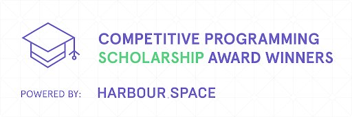
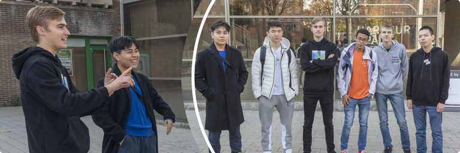

# Announcement

Hello Codeforces!

On [Saturday, December 18, 2021 at 21:35UTC+6](https://codeforces.com/https://www.timeanddate.com/worldclock/fixedtime.html?day=18&month=12&year=2021&hour=18&min=35&sec=0&p1=166) [Educational Codeforces Round 119 (Rated for Div. 2)](https://codeforces.com/contest/1620 "Educational Codeforces Round 119 (Rated for Div. 2)") will start. **Please, note the unusual start time.**

Series of Educational Rounds continue being held as [Harbour.Space University](https://codeforces.com/https://harbour.space/) initiative! You can read the details about the cooperation between [Harbour.Space University](https://codeforces.com/https://harbour.space/) and Codeforces in the [blog post](//codeforces.com/blog/entry/51208).

This round will be **rated for the participants with rating lower than 2100**. It will be held on extended ICPC rules. The penalty for each incorrect submission until the submission with a full solution is 10 minutes. After the end of the contest you will have 12 hours to hack any solution you want. You will have access to copy any solution and test it locally.

You will be given **6 or 7 problems** and **2 hours** to solve them.

The problems were invented and prepared by Adilbek [adedalic](https://codeforces.com/profile/adedalic "International Master adedalic") Dalabaev, Vladimir [vovuh](https://codeforces.com/profile/vovuh "Master vovuh") Petrov, Ivan [BledDest](https://codeforces.com/profile/BledDest "International Grandmaster BledDest") Androsov, Maksim [Neon](https://codeforces.com/profile/Neon "Candidate Master Neon") Mescheryakov, Roman [Roms](https://codeforces.com/profile/Roms "Master Roms") Glazov and me. Also huge thanks to Mike [MikeMirzayanov](https://codeforces.com/profile/MikeMirzayanov "Headquarters, MikeMirzayanov") Mirzayanov for great systems Polygon and Codeforces.

Good luck to all the participants!

Our friends at Harbour.Space also have a message for you:

*Hello once again, Codeforces!* 

*Almost 5 months have passed since we organized the Harbour.Space Scholarship Contest 2021-2022. It’s been quite a tough challenge with more than 15,000 participants. However, we were able to select the ones who were ready to take the opportunity and join Harbour.Space this year. In addition to the contest, we carefully reviewed all scholarship applications and awarded a total of 11 students.*

*We would like to introduce you our Competitive Programming Scholarship Winners who have already arrived to Barcelona:*

*[aniervs](https://codeforces.com/profile/aniervs "Candidate Master aniervs"), [MaksymOboznyi](https://codeforces.com/profile/MaksymOboznyi "Grandmaster MaksymOboznyi"), [244mhq](https://codeforces.com/profile/244mhq "Legendary Grandmaster 244mhq"), [Meijer](https://codeforces.com/profile/Meijer "Grandmaster Meijer"), [bthero](https://codeforces.com/profile/bthero "Grandmaster bthero"),[amanbol](https://codeforces.com/profile/amanbol "Master amanbol"), [DimmyT](https://codeforces.com/profile/DimmyT "Master DimmyT"), [998kover](https://codeforces.com/profile/998kover "International Grandmaster 998kover")*

*We are looking forward to achieving incredible results with our new ICPC teams. One of them, Harbour.Backspace ([MaksymOboznyi](https://codeforces.com/profile/MaksymOboznyi "Grandmaster MaksymOboznyi"), [244mhq](https://codeforces.com/profile/244mhq "Legendary Grandmaster 244mhq"), [998kover](https://codeforces.com/profile/998kover "International Grandmaster 998kover")), has already finished in 3rd place during Moscow Workshops. We wish them the best in the upcoming contests.*

*As usual, we are always excited to see Codeforces participants as our students here at Harbour.Space*

**UPD:** [Editorial is out](Tutorial.md)

