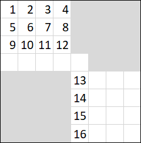
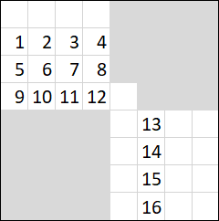

# Hello_2022_Editorial_(en)

Thank you for participation! Here is the editorial:

[1621A - Stable Arrangement of Rooks](../problems/A._Stable_Arrangement_of_Rooks.md "Hello 2022")

 **Editorial**
### [1621A - Stable Arrangement of Rooks](../problems/A._Stable_Arrangement_of_Rooks.md "Hello 2022")

It is easy to see that if there are two rooks in the neighbouring rows we can move one of them to the another of these two rows, so there shouldn't be two rooks in the neighbouring rows in a stable arrangement.

Let's split chessboard into ⌈n2⌉ regions in the following way: region 1 contains all cells of rows 1, 2, region 2 contains all cells of rows 3, 4 and so on. The last region can contain cells of only one row if n is odd. We had shown that there can't be two rooks in one region so if k>⌈n2⌉=⌊n+12⌋ there is no stable arrangement.

We can always place k≤⌊n+12⌋ rooks into cells (1,1), (3,3), …, (2k−1,2k−1). Such arrangement is stable because after moving any rook to the neighbouring row it will be in the same collumn and in the even numbered row where there are no other rooks. The same applies for moving rook to the neighbouring collumn.

Actually, we can show that condition from the first paragraph combined with the same condition for collumns is sufficient and necessary criterion for stable placement.

Bonus: how many stable arrangements exist?

 **Solution**[141571728](https://codeforces.com/contest/1621/submission/141571728 "Submission 141571728 by IgorI")

[1621B - Integers Shop](../problems/B._Integers_Shop.md "Hello 2022")

 **Editorial**
### [1621B - Integers Shop](../problems/B._Integers_Shop.md "Hello 2022")

Let L be the minimum integer Vasya will buy and R be the maximum integer Vasya will buy. Then it is easy to see that he will get all integers between L and R and only them after receiving a gift.

Because Vasya wants to maximise the number of integers he will get, he should buy the smallest and the largest integers available in the shop. They can either appear in the same segment or in different segments. It is important to note that if they appear in the same segment, then it is the longest one.

Let's add the segments to shop one by one and maintain the following six values: 

* The smallest integer in the shop and the cost of the cheapest segment that contains it.
* The largest integer in the shop and the cost of the cheapest segment that contains it.
* The length of the longest segment and the cost of the cheapest of such segments.

 It is easy to see that when we add new segment this values can only be updated by parameters of the new segment.When we know all this values it is easy to find how many coins Vasya will spend in the shop.

Total time complexity of this solution is O(n). There are other solutions (for example, solution with sets) that runs in O(nlogn).

 **Solution**[141572205](https://codeforces.com/contest/1621/submission/141572205 "Submission 141572205 by IgorI")

[Solution with sets](https://codeforces.com/contest/1621/submission/141572289)

[1621C - Hidden Permutations](../problems/C._Hidden_Permutations.md "Hello 2022")

 **Editorial**
### [1621C - Hidden Permutations](../problems/C._Hidden_Permutations.md "Hello 2022")

At first, let's solve this problem when p is a cycle of length n. It can be done by asking for q1 for n times. After this, we will receive 1, p1, pp1, ppp1,… in this order. Since p is a cycle, each x will appear once in this sequence. The next element after x will be px.

When p is not a cycle we can determine the cycle containing the first element of permutation by asking such queries. Actually, we can stop asking queries after receiving 1, thus determining this cycle in len+1 queries, where len is the length of this cycle. We can determine other cycles in the same way. 

We will ask n queries to determine all elements and one more query for determining each cycle end, that is not more than 2n queries.

 **Solution**[141572393](https://codeforces.com/contest/1621/submission/141572393 "Submission 141572393 by IgorI")

[1621D - The Winter Hike](../problems/D._The_Winter_Hike.md "Hello 2022")

 **Editorial**
### [1621D - The Winter Hike](../problems/D._The_Winter_Hike.md "Hello 2022")

Let's say that if for cell (i,j), ci,j=0 then it is covered with snow but the cost of removing snow from this cell is 0. It is obvious that we should remove all the snow in the bottom right corner of the grid.

In the case n=1 we should remove the snow from the exactly one of the remaining cells.

Now concider only the friends in cells (1,1), (1,n), (n,n), (n,1). The first operation that will affect any of them is either operation in the 1-st or in the n-th row or operation in the 1-st or in the n-th column. After any of these operaions one of them will be in one of the following cells: (2n,1), (1,2n), (2n,n), (1,n+1), (n+1,n), (n,n+1), (n+1,1), (n,2n). So we should remove snow from at least one of these cells.

Now we can show that it is actually enough to remove snow from exactly one of these cells. Let's assume that we removed snow from (n,n+1). All other cells are identical.

Then you can move your friends from the n-th row to the (n+1)-th column in 2n moves as follows: 

* Move all your friends in the n-th row to the next cell of this row.
* Move all your friends in the (n+1)-th column to the next cell of this column.
* Repeat these two operations n−1 more times.

After this, your friends will stand in the following cells: 

  Here, gray cells are covered with snow. Each integer denotes one of your friends.  Now you can move all your friends in the bottom right corner to the right (once) and move all your friends in the top left square to the bottom (once). After this, they will stand in the following cells:   Now it is easy to see, how to move friends that initially were in the (n−1)-th row to the bottom right corner. By repeation these sequences of operations you can help your friends to finish the trip.

 **Solution**[141572457](https://codeforces.com/contest/1621/submission/141572457 "Submission 141572457 by IgorI")

[1621E - New School](../problems/E._New_School.md "Hello 2022")

 **Editorial**
### [1621E - New School](../problems/E._New_School.md "Hello 2022")

Suppose, that you know average ages of each group of studens avg1,avg2,…,avgm. How can we check whether we can start lessons? Let's sort this ages and ages of teachers in the decreasing order. Now we have avg1≥avg2≥…≥avgm and a1≥a2≥…≥an. In all the following solution I will assume that average ages of students and teachers are sorted in the decreasing order.

Let's show that we can start lessons if and only if avgi≤ai for all 1≤i≤m. If avgi>ai for some i then the eldest i groups can be assigned only to the i−1 eldest teachers, so there is no possible assignment. Otherwise we can assign the i-th group to the i-th teacher.

When one of the students refuse to study, only one value of avgi changes to the new value x. Let's denote the new position of this group in the sorted list as j. Then all groups on positions between i and j will move by 1 towards the initial position of group i.

This position j can be easily found with binary search. Then we can compare aj and x, ak with avgk for groups that haven't move and ak with avgk±1 for groups that have moved to the neighbouring positions. It can be easy done with prefix sum arrays.

We can also show that we can do binary search in each group, but it doesn't decrease time complexity (for example, in case when all groups are small).

 **Solution**[141572555](https://codeforces.com/contest/1621/submission/141572555 "Submission 141572555 by IgorI")

[1621F - Strange Instructions](../problems/F._Strange_Instructions.md "Hello 2022")

 **Editorial**
### [1621F - Strange Instructions](../problems/F._Strange_Instructions.md "Hello 2022")

From the rule 4 it follows that the sequence of types of operations looks like …, (1 or 3), 2, (1 or 3), 2, (1 or 3), ….

One can suppose that operation 1 is "better" than operation 3 so we can (in optimal solution) do all operations of type 3 after all operations of type 1. However it is now always the truth: for example for s=00101 with large a and b and small c it is optimal to do operations of types 3, 2 and 1 in this order to get profit of a+b−c (00101→0011→011→01). But it turns out that it is the only case when we should do operation of type 1 after the operation of the type 3: we can do no more than one such operation 1 and we can do it in the end. I will prove it later.

Now we know how does the operation sequence look like. Let's now think what zeroes and ones we will remove on each step. Obviously, the only case we should use operation of type 3 is to remove the last 0 in the block (block of zeroes or ones is the unextendable substring constisting only of zeroes or ones) otherwise we can use the operation of type 1. 

Let's now think that string is a sequence of blocks. Obiviously, all zeroes/ones in one block are indistinguishable. Let's look how does the number of possible operations of type 2 changes after each operation. It is the number of ones minus the number of blocks of ones. After the operation of type 1 the blocks structure doesn't changes; after the operation of type 2 the blocks structure also doesn't change but the number of ones reduces by one; after the operation of type of 3 the number of ones doesn't change, but two blocks of ones are merged together (if we removed not the first or last block). 

So, the number of possible operations of type 2 decreaces by one after the operation of type 2 and can increase by one after the operation of type 3. Also we can see that the operation of type 2 can't affect any block of zeroes in any way. From here it follows that all operations of type 2 are indistinguishable and we should only care about the amount of possible such operations. 

Also it follows that using operation 3 to remove one of the middle blocks is always better than using operation 3 to remove the block from the side. 

Also it follows that if we have no possible operation of type 2 remaining the only way to not stop doing operations it to do operation of type 3 with one of the middle blocks. However, after it we will do operation of type 2 and will come back to this situation again. Here, in cases b<c or no operation of type 3 available we can do operation of type 1 (if it is possible) and stop. 

I claim that the case above is the only case when we should do the operation of type 1 after the operation 3. Assume it is not. Then we have consecutive operations of types 3, 2, 1, 2 in this order. Then we had possible operations of type 2 before the first of these operations and operations of types 1 and 3 are applied to the different blocks. Thus we can make the same operations in the order 1, 2, 3, 2 and don't change the answer (we don't care what block to we apply the type 2 operation). So there is an optimal sequence of operations without consecutive operations 3, 2, 1, 2. 

Well, we know much enough about operations of types 2 and 3. Now let's go to the operation of type 1. When we will start making operations of type 3? There are two cases: we cannot make any operation of type 1 or we have no possible operations of type 2. In the first case we will make all possible operations of type 1 so it doesn't matter in what order we will do them. In the second case we will never come back to the operations of type 1 except the last operation, so we should prepare as much blocks of length 1 as possible. The best way to do this is to remove zeroes from the shortest block except the corner blocks on each operation, and then remove zeroes from the corner blocks.

I claim that this is enough to solve the problem. It seems that there are too many cases but all of them are covered by the algorithm below.

Let's fix the parity of the first operation type to simplify the implementation, so on each step we will know the parity of the type of operation we should do next.

Now the algorithm is (after each operation we should try to update the answer): 

* If we should do the operation of type 2:
	+ If we can do it, we do it.
	+ Otherwise, we should terminate.
* If we should do the operation of type 1 or 3:
	+ If there are no possible operations of type 2:
		- If we can do operation of type 1, we should try to do it (but don't actually do it) and update the answer. It it the last operation in this case.
		- If we can do operation of type 3 and remove one of the center blocks, we should do it.
		- Otherwise, we should terminate.
	+ If there are possible operations of type 2:
		- If we can do operation of type 1 on one of the middle blocks, we should do it on the one of the shortest middle blocks.
		- Otherwise, if we can do operation of type 1 on one of the corner blocks, we should do it.
		- Otherwise, if we can do operation of type 3 on one of the middle blocks, we should do it.
		- Otherwise, if we can do operation of type 3 on one of the corner blocks, we should do it.
		- Otherwise, we should terminate.

It covers all the cases and works in O(n). Total complexity is O(nlogn) because of sorting.

Bonus: s is given, calculate answers for q queries with a, b, c faster than in O(nq).

 **Solution**[141572624](https://codeforces.com/contest/1621/submission/141572624 "Submission 141572624 by IgorI")

[1621G - Weighted Increasing Subsequences](../problems/G._Weighted_Increasing_Subsequences.md "Hello 2022")

 **Editorial**Tutorial is loading... **Solution**[141572701](https://codeforces.com/contest/1621/submission/141572701 "Submission 141572701 by IgorI")

[1621H - Trains and Airplanes](../problems/H._Trains_and_Airplanes.md "Hello 2022")

 **Editorial**
### [1621H - Trains and Airplanes](../problems/H._Trains_and_Airplanes.md "Hello 2022")

Let scansv,i be the number of scans in the i-th zone if we start from the vertex v and scansv,zv=0.

Note that scans doesn't change during queries.

Now our task is to calculate ∑z∈zonesmin(scansv,z⋅finez,passz) over some set of vertices Ai described in the i-th query. 

It is important to note that for any two vertices v1,v2∈Ai and any zone z holds |scansv1,z−scansv2,z|≤1. From this, we can see that there are no more than O(2k) different values of scansv for v∈Ai, so we don't need to check all vertices in Ai to find the answer. However, it is still quite a lot.

Let minscansz be the min value of scansv,z for v∈Ai. For some vertices v we will have minscansz scans in zone z and minscansz+1 scans for other vertices.

Actually, we can look at the moment t we escape the start zone (zone that contains the airport). For each zone z there is a segmentmodT such that if t lies in it we will have minscansz scans in this zone and we will have minscansz+1 scans otherwise.

Let's suppose we are going to do something like sweepline on this segments. There are O(k) segments and they can split themodT circle into at most O(k) sections. This is how we get that we actually should check not more that 2k vertices in order to find answer for each query.

What about the implementation part, we should be able to find where we escape the start zone (let's call this vertex V) and the time we spend on the road from any vertex to the vertex 1. It can be easily done with dfs. Also we should be able to calculate scansV. We can do it in O(k) by repeatedly going to the next vertex of the path in another zone. While doing this we can also findmodT segments when we should escape the start zone in order to have less scans in each zone: if we start from vertex V and we are in the zone z at the segment of moments [tl,tr], then we will have to pay additional fine in zone z if we pass through V at one of moments [T−tr,T−tl](modT). Then we will do sweepline algorithm on this segments to find the segments of times we are interested in. The last thing we should be able to do is to determine in which of previouly descibed segments there are vertices in Ai. It can be done by computing this segment for each vertex and then merging this values by dfs.

During answering the query we can iterate over all previouly descibed segments and update answer in case we have vertex in this segment. In order to reduce time complexity of answering query from O(k2) to O(k) we should actually perform such sweepline and maintain current answer and precompute whether we have vertices in this section.

It is how we can get O(nklogk+qk) solution with O(nk) memory. We can also do all calculations in place and solve this problem with O(n) memory in O(nklogk+qklogk) which is not much slower.

It seems that this problem is somehow connected with real life so you can be interested how such descripion of set of vertices in queries was obtained. Assume that tourist already was in this airport. He bought the ticket at the station near the airport but activated it only at the station u in the same zone. At the moment of query he had this ticket and it contained some information about activation.

Bonus (unsolved): can you support some of the other change queries (road lengths, tree structure, zones of stations, constant T)?

 **Solution**[141572824](https://codeforces.com/contest/1621/submission/141572824 "Submission 141572824 by IgorI")

[Memory optimized](https://codeforces.com/contest/1621/submission/141572780)

[1621I - Two Sequences](../problems/I._Two_Sequences.md "Hello 2022")

 **Editorial**Tutorial is loading... **Solution**[141588291](https://codeforces.com/contest/1621/submission/141588291 "Submission 141588291 by IgorI")

