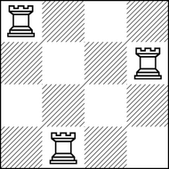

<h1 style='text-align: center;'> A. Stable Arrangement of Rooks</h1>

<h5 style='text-align: center;'>time limit per test: 1 second</h5>
<h5 style='text-align: center;'>memory limit per test: 256 megabytes</h5>

You have an $n \times n$ chessboard and $k$ rooks. Rows of this chessboard are numbered by integers from $1$ to $n$ from top to bottom and columns of this chessboard are numbered by integers from $1$ to $n$ from left to right. The cell $(x, y)$ is the cell on the intersection of row $x$ and collumn $y$ for $1 \leq x \leq n$ and $1 \leq y \leq n$.

The arrangement of rooks on this board is called good, if no rook is beaten by another rook.

A rook beats all the rooks that shares the same row or collumn with it.

The good arrangement of rooks on this board is called not stable, if it is possible to move one rook to the adjacent cell so arrangement becomes not good. Otherwise, the good arrangement is stable. Here, adjacent cells are the cells that share a side.

  Such arrangement of $3$ rooks on the $4 \times 4$ chessboard is good, but it is not stable: the rook from $(1, 1)$ can be moved to the adjacent cell $(2, 1)$ and rooks on cells $(2, 1)$ and $(2, 4)$ will beat each other. Please, find any stable arrangement of $k$ rooks on the $n \times n$ chessboard or report that there is no such arrangement.

### Input

The first line contains a single integer $t$ ($1 \leq t \leq 100$) — the number of test cases.

The first line of each test case contains two integers $n$, $k$ ($1 \leq k \leq n \leq 40$) — the size of the chessboard and the number of rooks.

### Output

If there is a stable arrangement of $k$ rooks on the $n \times n$ chessboard, output $n$ lines of symbols . and R. The $j$-th symbol of the $i$-th line should be equals R if and only if there is a rook on the cell $(i, j)$ in your arrangement.

If there are multiple solutions, you may output any of them.

If there is no stable arrangement, output $-1$.

## Example

### Input


```text
53 23 31 15 240 33
```
### Output

```text

..R
...
R..
-1
R
.....
R....
.....
....R
.....
-1
```
## Note

In the first test case, you should find stable arrangement of $2$ rooks on the $3 \times 3$ chessboard. Placing them in cells $(3, 1)$ and $(1, 3)$ gives stable arrangement.

In the second test case it can be shown that it is impossbile to place $3$ rooks on the $3 \times 3$ chessboard to get stable arrangement.


#### Tags 

#800 #NOT OK #constructive_algorithms 

## Blogs
- [All Contest Problems](../Hello_2022.md)
- [Hello 2022](../blogs/Hello_2022.md)
- [Hello 2022 Editorial (en)](../blogs/Hello_2022_Editorial_(en).md)
