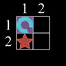
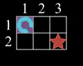

# Tutorial_(en)

In my opinion, all of the problems have a very simple solution and actually require no special data structure at all. To demonstrate the point, I will also use EvErYoNe'S fAvOrItE lAnGuAgE: **Pascal**.

I will also include some notes, which are not related to the solution at all, but I find them interesting, so I will also include them in.

[A. Robot Cleaner](../problems/A._Robot_Cleaner.md)
-----------------------------------------------------------------

Obviously, the problem is solvable using simulation. But it is solvable in O(1)O(1) time as well, and I will discuss it.

 **Tutorial**
### [1623A - Robot Cleaner](../problems/A._Robot_Cleaner.md "Codeforces Round 763 (Div. 2)")

Let's consider the 1-D problem of this problem: there are n cells, lying in a row. The robot is at the x-th cell, and the dirty cell is at the y-th cell. Each second, the robot cleans the cell at its position. The robot initially moves by 1 cell to the right each second. If there is no cell in the movement direction, its direction will be reflected. What is the minimum time for the robot to clean the dirty cell?

There are two cases needed to be considered: 

* If x≤y, then the answer is y−x. The robot just goes straight to the dirty cell.
* Otherwise, if x>y, then the robot needs to go to the right endpoint first, and then go back to the dirty cell. Going to the right endpoint takes n−x seconds, and going from that cell to the dirty cell takes n−y seconds. Therefore, the answer for this case is 2⋅n−x−y.

Going back to our original problem, we can solve it by dividing it into two 1-D versions. This is done by projecting the position of the robot and the dirty cell onto the Ox and Oy axis as follows.

  By doing so, we can see that we can clean the dirty cell, if and only if one of the projections of the robot can reach the dirty cell. Therefore, the answer is the minimum between the answers of the two sub-problems.

 **Problem note*** Yes, I purposely make the constraint small. Firstly, the simulation solution is straightforward to think of, and I think everyone should be able to do it. But secondly, I wanted to see high-rated people suffering from going too fast :).
* I hope that you like the animation! If you didn't know it yet, I use the library called [Manim](https://codeforces.com/https://www.manim.community/), created by [3Blue1Brown](https://codeforces.com/https://www.youtube.com/c/3blue1brown). He has a lot of great content about math with excellent animation. So if you wanted to see the illustrations in higher quality, or see the illustration of the other input, here is my [Jupyter Notebook on Google Colab](https://codeforces.com/https://colab.research.google.com/drive/1vktCjRZiiGr0grAw68lTaZDqvJ8OJin3?authuser=1#scrollTo=2YqkyZZl_glG), that you can run directly and see it. The first example is already rendered but seems like the file is too big, and Google asks for a login first to see it.
* Making the animation is one process, but uploading it is another. Polygon only supported a PNG file with the maximum size of 1 MB, so I need to first compress the GIF, and then convert it to APNG (animated PNG). The process is a little painful tho. Not only do I need the external tool for compression, but I need to reduce the playtime of the animation as well (so the other example besides the first one is faster).
Pascal solution: [140968868](https://codeforces.com/contest/1623/submission/140968868). C++ solution: [140968900](https://codeforces.com/contest/1623/submission/140968900)

[B. Game On Ranges](../problems/B._Game_on_Ranges.md)
------------------------------------------------------------------

There are a lot of solutions to this problem. The solution I described below might be the simplest in my opinion.

 **Tutorial**
### [1623B - Game on Ranges](../problems/B._Game_on_Ranges.md "Codeforces Round 763 (Div. 2)")

If the length of a range [l,r] is 1 (that is, l=r), then d=l=r. Otherwise, if Bob picks a number d, then Alice has to put the sets [l,d−1] and [d+1,r] (if existed) back to the set. Thus, there will be a moment that Alice picks the range [l,d−1] (if existed), and another moment to pick the range [d+1,r] (if existed) as well.

Using the above observation, for each range [l,r], we can iterate the number d from l to r, check if both range [l,d−1] (if d>l) and [d+1,r] (if d<r) existed in the Alice's picked ranges. Or in other words, check if these ranges are given in the input.

For checking, we can either use set data structures supported in most programming languages or simply use a 2-dimensional array for marking the picked ranges. The time complexity is, therefore, O(n2).

 This problem can be solved in O(nlogn) as well, and even O(n) with some black magic like counting sort, but that is not required during the contest. **Problem note*** The game process is actually inspired by *Quick sort*: the range, picked by Alice, is the sorting range, and the number, picked by Bob, is the pivot.
* Testers really like sorting. Some of the testers demand ***order*** for the input, so they need to do the sorting. But Nah, that is totally not required :)
Pascal solution: [140968967](https://codeforces.com/contest/1623/submission/140968967). C++ solution: [140968942](https://codeforces.com/contest/1623/submission/140968942)

[C. Balanced Stone Heaps](../problems/C._Balanced_Stone_Heaps.md)
------------------------------------------------------------------------

 **Tutorial**
### [1623C - Balanced Stone Heaps](../problems/C._Balanced_Stone_Heaps.md "Codeforces Round 763 (Div. 2)")

The answer can be binary searched. That is, we can find the biggest number x, such that we can make all heap having at least x stones. So our job here is to check if we can satisfy the said condition with a number x.

Let's consider a reversed problem: we go from 1 to n−2, pick a number d (0≤3⋅d≤hi), move d and 2⋅d stones from the i-th heap to the i+1 heap and i+2-th heap respectively. In this problem, we can greedily move the stones: since x is the minimum required stones, if at some moment, we have hi<x, then we can not satisfy the condition for x anymore. Otherwise, it is always the best to use as many stones as we can, that is, choose d=⌊hi−x3⌋, and move d and 2⋅d stones to the i+1 and i+2 heaps respectively. In the end, if all the heap are not less than x, we can conclude that we can make all heaps having not less than x stones with this process.

Going back to our original problem, it seems like we can solve it by doing the process in the reversed order, as discussed above. But there is a catch! The number of stones that can be moved must not exceed the number of the stones in the original heap! So, if we call hi — the original heap size, and h′i — the current modified heap size, then the number of stones that we should move is d=⌊min{hi,h′i−x}3⌋ at each step.

There is not much to note about this problem.

Pascal solution: [140968985](https://codeforces.com/contest/1623/submission/140968985) C++ solution: [140969004](https://codeforces.com/contest/1623/submission/140969004)

[D. Robot Cleaner Revisit](../problems/D._Robot_Cleaner_Revisit.md)
-------------------------------------------------------------------------

 **Tutorial**
### [1623D - Robot Cleaner Revisit](../problems/D._Robot_Cleaner_Revisit.md "Codeforces Round 763 (Div. 2)")

In order to see how my solution actually works, let's solve this problem, the math way! You can skip to the "In general, ..." part if you don't really care about these concrete examples.

First of all, let ¯p be the probability of not cleaning, that is, the probability that the robot will not be able to clean. So ¯p=1−p100.

Let's revisit the first example again. 

  In this example, the robot has 2 states: when it was at position (1,1), and when it was at (2,2). Let x be the answer for this problem when the robot started at (1,1), and y be the answer for this problem when the robot started at (2,2).

Let's consider the first state. If the robot can clean, it spends 0 seconds to clean the dirty cell. Otherwise, it will spend 1+y seconds. Therefore, we have an equation: x=¯p(1+y).

Similarly, we also have the an equation: y=¯p(1+x), since these two states are symetrical. Subtituding y=¯p(1+x) into x=¯p(1+y), we have

x=¯p(1+¯p(1+x))

By substituting ¯p in, we can find the value of x.

Let's consider the other example.

  In this example, the robot has 4 states: when it is at (1,1), when it is at (2,2) but going to the right, when it is at (1,3), and when it is at (2,2) but going to the left. Let the answer for these states be x1,x2,x3, and x4. Similar to the previous example, we can write down the equations:

{x1=1+x2(because at (1,1) the robot cannot clean the dirty cell)x2=¯p(1+x3)x3=¯p(1+x4)x4=¯p(1+x1)

Substituting these equations back to back, we can have the following equation: x1=1+¯p(1+¯p(1+¯p(1+x)))

And again, if we substitute ¯p in, the answer can be found easily.

In general, the path that the robot takes will form a cycle, containing the initial position. If we call x the answer to the problem at the initial position, the equation we need to solve will have the following form:

x=a1(1+a2(1+a3(1+…ak(1+x)…)))

where k is the number of states in the cycle, and ai is some coefficient. ai=¯p if, at the i-th state in the cycle, we have an opportunity to clean the dirty cell, and 1 otherwise.

The equation can easily be solved by expanding the brackets from the innermost to the outermost, by going through the cycle in the reverse order. After the expansion, the equation will be a very simple linear equation with the form x=u+vx, and the solution will be x=u1−v.

To construct the equation, we can first find the cycle by either DFS or BFS, and go through the cycle in the reverse order for expansion. Or, we can do the reverse simulation, maintaining the coefficient u and v right away. And even better, we can just forget about the cycle and iterate exactly 4(n−1)(m−1) times (not 4nm though), since 4(n−1)(m−1) will always be the multiple of k — the cycle length. The time complexity of this solution is O(nm).

 Using the O(1) solution in problem A, this problem is solvable in O(n+m) as well, but that is not required. **Problem note*** This is the *not planned* problem in the problem set.
* All of the solutions that I saw, including the solution by testers and in the comments, use some sort of formulas, which I actually don't understand yet :).
Pascal solution: [140969014](https://codeforces.com/contest/1623/submission/140969014) C++ solution: [140969025](https://codeforces.com/contest/1623/submission/140969025)

[E. Middle Duplication](../problems/E._Middle_Duplication.md)
----------------------------------------------------------------------

 **Tutorial**
### [1623E - Middle Duplication](../problems/E._Middle_Duplication.md "Codeforces Round 763 (Div. 2)")

Firstly, we need to determine if a label should be duplicated at all. For example, in the string "bac", the characters 'b' and 'c' should never be duplicated, since duplicating them always make the result worse ("bbac" and "bacc" are both lexicographically greater than "bac"). This is because, next to the character 'b' is 'a', and 'a' is smaller than 'b'. For the case of 'c', after it there is no more characters, thus we should not duplicate it as well. Let's call a node good if duplicating its label will make the result better (lexicographically smaller). To find good nodes, we can find the initial string representation of the tree using DFS. A node is good if the next different character in the string representation must exist and is smaller than the label of the node.

After finding the good nodes, let's find the first label that we should duplicate. This label must be from a good label and must lie as close to the start of the string as possible. We can find this label, also by DFS. We still do DFS in the in-order, and the first good node having depth not exceed k will be the first node to have the label duplicated. And by duplicating this node, we must duplicate the labels of its ancestors as well. Note that during the DFS process, if we don't duplicate a node, we should not go to the right sub-tree.

Let's call the cost of duplicating a node the number of its ancestors that is not duplicated before. The cost of the first duplicated node is its depth, which can be calculated while doing DFS. The cost of the other nodes can also be maintained while doing DFS as well: if a node is duplicated, the root going to the right sub-tree will have a cost of 1.

So overall we will have the following DFS algorithm on the node u: 

1. If u=0, then we do nothing.
2. If cost[u]>k , we do nothing.
3. Assign cost[l[u]]←cost[u]+1 and do DFS on l[u].
4. If l[u] has it label duplicated, we duplicate the label of u.
5. Otherwise, if u is good, we duplicate the label of u as well, and decrease k by cost[u].
6. If u is duplicated, then assign cost[r[u]]←1, do DFS on r[u].

For implementation, we can pass the variable cost together with u to the DFS function, and don't need to declare a global array.

The overall time complexity of this solution is O(n).

 **Problem note*** The colors for the illustration are friendly to color-blind :).
* If you are using a dark theme you will see a small hidden message in the illustration :). You can also see it by just changing the background to black (using F12 in the browser and changing the CSS).
Pascal solution: [140969053](https://codeforces.com/contest/1623/submission/140969053) C++ solution: [140969037](https://codeforces.com/contest/1623/submission/140969037)

