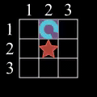

<h1 style='text-align: center;'> D. Robot Cleaner Revisit</h1>

<h5 style='text-align: center;'>time limit per test: 3 seconds</h5>
<h5 style='text-align: center;'>memory limit per test: 256 megabytes</h5>

The statement of this problem shares a lot with problem A. The differences are that in this problem, the probability is introduced, and the constraint is different.

A robot cleaner is placed on the floor of a rectangle room, surrounded by walls. The floor consists of $n$ rows and $m$ columns. The rows of the floor are numbered from $1$ to $n$ from top to bottom, and columns of the floor are numbered from $1$ to $m$ from left to right. The cell on the intersection of the $r$-th row and the $c$-th column is denoted as $(r,c)$. The initial position of the robot is $(r_b, c_b)$.

In one second, the robot moves by $dr$ rows and $dc$ columns, that is, after one second, the robot moves from the cell $(r, c)$ to $(r + dr, c + dc)$. Initially $dr = 1$, $dc = 1$. If there is a vertical wall (the left or the right walls) in the movement direction, $dc$ is reflected before the movement, so the new value of $dc$ is $-dc$. And if there is a horizontal wall (the upper or lower walls), $dr$ is reflected before the movement, so the new value of $dr$ is $-dr$.

Each second (including the moment before the robot starts moving), the robot cleans every cell lying in the same row or the same column as its position. There is only one dirty cell at $(r_d, c_d)$. The job of the robot is to clean that dirty cell. 

After a lot of testings in problem A, the robot is now broken. It cleans the floor as described above, but at each second the cleaning operation is performed with probability $\frac p {100}$ only, and not performed with probability $1 - \frac p {100}$. The cleaning or not cleaning outcomes are independent each second.

Given the floor size $n$ and $m$, the robot's initial position $(r_b, c_b)$ and the dirty cell's position $(r_d, c_d)$, find the expected time for the robot to do its job.

It can be shown that the answer can be expressed as an irreducible fraction $\frac x y$, where $x$ and $y$ are integers and $y \not \equiv 0 \pmod{10^9 + 7} $. 
### Output

 the integer equal to $x \cdot y^{-1} \bmod (10^9 + 7)$. In other words, output such an integer $a$ that $0 \le a < 10^9 + 7$ and $a \cdot y \equiv x \pmod {10^9 + 7}$.

### Input

Each test contains multiple test cases. The first line contains the number of test cases $t$ ($1 \le t \le 10$). Description of the test cases follows.

A test case consists of only one line, containing $n$, $m$, $r_b$, $c_b$, $r_d$, $c_d$, and $p$ ($4 \le n \cdot m \le 10^5$, $n, m \ge 2$, $1 \le r_b, r_d \le n$, $1 \le c_b, c_d \le m$, $1 \le p \le 99$) — the sizes of the room, the initial position of the robot, the position of the dirt cell and the probability of cleaning in percentage.

### Output

For each test case, print a single integer — the expected time for the robot to clean the dirty cell, modulo $10^9 + 7$.

## Example

### Input


```text
6
2 2 1 1 2 1 25
3 3 1 2 2 2 25
10 10 1 1 10 10 75
10 10 10 10 1 1 75
5 5 1 3 2 2 10
97 98 3 5 41 43 50
```
### Output


```text
3
3
15
15
332103349
99224487
```
## Note

In the first test case, the robot has the opportunity to clean the dirty cell every second. Using the [geometric distribution](https://en.wikipedia.org/wiki/Geometric_distribution), we can find out that with the success rate of $25\%$, the expected number of tries to clear the dirty cell is $\frac 1 {0.25} = 4$. But because the first moment the robot has the opportunity to clean the cell is before the robot starts moving, the answer is $3$.

  Illustration for the first example. The blue arc is the robot. The red star is the target dirt cell. The purple square is the initial position of the robot. Each second the robot has an opportunity to clean a row and a column, denoted by yellow stripes. In the second test case, the board size and the position are different, but the robot still has the opportunity to clean the dirty cell every second, and it has the same probability of cleaning. Therefore the answer is the same as in the first example.

  Illustration for the second example. The third and the fourth case are almost the same. The only difference is that the position of the dirty cell and the robot are swapped. But the movements in both cases are identical, hence the same result.


#### Tags 

#2300 #NOT OK #implementation #math #probabilities 

## Blogs
- [All Contest Problems](../Codeforces_Round_763_(Div._2).md)
- [Announcement (en)](../blogs/Announcement_(en).md)
- [Tutorial (en)](../blogs/Tutorial_(en).md)
