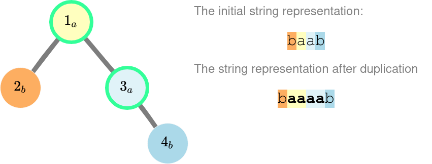
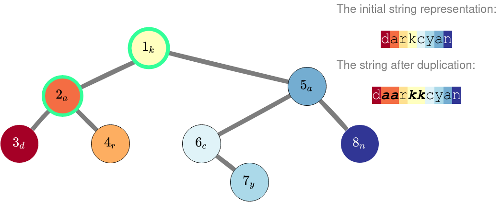
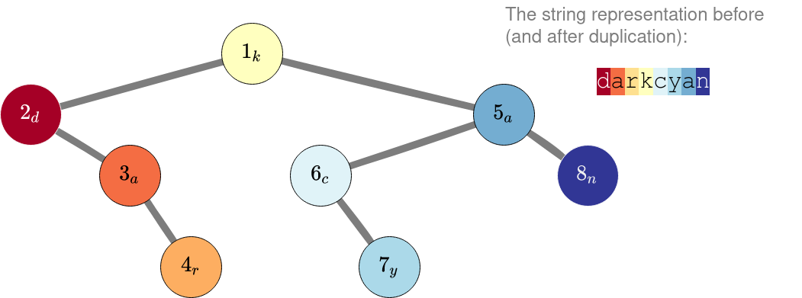

<h1 style='text-align: center;'> E. Middle Duplication</h1>

<h5 style='text-align: center;'>time limit per test: 1 second</h5>
<h5 style='text-align: center;'>memory limit per test: 256 megabytes</h5>

A binary tree of $n$ nodes is given. Nodes of the tree are numbered from $1$ to $n$ and the root is the node $1$. Each node can have no child, only one left child, only one right child, or both children. For convenience, let's denote $l_u$ and $r_u$ as the left and the right child of the node $u$ respectively, $l_u = 0$ if $u$ does not have the left child, and $r_u = 0$ if the node $u$ does not have the right child.

Each node has a string label, initially is a single character $c_u$. Let's define the string representation of the binary tree as the concatenation of the labels of the nodes in the in-order. Formally, let $f(u)$ be the string representation of the tree rooted at the node $u$. $f(u)$ is defined as follows: $$ f(u) = \begin{cases} \texttt{<empty string>}, & \text{if }u = 0; \\\ f(l_u) + c_u + f(r_u) & \text{otherwise}, \end{cases} $$ where $+$ denotes the string concatenation operation.

This way, the string representation of the tree is $f(1)$.

For each node, we can duplicate its label at most once, that is, assign $c_u$ with $c_u + c_u$, but only if $u$ is the root of the tree, or if its parent also has its label duplicated.

You are given the tree and an integer $k$. What is the lexicographically smallest string representation of the tree, if we can duplicate labels of at most $k$ nodes?

A string $a$ is lexicographically smaller than a string $b$ if and only if one of the following holds: 

* $a$ is a prefix of $b$, but $a \ne b$;
* in the first position where $a$ and $b$ differ, the string $a$ has a letter that appears earlier in the alphabet than the corresponding letter in $b$.
##### Input

The first line contains two integers $n$ and $k$ ($1 \le k \le n \le 2 \cdot 10^5$).

The second line contains a string $c$ of $n$ lower-case English letters, where $c_i$ is the initial label of the node $i$ for $1 \le i \le n$. 
## Note

 that the given string $c$ is not the initial string representation of the tree.

The $i$-th of the next $n$ lines contains two integers $l_i$ and $r_i$ ($0 \le l_i, r_i \le n$). If the node $i$ does not have the left child, $l_i = 0$, and if the node $i$ does not have the right child, $r_i = 0$.

It is guaranteed that the given input forms a binary tree, rooted at $1$.

##### Output

Print a single line, containing the lexicographically smallest string representation of the tree if at most $k$ nodes have their labels duplicated.

## Examples

##### Input


```text
4 3
abab
2 3
0 0
0 4
0 0
```
##### Output


```text
baaaab
```
##### Input

```text

8 2
kadracyn
2 5
3 4
0 0
0 0
6 8
0 7
0 0
0 0

```
##### Output


```text
daarkkcyan
```
##### Input

```text

8 3
kdaracyn
2 5
0 3
0 4
0 0
6 8
0 7
0 0
0 0

```
##### Output


```text

darkcyan
```
## Note

The images below present the tree for the examples. The number in each node is the node number, while the subscripted letter is its label. To the right is the string representation of the tree, with each letter having the same color as the corresponding node.

Here is the tree for the first example. Here we duplicated the labels of nodes $1$ and $3$. We should not duplicate the label of node $2$ because it would give us the string "bbaaab", which is lexicographically greater than "baaaab".

  In the second example, we can duplicate the labels of nodes $1$ and $2$. 
## Note

 that only duplicating the label of the root will produce a worse result than the initial string.

  In the third example, we should not duplicate any character at all. Even though we would want to duplicate the label of the node $3$, by duplicating it we must also duplicate the label of the node $2$, which produces a worse result.

  There is no way to produce string "darkkcyan" from a tree with the initial string representation "darkcyan" :(.


#### Tags 

#2500 #NOT OK #data_structures #dfs_and_similar #greedy #strings #trees 

## Blogs
- [All Contest Problems](../Codeforces_Round_763_(Div._2).md)
- [Announcement (en)](../blogs/Announcement_(en).md)
- [Tutorial (en)](../blogs/Tutorial_(en).md)
