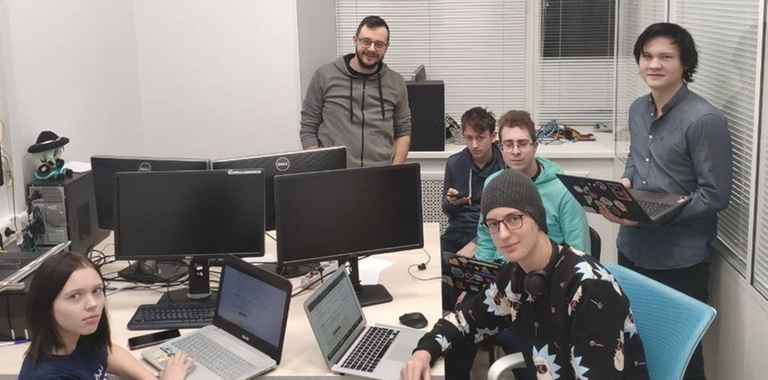

# Announcement

Hello! [Codeforces Round 764 (Div. 3)](https://codeforces.com/contest/1624 "Codeforces Round 764 (Div. 3)") will start at [Monday, January 10, 2022 at 20:35UTC+6](https://codeforces.com/https://www.timeanddate.com/worldclock/fixedtime.html?day=10&month=1&year=2022&hour=17&min=35&sec=0&p1=166). You will be offered 7-8 problems with expected difficulties to compose an interesting competition for participants with ratings up to 1600. However, all of you who wish to take part and have a rating of 1600 or higher, can register for the round unofficially.

The round will be hosted by rules of educational rounds (extended ICPC). Thus, solutions will be judged on preliminary tests during the round, and after the round, it will be a 12-hour phase of **open hacks**.

You will be given **7-8 problems** and **2 hours and 15 minutes** to solve them. One of the problems in this round is **interactive**. Don't forget to read the [guide on interactive problems](https://codeforces.com/blog/entry/45307).

Note that the **penalty** for the wrong submission in this round is **10 minutes**.

[Remember](https://codeforces.com/blog/entry/59228) that only the trusted participants of the third division will be included in the official standings table. As it is written by link, this is a compulsory measure for combating unsporting behavior. To qualify as a *trusted participant of the third division*, you must:

 * take part in at least five rated rounds (and solve at least one problem in each of them)
* do not have a point of 1900 or higher in the rating.

**Regardless of whether you are a trusted participant of the third division or not, if your rating is less than 1600, then the round will be rated for you.**

Thanks to MikeMirzayanov for the platform, help with ideas for problems and for coordination of our work. Problems have been created and written by ITMO University team: [MikeMirzayanov](https://codeforces.com/profile/MikeMirzayanov "Headquarters, MikeMirzayanov"), [MisterGu](https://codeforces.com/profile/MisterGu "Unrated, MisterGu"), [myav](https://codeforces.com/profile/myav "Pupil myav"), [Gol_D](https://codeforces.com/profile/Gol_D "Candidate Master Gol_D"), [Aris](https://codeforces.com/profile/Aris "Candidate Master Aris"), [senjougaharin](https://codeforces.com/profile/senjougaharin "Master senjougaharin") and [Vladosiya](https://codeforces.com/profile/Vladosiya "Expert Vladosiya").

We would like to thank: [itohdak](https://codeforces.com/profile/itohdak "Master itohdak"), [Yogi79](https://codeforces.com/profile/Yogi79 "Specialist Yogi79"), [smtcoder](https://codeforces.com/profile/smtcoder "Specialist smtcoder"), [Ra16bit](https://codeforces.com/profile/Ra16bit "Grandmaster Ra16bit"), [Tlatoani](https://codeforces.com/profile/Tlatoani "International Grandmaster Tlatoani"), [nigus](https://codeforces.com/profile/nigus "International Grandmaster nigus"), [MrDindows](https://codeforces.com/profile/MrDindows "International Grandmaster MrDindows"), [leaf1415](https://codeforces.com/profile/leaf1415 "Grandmaster leaf1415"), [Kniaz](https://codeforces.com/profile/Kniaz "Master Kniaz"), [Alireza](https://codeforces.com/profile/Alireza "Expert Alireza"), [mini4141](https://codeforces.com/profile/mini4141 "Specialist mini4141"), [Jostic11](https://codeforces.com/profile/Jostic11 "Master Jostic11"), [BitHashTech](https://codeforces.com/profile/BitHashTech "Specialist BitHashTech"), [An_yujin](https://codeforces.com/profile/An_yujin "Pupil An_yujin"), [oversolver](https://codeforces.com/profile/oversolver "Master oversolver") и [sodafago](https://codeforces.com/profile/sodafago "Expert sodafago") for testing the contest and valuable feedback. List of testers will be updated.

Good luck!

**UPD:** Here is a photo of our team answering your questions during the round:

**UPD 2:** [Editorial](Tutorial.md)

