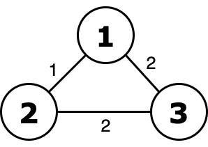
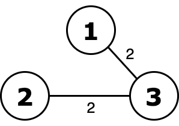
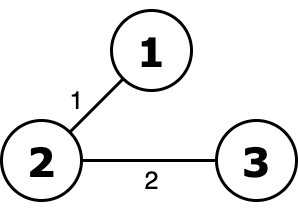

<h1 style='text-align: center;'> G. MinOr Tree</h1>

<h5 style='text-align: center;'>time limit per test: 2 seconds</h5>
<h5 style='text-align: center;'>memory limit per test: 256 megabytes</h5>

Recently, Vlad has been carried away by spanning trees, so his friends, without hesitation, gave him a connected weighted undirected graph of $n$ vertices and $m$ edges for his birthday.

Vlad defined the ority of a spanning tree as the [bitwise OR](https://tiny.cc/bitwise_or) of all its weights, and now he is interested in what is the minimum possible ority that can be achieved by choosing a certain spanning tree. A spanning tree is a connected subgraph of a given graph that does not contain cycles.

In other words, you want to keep $n-1$ edges so that the graph remains connected and the bitwise OR weights of the edges are as small as possible. You have to find the minimum bitwise OR itself.

### Input

The first line of the input contains an integer $t$ ($1 \le t \le 10^4$) — the number of test cases in the input.

An empty line is written in front of each test case.

This is followed by two numbers $n$ and $m$ ($3 \le n \le 2 \cdot 10^5, n - 1 \le m \le 2 \cdot 10^5$) — the number of vertices and edges of the graph, respectively.

The next $m$ lines contain the description of the edges. Line $i$ contains three numbers $v_i$, $u_i$ and $w_i$ ($1 \le v_i, u_i \le n$, $1 \le w_i \le 10^9$, $v_i \neq u_i$) — the vertices that the edge connects and its weight.

It is guaranteed that the sum $m$ and the sum $n$ over all test cases does not exceed $2 \cdot 10^5$ and each test case contains a connected graph.

### Output

Print $t$ lines, each of which contains the answer to the corresponding set of input data — the minimum possible spanning tree ority.

## Example

### Input


```text
3  
3 31 2 12 3 21 3 2  
5 74 2 72 5 83 4 23 2 12 4 24 1 21 2 2  
3 41 2 12 3 21 3 33 1 4
```
### Output

```text

2
10
3

```
## Note

  Graph from the first test case.   Ority of this tree equals to 2 or 2 = 2 and it's minimal.   Without excluding edge with weight $1$ ority is 1 or 2 = 3. 

#### Tags 

#1900 #NOT OK #bitmasks #dfs_and_similar #dsu #graphs #greedy 

## Blogs
- [All Contest Problems](../Codeforces_Round_764_(Div._3).md)
- [Announcement](../blogs/Announcement.md)
- [Tutorial](../blogs/Tutorial.md)
