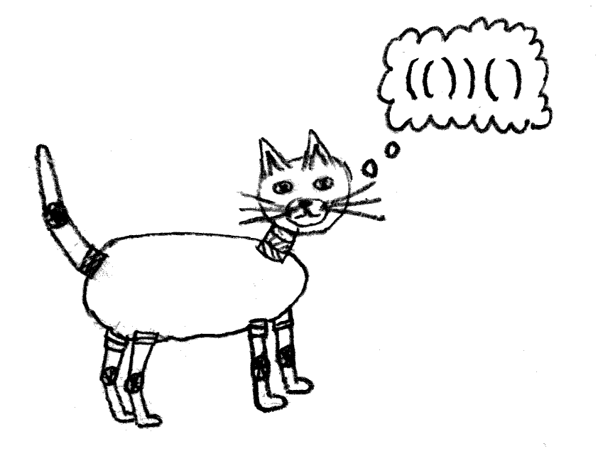

<h1 style='text-align: center;'> E1. Cats on the Upgrade (easy version)</h1>

<h5 style='text-align: center;'>time limit per test: 6 seconds</h5>
<h5 style='text-align: center;'>memory limit per test: 256 megabytes</h5>

This is the easy version of the problem. The only difference between the easy and the hard versions are removal queries, they are present only in the hard version.

"Interplanetary Software, Inc." together with "Robots of Cydonia, Ltd." has developed and released robot cats. These electronic pets can meow, catch mice and entertain the owner in various ways.

The developers from "Interplanetary Software, Inc." have recently decided to release a software update for these robots. After the update, the cats must solve the problems about bracket sequences. One of the problems is described below.

  First, we need to learn a bit of bracket sequence theory. Consider the strings that contain characters "(", ")" and ".". Call a string regular bracket sequence (RBS), if it can be transformed to an empty string by one or more operations of removing either single "." characters, or a continuous substring "()". For instance, the string "(()(.))" is an RBS, as it can be transformed to an empty string with the following sequence of removals:

 "(()(.))" $\rightarrow$ "(()())" $\rightarrow$ "(())" $\rightarrow$ "()" $\rightarrow$ "". We got an empty string, so the initial string was an RBS. At the same time, the string ")(" is not an RBS, as it is not possible to apply such removal operations to it.

An RBS is simple if this RBS is not empty, doesn't start with ".", and doesn't end with ".".

Denote the substring of the string $s$ as its sequential subsegment. In particular, $s[l\dots r] = s_ls_{l+1}\dots s_r$, where $s_i$ is the $i$-th character of the string $s$.

Now, move on to the problem statement itself. You are given a string $s$, initially consisting of characters "(" and ")". You need to answer the queries of the following kind.

Given two indices, $l$ and $r$ ($1 \le l < r \le n$), and it's guaranteed that the substring $s[l\dots r]$ is a simple RBS. You need to find the number of substrings in $s[l\dots r]$ such that they are simple RBS. In other words, find the number of index pairs $i$, $j$ such that $l \le i < j \le r$ and $s[i\dots j]$ is a simple RBS.

You are an employee in "Interplanetary Software, Inc." and you were given the task to teach the cats to solve the problem above, after the update.

## Note

 that the "." character cannot appear in the string in this version of the problem. It is only needed for the hard version.

### Input

The first line contains two integers $n$ and $q$ ($2 \le n \le 3\cdot10^5$, $1 \le q \le 3\cdot10^5$), the length of the string, and the number of queries.

The second line contains the string $s$, consisting of $n$ characters "(" and ")".

Each of the following $q$ lines contains three integers $t$, $l$ and $r$ ($t = 2$, $1 \le l < r \le n$), the queries you need to answer. It is guaranteed that all the queries are valid and correspond to the problem statements. 
## Note

 that $t$ is unused and always equal to two in this problem. It is required for the hard version of the problem.

### Output

For each query, print a single integer in a separate line, the number of substrings that are simple RBS. The answers must be printed in the same order as the queries are specified in the input.

## Example

### Input


```text
9 4
)(()())()
2 3 6
2 2 7
2 8 9
2 2 9
```
### Output


```text
3
4
1
6
```
## Note

Consider the example test case.

The answer to the first query is $3$, as there are three suitable substrings: $s[3\dots6]$, $s[3\dots4]$ and $s[5\dots6]$.

The answer to the second query is $4$. The substrings are $s[3\dots6]$, $s[3\dots4]$, $s[5\dots6]$ and $s[2\dots7]$.

The answer to the third query is $1$. The substring is $s[8\dots9]$.

The answer to the fourth query is $6$. The substrings are $s[3\dots6]$, $s[3\dots4]$, $s[5\dots6]$, $s[2\dots7]$, $s[8\dots9]$ and $s[2\dots9]$.


#### Tags 

#2500 #NOT OK #brute_force #data_structures #dfs_and_similar #divide_and_conquer #dp #graphs #trees 

## Blogs
- [All Contest Problems](../Codeforces_Round_765_(Div._2).md)
- [Announcement](../blogs/Announcement.md)
- [Tutorial](../blogs/Tutorial.md)
