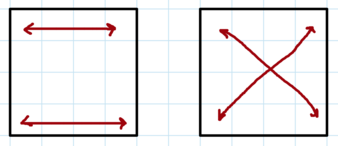
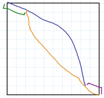

# Tutorial_(en)

Thank you for participating in our contest! We hope you enjoyed it.

[1627A - Not Shading](../problems/A._Not_Shading.md "Codeforces Round 766 (Div. 2)")

 **Hint 1**When is the answer −1? When is the answer 0? When is the answer 1?

 **Hint 2**Can you do all remaining cases in 2 steps?

 **Solution**
### [1627A - Not Shading](../problems/A._Not_Shading.md "Codeforces Round 766 (Div. 2)")

There are several cases to consider: 

* If all the cell are white, then it is impossible to perform any operations, so you cannot make any cell black. The answer is −1.
* If the cell in row r and column c is already black, then we don't need to perform any operations. The answer is 0.
* If any of the cells in row r are already black (that is, the cell we need to turn black shares a row with a black cell), then we can take this black cell and make row r. The same is true if any of the cells in column c are already black. The answer is 1.
* Otherwise, we claim the answer is 2. Take any black cell and make its row black. This means that every column contains a black cell, so now we can take column c are turn it black. Thus the answer is 2.

 This can be easily implemented in O(nm) time per test case. **Implementation (C++)**[142882991](https://codeforces.com/contest/1627/submission/142882991 "Submission 142882991 by flamestorm")

 **Implementation (Java)**[142882684](https://codeforces.com/contest/1627/submission/142882684 "Submission 142882684 by fishy15")

 **Implementation (Python)**[142882963](https://codeforces.com/contest/1627/submission/142882963 "Submission 142882963 by manish.17")

 **Video Editorial**[https://www.youtube.com/watch?v=j_oe8DA4hhM](https://codeforces.com/https://www.youtube.com/watch?v=j_oe8DA4hhM)

[1627B - Not Sitting](../problems/B._Not_Sitting.md "Codeforces Round 766 (Div. 2)")

 **Hint**If the classroom was one-dimensional, i.e. n=1, where would the best place for Tina to sit be?

 **Hint Solution**The best place for Tina to sit a grid where n=1 would be either (1,1), or (1,m).

 **Solution**
### [1627B - Not Sitting](../problems/B._Not_Sitting.md "Codeforces Round 766 (Div. 2)")

Let's denote Rahul's seat as (a,b) and Tina's seat as (c,d). Notice that the in the distance between their seats, |a−c|+|b−d|, |a−c| and |b−d| are independent of each other, i.e. both the x-coordinate and y-coordinate of Tina's seat are independent. From the answer to the hint above, we can see that the optimal seat for Tina in a 1-dimensional classroom is one of the edge seats, and combining this with the previous observation means that the optimal seat for Tina is always one of the corner seats.

Since Rahul chooses seats optimally, he will know that Tina will choose one of the corner seats, so he will choose a seat such that the maximum distance from it to one of the corner seats is minimised. As Tina also chooses which seats to paint optimally, the best strategy for her is to paint the k seats with minimum maximum distance to one of the corner seats pink.

We can implement this by calculating for each seat the maximum distance to one of the corner seats from it, and storing these values in an array. After sorting this array in non-decreasing order, we can simply print the first n⋅m−1 values of the array, as the i-th value of the array (0-indexed) is the optimal answer for k=i.

This can be implemented in O(nmlog(nm)) time per test case.

 **Implementation (C++)**[142882828](https://codeforces.com/contest/1627/submission/142882828 "Submission 142882828 by ScarletS")

 **Implementation (Java)**[142882836](https://codeforces.com/contest/1627/submission/142882836 "Submission 142882836 by fishy15")

 **Implementation (Python)**[142883072](https://codeforces.com/contest/1627/submission/142883072 "Submission 142883072 by manish.17")

 **Video Editorial**[https://www.youtube.com/watch?v=rwSzE-V-2V4](https://codeforces.com/https://www.youtube.com/watch?v=rwSzE-V-2V4)

[1627C - Not Assigning](../problems/C._Not_Assigning.md "Codeforces Round 766 (Div. 2)")

 **Hint**When does a valid assignment not exist?

 **Solution**
### [1627C - Not Assigning](../problems/C._Not_Assigning.md "Codeforces Round 766 (Div. 2)")

Let us first see when a valid assignment does not exist.

Claim. If any vertex has 3 or more edges adjacent to it, no valid assignment exists.

Proof. Consider a graph where a vertex has edges to three other vertices with weights x, y and z respectively. For a valid assignment, x, y and z need to be primes themselves. Also, x+y, y+z and x+z need to be primes too.

Since x,y,z≥2 (as 2 is the smallest prime), thus x+y,x+z,y+z≥4, so they must be odd primes. This implies: 

* x and y have opposite parity.
* y and z have opposite parity.
* x and z have opposite parity.

As all the three conditions cannot hold together, hence we have a contradiction. 

Proven.

So, we have a tree where every vertex has either one or two edges adjacent to it. Such a tree will have exactly two leaf nodes for n≥2 and have the following structure, where V1 and Vn are the leaf nodes.

V1⟷V2⟷V3⋯⟷Vn−1⟷Vn

Thus, starting a DFS from any leaf node, we can assign weights 2 and 3 (or 2 and the first number of any [twin prime pair](https://codeforces.com/https://en.wikipedia.org/wiki/Twin_prime)) alternatingly to form a prime tree, as 2, 3 and 2+3=5 are all primes.

Expected time complexity: O(n)

 **Implementation (C++)**[142882592](https://codeforces.com/contest/1627/submission/142882592 "Submission 142882592 by saarang")

 **Implementation (Java)**[142882888](https://codeforces.com/contest/1627/submission/142882888 "Submission 142882888 by fishy15")

 **Implementation (Python)**[142883185](https://codeforces.com/contest/1627/submission/142883185 "Submission 142883185 by manish.17")

 **Video Editorial**[https://www.youtube.com/watch?v=0TigYx222pY](https://codeforces.com/https://www.youtube.com/watch?v=0TigYx222pY)

[1627D - Not Adding](../problems/D._Not_Adding.md "Codeforces Round 766 (Div. 2)")

 **Hint**After applying operations, all elements in the array will be between 1 and A inclusive, where A is the maximum element of the initial array.

 **Solution**
### [1627D - Not Adding](../problems/D._Not_Adding.md "Codeforces Round 766 (Div. 2)")

Note that the gcd of two numbers cannot exceed their maximum. Let the maximum element of the array be A. So for every number from 1 to A, we try to check whether that element can be included in the array after performing some operations or not.

How to check for a particular number x?

For x to be in the final array, either: 

* It already exists in the initial array.
* Or, the gcd of all multiples of x present in the initial array equals x.

Proof

For x to be added after some operations, there must be some subset of the array which has a gcd equal to x. We can perform the operations by taking the current gcd and one element from the subset at a time and at the end we will obtain x. 

Note that such a subset can only contain multiples of x. So it is enough to check that the gcd of all multiples is equal to x.

Thus, the overall solution takes O(n+AlogA).

 **Implementation (C++)**[142883054](https://codeforces.com/contest/1627/submission/142883054 "Submission 142883054 by saarang")

 **Implementation (Java)**[142882944](https://codeforces.com/contest/1627/submission/142882944 "Submission 142882944 by fishy15")

 **Implementation (Python)**[142883356](https://codeforces.com/contest/1627/submission/142883356 "Submission 142883356 by manish.17")

 **Video Editorial**[https://www.youtube.com/watch?v=VdbUkNgjiy0](https://codeforces.com/https://www.youtube.com/watch?v=VdbUkNgjiy0)

[1627E - Not Escaping](../problems/E._Not_Escaping.md "Codeforces Round 766 (Div. 2)")

 **Hint**Try solving for n,m,k≤1000.

 **Hint 2**Do we need to account for all n⋅m rooms?

 **Hint 3**Solve for each row independently.

 **Solution**
### [1627E - Not Escaping](../problems/E._Not_Escaping.md "Codeforces Round 766 (Div. 2)")

The building plan of the input consists of n⋅m rooms, which in the worst case is 1010 however, most of these rooms are unimportant to us. We can instead use a much reduced version of the building consisting of at most 2k+2 rooms, both endpoints of each ladder, as well as our starting and target rooms.

As every ladder connects a lower floor to a higher floor and is one-directional, we can process the rooms floor by floor, from floor 1 to floor n. On each floor, let's sort all the rooms in non-decreasing order. Now, we can use dynamic programming, as well as the compression previously mentioned to calculate the minimum distance to get to all important rooms. First, we calculate the minimum cost to get to each room using a room on the same floor as an intermediate. We can do this by iterating over the rooms on a floor twice, once from left to right, and then once from right to left. Then, for each room on the floor, if it has a ladder going up from it, we can update the dp value of the room where the ladder ends.

Our answer is the dp value of the target room.

This can be implemented in O(klog(k)) time per test case.

 **Implementation (C++)**[142882988](https://codeforces.com/contest/1627/submission/142882988 "Submission 142882988 by ScarletS")

 **Implementation (Java)**[142883027](https://codeforces.com/contest/1627/submission/142883027 "Submission 142883027 by fishy15")

 **Implementation (Python)**[142883485](https://codeforces.com/contest/1627/submission/142883485 "Submission 142883485 by manish.17")

[1627F - Not Splitting](../problems/F._Not_Splitting.md "Codeforces Round 766 (Div. 2)")

 **Hint 1**What can you say about all valid cuts?

 **Hint 2**The cuts are rotationally symmetric about the center. How do we find the cut that breaks the fewest edges?

 **Hint 3**Shortest paths.

 **Solution**
### [1627F - Not Splitting](../problems/F._Not_Splitting.md "Codeforces Round 766 (Div. 2)")

Claim. Any cut that splits the square into two congruent parts is rotationally symmetric about the center by 180∘.

Proof. It is a special case when the cut is a vertical or horizontal line. Assume otherwise. Then: 

* One piece has a row containing more than k2, but less than k squares.
* One piece has a column containing more than k2, but less than k squares.
* Both exactly pieces contain two of the corners of the grid.

Now consider the isometry of the plane bringing one piece to the other. Then the corners of the grid of one piece must map to the corners of the grid of the other piece, since there has to be a straight edge connecting them with length k, which only exists between two corners. There are precisely two such isometries that fit within the bounds of the square: a reflection and a 180∘ rotation, pictured below, respectively.

  However if one piece has a row containing more than k2 but less than k squares, then in the first case the number of squares in that row is greater than k. The same holds in the case of a vertical reflection. Hence the cut must be rotationally symmetric.

 Now we can turn the problem into a graph problem. Consider the graph whose vertices are vertices of the grid and whose edges are edges of the grid. We need to minimize the number of pairs of squares that we "split up" in our cut. Note that each pair of squares shares an edge. Thus, we want to minimize the number of these edges we pass through. Let's initially weight all edges with 0, and increase the weight by 1 for each edge given.

Since each cut is rotationally symmetric about the center, we can just consider finding a minimal-weight path from the boundary to the center, and then rotating this path 180∘ to find a valid cut. However, there are three details we need to iron out: 

1. The cut may pass through other weighted edges when rotated.
2. We need to find an efficient way to find the shortest path from each boundary point to the center.
3. The cut may be self-intersecting.

 The first point can be accounted for by weighting each edge and its rotated counterpart, so both the path and its rotation will be counted when finding the shortest path.The second point can be accounted for by noticing that the boundary of the square has all edges of weight 0, so we can just run single source shortest paths from any single point on the boundary.

For the third point, consider some path that intersects itself when rotated. Suppose we build the path edge-by-edge, along with its mirror copy. At some point we will hit the mirror copy. But that means that there is a way with strictly fewer edges to reach the same point: just take the path from this intersection to the start of the mirror copy. See the image below.

  Instead of taking the long path (in blue/orange), we can take the shorter path (in green/purple). So now all our details are successfully ironed out. We can just run Dijkstra's algorithm from any vertex and find the length of the shortest path, solving the problem in O(n+k2logk).

 **Implementation (C++)**[142882843](https://codeforces.com/contest/1627/submission/142882843 "Submission 142882843 by flamestorm")

 **Implementation (Java)**[142883089](https://codeforces.com/contest/1627/submission/142883089 "Submission 142883089 by fishy15")

 **Implementation (Python)**[142883580](https://codeforces.com/contest/1627/submission/142883580 "Submission 142883580 by manish.17")

 **Author Notes**The problem was originally written as problem E, with a harder F, but we decided that the other F was too hard and moved this problem to F.

Sorry for the statement of the problem initially. It was correct throughout testing, but during translation it seems that it might have been changed from subsequence to subarray accidentally.

