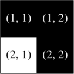

<h1 style='text-align: center;'> A. Not Shading</h1>

<h5 style='text-align: center;'>time limit per test: 1 second</h5>
<h5 style='text-align: center;'>memory limit per test: 256 megabytes</h5>

There is a grid with $n$ rows and $m$ columns. Some cells are colored black, and the rest of the cells are colored white.

In one operation, you can select some black cell and do exactly one of the following: 

* color all cells in its row black, or
* color all cells in its column black.

You are given two integers $r$ and $c$. Find the minimum number of operations required to make the cell in row $r$ and column $c$ black, or determine that it is impossible.

### Input

The input consists of multiple test cases. The first line contains an integer $t$ ($1 \leq t \leq 100$) — the number of test cases. The description of the test cases follows.

The first line of each test case contains four integers $n$, $m$, $r$, and $c$ ($1 \leq n, m \leq 50$; $1 \leq r \leq n$; $1 \leq c \leq m$) — the number of rows and the number of columns in the grid, and the row and column of the cell you need to turn black, respectively.

Then $n$ lines follow, each containing $m$ characters. Each of these characters is either 'B' or 'W' — a black and a white cell, respectively.

### Output

For each test case, if it is impossible to make the cell in row $r$ and column $c$ black, output $-1$. 

Otherwise, output a single integer — the minimum number of operations required to make the cell in row $r$ and column $c$ black. 

## Example

### Input


```text
93 5 1 4WBWWWBBBWBWWBBB4 3 2 1BWWBBWWBBWWB2 3 2 2WWWWWW2 2 1 1WWWB5 9 5 9WWWWWWWWWWBWBWBBBWWBBBWWBWWWBWBWBBBWWWWWWWWWW1 1 1 1B1 1 1 1W1 2 1 1WB2 1 1 1WB
```
### Output

```text

1
0
-1
2
2
0
-1
1
1

```
## Note

The first test case is pictured below.

  We can take the black cell in row $1$ and column $2$, and make all cells in its row black. Therefore, the cell in row $1$ and column $4$ will become black.

  In the second test case, the cell in row $2$ and column $1$ is already black.

In the third test case, it is impossible to make the cell in row $2$ and column $2$ black.

The fourth test case is pictured below.

  We can take the black cell in row $2$ and column $2$ and make its column black. 

  Then, we can take the black cell in row $1$ and column $2$ and make its row black. 

  Therefore, the cell in row $1$ and column $1$ will become black.


#### Tags 

#800 #NOT OK #constructive_algorithms #implementation 

## Blogs
- [All Contest Problems](../Codeforces_Round_766_(Div._2).md)
- [Announcement (en)](../blogs/Announcement_(en).md)
- [Tutorial (en)](../blogs/Tutorial_(en).md)
