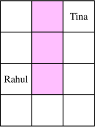
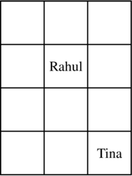

<h1 style='text-align: center;'> B. Not Sitting</h1>

<h5 style='text-align: center;'>time limit per test: 1 second</h5>
<h5 style='text-align: center;'>memory limit per test: 256 megabytes</h5>

Rahul and Tina are looking forward to starting their new year at college. As they enter their new classroom, they observe the seats of students are arranged in a $n \times m$ grid. The seat in row $r$ and column $c$ is denoted by $(r, c)$, and the distance between two seats $(a,b)$ and $(c,d)$ is $|a-c| + |b-d|$. 

As the class president, Tina has access to exactly $k$ buckets of pink paint. The following process occurs. 

* First, Tina chooses exactly $k$ seats in the classroom to paint with pink paint. One bucket of paint can paint exactly one seat.
* After Tina has painted $k$ seats in the previous step, Rahul chooses where he sits. He will not choose a seat that has been painted pink due to his hatred of the colour pink.
* After Rahul has chosen his seat, Tina chooses a seat for herself. She can choose any of the seats, painted or not, other than the one chosen by Rahul.

Rahul wants to choose a seat such that he sits as close to Tina as possible. However, Tina wants to sit as far away from Rahul as possible due to some complicated relationship history that we couldn't fit into the statement!

Now, Rahul wonders for $k = 0, 1, \dots, n \cdot m - 1$, if Tina has $k$ buckets of paint, how close can Rahul sit to Tina, if both Rahul and Tina are aware of each other's intentions and they both act as strategically as possible? Please help satisfy Rahul's curiosity! 

### Input

The input consists of multiple test cases. The first line contains an integer $t$ ($1 \leq t \leq 5 \cdot 10^4$) — the number of test cases. The description of the test cases follows.

The first line of each test case contains two integers $n$, $m$ ($2 \leq n \cdot m \leq 10^5$) — the number of rows and columns of seats in the classroom.

The sum of $n \cdot m$ across all test cases does not exceed $10^5$.

### Output

For each test case, output $n \cdot m$ ordered integers — the distance between Rahul and Tina if both of them act optimally for every $k \in [0, n \cdot m - 1]$.

## Example

### Input


```text
24 31 2
```
### Output

```text

3 3 4 4 4 4 4 4 5 5 5 5 
1 1 

```
## Note

One possible sequence of choices for the first testcase where Tina has $k=3$ buckets of paints is as follows.

Tina paints the seats at positions $(1, 2)$, $(2, 2)$, $(3, 2)$ with pink paint. Rahul chooses the seat at $(3, 1)$ after which Tina chooses to sit at $(1, 3)$. 

Therefore, the distance between Tina and Rahul is $|3-1| + |1-3| = 4$, and we can prove that this is indeed the minimum possible distance under the given constraints. There may be other choices of seats which lead to the same answer as well.

For $k=0$ in the first test case, Rahul can decide to sit at $(2, 2)$ and Tina can decide to sit at $(4, 3)$ so the distance between them would be $|2 - 4| + |2 - 3| = 3$.

Below are pictorial representations of the $k=3$ and $k=0$ cases for the first test case.

  A possible seating arrangement for $k=3$.  A possible seating arrangement for $k=0$. 

#### Tags 

#1300 #NOT OK #games #greedy #sortings 

## Blogs
- [All Contest Problems](../Codeforces_Round_766_(Div._2).md)
- [Announcement (en)](../blogs/Announcement_(en).md)
- [Tutorial (en)](../blogs/Tutorial_(en).md)
