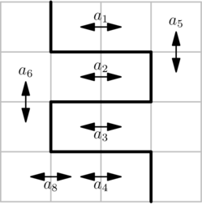

<h1 style='text-align: center;'> F. Not Splitting</h1>

<h5 style='text-align: center;'>time limit per test: 3 seconds</h5>
<h5 style='text-align: center;'>memory limit per test: 512 megabytes</h5>

There is a $k \times k$ grid, where $k$ is even. The square in row $r$ and column $c$ is denoted by $(r,c)$. Two squares $(r_1, c_1)$ and $(r_2, c_2)$ are considered adjacent if $\lvert r_1 - r_2 \rvert + \lvert c_1 - c_2 \rvert = 1$.

An array of adjacent pairs of squares is called strong if it is possible to cut the grid along grid lines into two connected, [congruent](https://en.wikipedia.org/wiki/Congruence_(geometry)) pieces so that each pair is part of the same piece. Two pieces are congruent if one can be matched with the other by translation, rotation, and reflection, or a combination of these.

  The picture above represents the first test case. Arrows indicate pairs of squares, and the thick black line represents the cut. You are given an array $a$ of $n$ pairs of adjacent squares. Find the size of the largest strong subsequence of $a$. An array $p$ is a subsequence of an array $q$ if $p$ can be obtained from $q$ by deletion of several (possibly, zero or all) elements.

### Input

The input consists of multiple test cases. The first line contains an integer $t$ ($1 \leq t \leq 100$) — the number of test cases. The description of the test cases follows.

The first line of each test case contains two space-separated integers $n$ and $k$ ($1 \leq n \leq 10^5$; $2 \leq k \leq 500$, $k$ is even) — the length of $a$ and the size of the grid, respectively.

Then $n$ lines follow. The $i$-th of these lines contains four space-separated integers $r_{i,1}$, $c_{i,1}$, $r_{i,2}$, and $c_{i,2}$ ($1 \leq r_{i,1}, c_{i,1}, r_{i,2}, c_{i,2} \leq k$) — the $i$-th element of $a$, represented by the row and column of the first square $(r_{i,1}, c_{i,1})$ and the row and column of the second square $(r_{i,2}, c_{i,2})$. These squares are adjacent.

It is guaranteed that the sum of $n$ over all test cases does not exceed $10^5$, and the sum of $k$ over all test cases does not exceed $500$.

### Output

For each test case, output a single integer — the size of the largest strong subsequence of $a$.

## Example

### Input


```text
38 41 2 1 32 2 2 33 2 3 34 2 4 31 4 2 42 1 3 12 2 3 24 1 4 27 21 1 1 22 1 2 21 1 1 21 1 2 11 2 2 21 1 2 11 2 2 21 63 3 3 4
```
### Output

```text

7
4
1

```
## Note

In the first test case, the array $a$ is not good, but if we take the subsequence $[a_1, a_2, a_3, a_4, a_5, a_6, a_8]$, then the square can be split as shown in the statement.

In the second test case, we can take the subsequence consisting of the last four elements of $a$ and cut the square with a horizontal line through its center.


#### Tags 

#2700 #NOT OK #geometry #graphs #greedy #implementation #shortest_paths 

## Blogs
- [All Contest Problems](../Codeforces_Round_766_(Div._2).md)
- [Announcement (en)](../blogs/Announcement_(en).md)
- [Tutorial (en)](../blogs/Tutorial_(en).md)
