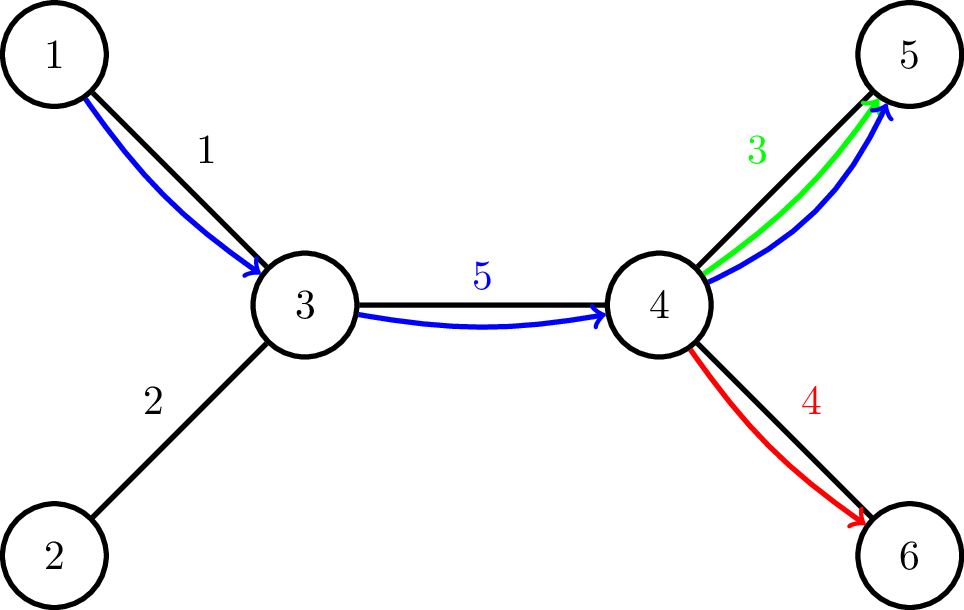

<h1 style='text-align: center;'> E. Groceries in Meteor Town</h1>

<h5 style='text-align: center;'>time limit per test: 2 seconds</h5>
<h5 style='text-align: center;'>memory limit per test: 256 megabytes</h5>

Mihai lives in a town where meteor storms are a common problem. It's annoying, because Mihai has to buy groceries sometimes, and getting hit by meteors isn't fun. Therefore, we ask you to find the most dangerous way to buy groceries so that we can trick him to go there.

The town has $n$ buildings numbered from $1$ to $n$. Some buildings have roads between them, and there is exactly $1$ simple path from any building to any other building. Each road has a certain meteor danger level. The buildings all have grocery stores, but Mihai only cares about the open ones, of course. Initially, all the grocery stores are closed.

You are given $q$ queries of three types:

1. Given the integers $l$ and $r$, the buildings numbered from $l$ to $r$ open their grocery stores (nothing happens to buildings in the range that already have an open grocery store).
2. Given the integers $l$ and $r$, the buildings numbered from $l$ to $r$ close their grocery stores (nothing happens to buildings in the range that didn't have an open grocery store).
3. Given the integer $x$, find the maximum meteor danger level on the simple path from $x$ to any open grocery store, or $-1$ if there is no edge on any simple path to an open store.
### Input

The first line contains the two integers $n$ and $q$ ($2 \le n, q \le 3\cdot 10^5$).

Then follows $n - 1$ lines, the $i$-th of which containing the integers $u_i$, $v_i$, and $w_i$ ($1 \le u_i, v_i \le n, \enspace 1 \le w_i \le 10^9$) meaning there is two way road between building $u_i$ and $v_i$ with meteor danger level $w_i$.

It is guaranteed that the given edges form a tree.

Then follows $q$ lines, the $j$-th of which begin with the integer $t_j$ ($1 \le t_j \le 3$), meaning the $j$-th query is of the $t_j$-th type.

If $t_j$ is $1$ or $2$ the rest of the line contains the integers $l_j$ and $r_j$ ($1 \le l_j \le r_j \le n$).

If $t_j$ is $3$ the rest of the line contains the integer $x_j$ ($1 \le x_j \le n$).

### Output

For each query of the $3$rd type ($t_j = 3$), output the maximum meteor danger level that is on some edge on the simple path from $x_j$ to some open store, or $-1$ if there is no such edge.

## Example

### Input


```text
6 9
1 3 1
2 3 2
4 5 3
4 6 4
3 4 5
3 1
1 1 1
3 1
2 1 1
1 5 6
3 4
2 6 6
3 4
3 1
```
### Output


```text
-1
-1
4
3
5
```
## Note



This is an illustration of the town given in the sample input.

In the first query, there are no open stores, so obviously there are no edges on the simple path from $1$ to any open store, so the answer is $-1$.

After the second and third queries, the set of open stores is $\{1\}$. The simple path from $1$ to $1$ has no edges, so the answer for the $3$rd query is $-1$.

After the fourth query, there are no open stores.

After the fifth and sixth queries, the set of open stores is $\{5, 6\}$. In the sixth query, there are two paths from $x_j = 4$ to some open grocery store: $4$ to $5$ and $4$ to $6$. The biggest meteor danger is found on the edge from $4$ to $6$, so the answer for the $6$th query is $4$. This path is marked with red in the illustration.

After the rest of the queries, the set of open stores is $\{5\}$. In the eighth query, the only path from $x_j = 4$ to an open store is from $4$ to $5$, and the maximum weight on that path is $3$. This path is marked with green in the illustration.

In the ninth query, the only path from $x_j = 1$ to an open store is from $1$ to $5$, and the maximum weight on that path is $5$. This path is marked with blue in the illustration.


#### Tags 

#3100 #NOT OK #binary_search #data_structures #dsu #trees 

## Blogs
- [All Contest Problems](../Codeforces_Round_767_(Div._1).md)
- [Announcement (en)](../blogs/Announcement_(en).md)
- [Tutorial (en)](../blogs/Tutorial_(en).md)
