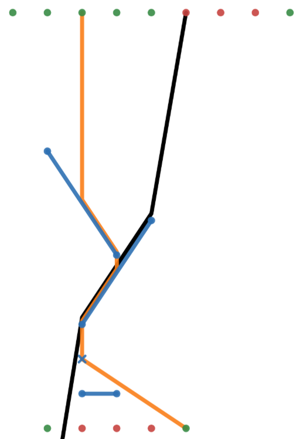

<h1 style='text-align: center;'> F. Spaceship Crisis Management</h1>

<h5 style='text-align: center;'>time limit per test: 8 seconds</h5>
<h5 style='text-align: center;'>memory limit per test: 256 megabytes</h5>

NASA (Norwegian Astronaut Stuff Association) is developing a new steering system for spaceships. But in its current state, it wouldn't be very safe if the spaceship would end up in a bunch of space junk. To make the steering system safe, they need to answer the following:

Given the target position $t = (0, 0)$, a set of $n$ pieces of space junk $l$ described by line segments $l_i = ((a_{ix}, a_{iy}), (b_{ix}, b_{iy}))$, and a starting position $s = (s_x, s_y)$, is there a direction such that floating in that direction from the starting position would lead to the target position?

When the spaceship hits a piece of space junk, what happens depends on the absolute difference in angle between the floating direction and the line segment, $\theta$:

* If $\theta < 45^{\circ}$, the spaceship slides along the piece of space junk in the direction that minimizes the change in angle, and when the spaceship slides off the end of the space junk, it continues floating in the direction it came in (before hitting the space junk).
* If $\theta \ge 45^{\circ}$, the spaceship stops, because there is too much friction to slide along the space junk.

You are only given the set of pieces of space junk once, and the target position is always $(0, 0)$, but there are $q$ queries, each with a starting position $s_j = (s_{jx}, s_{jy})$.

Answer the above question for each query.

### Input

The first line contains the the integer $n$ ($1 \le n \le 1500$).

Then follows $n$ lines, the $i$-th of which containing the $4$ integers $a_{ix}$, $a_{iy}$, $b_{ix}$, and $b_{iy}$ ($|a_{ix}|, |a_{iy}|, |b_{ix}|, |b_{iy}| \le 1000$).

Then follows a line containing the integer $q$ ($1 \le q \le 1000$).

Then follows $q$ lines, the $j$-th of which containing the $2$ integers $s_{jx}$ and $s_{jy}$ ($|s_{jx}|, |s_{jy}| \le 1000$).

It is guaranteed that none of the segments in $l$ cross or touch, that $t$ is not on any segment in $l$, that $s_j$ is not on any segment in $l$, and that $s \neq t$.

### Output

For each query $s_j$ print an answer. If there exists a direction such that floating from $s_j$ in that direction, possibly sliding along some pieces of space junk, leads to $t$, print "YES". Otherwise, print "NO" (case insensitive).

## Example

### Input


```text
3
0 1 2 4
1 3 -1 6
0 -1 1 -1
14
-2 10
-1 10
0 10
1 10
2 10
3 10
4 10
5 10
6 10
-1 -2
0 -2
1 -2
2 -2
3 -2
```
### Output


```text
YES
YES
YES
YES
YES
NO
NO
NO
YES
YES
NO
NO
NO
YES
```
## Note



The blue cross represents the target location, and the other blue line segments represent the space junk.

Green dots represent starting locations where the answer is yes, and red dots represent starting locations where the answer is no.

The yellow lines are possible paths to the target location for the $3$rd and $14$th queries. 

The black line is a possible path from the starting location in the $6$th query, but it barely misses the target location.


#### Tags 

#3500 #NOT OK #binary_search #data_structures #geometry #sortings 

## Blogs
- [All Contest Problems](../Codeforces_Round_767_(Div._1).md)
- [Announcement (en)](../blogs/Announcement_(en).md)
- [Tutorial (en)](../blogs/Tutorial_(en).md)
