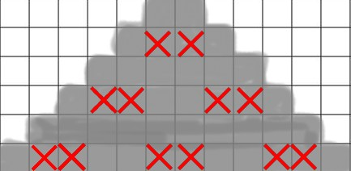
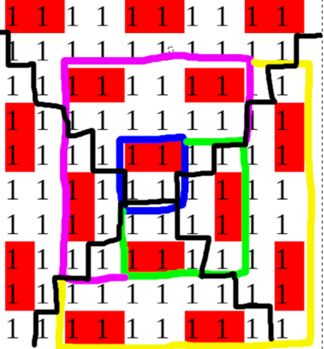

# Tutorial_(en)

Thanks for participating in the round! We hope you enjoyed it.

In addition to the usual text-editorial below, [namanbansal013](https://codeforces.com/profile/namanbansal013 "Expert namanbansal013") will explain Div. 2 solutions on [his stream](https://codeforces.com/https://www.youtube.com/watch?v=PfT7yNZCd3I), and [ak2006](https://codeforces.com/profile/ak2006 "Specialist ak2006") has made video explanations for Div. 2 [B](https://codeforces.com/https://www.youtube.com/watch?v=foEOl8bq_0A), [C](https://codeforces.com/https://www.youtube.com/watch?v=uEoL3Gzg5d8), [D](https://codeforces.com/https://www.youtube.com/watch?v=moS6WTxCEjE), and [E](https://codeforces.com/https://www.youtube.com/watch?v=gW9fVgTVmYY).

 
### [1629A - Download More RAM](../problems/A._Download_More_RAM.md "Codeforces Round 767 (Div. 2)")

Using some software is never bad. It always ends up increasing your RAM if you can use it. And for any possible order to use a set of software in, they all result in the same amount RAM in the end. So we can greedily go through the list, using software if you have enough RAM for it. After going through the list, your RAM may have increased, so maybe some of the software you couldn't use at the start is now usable. Therefore we have to go through the list again (now with the used software removed) until the RAM doesn't increase anymore. This results in time complexity O(n2), which is fine for these constraints.

It turns out we don't actually need to go through the list of software more than once if we sort it by a. This results in O(nlogn) time complexity.

 
### [1629B - GCD Arrays](../problems/B._GCD_Arrays.md "Codeforces Round 767 (Div. 2)")

For the GCD of the whole array to be greater than 1, each of the elements must have a common prime factor, so we need to find the prime factor that's the most common in the array and merge the elements that have this prime factor with those who don't, the answer being the size of the array - number of occurrences of the most frequent prime factor. And, because the numbers are consecutive, the most common prime factor is always 2. So, the minimum number of moves we need to do is the count of odd numbers in the given range, which is (r−l+1)−(r/2−(l−1)/2). Now. the answer is "YES" when the minimum number of moves we need to do is less than or equal to k and "NO" otherwise. 

The extra cases we should take care of are the ones where l=r, in which the answer is always "YES", or "NO' only when l=r=1.

 
### [1628A - Meximum Array](https://codeforces.com/contest/1628/problem/A "Codeforces Round 767 (Div. 1)")

The splitting points can be picked greedily. Firstly, find the MEX of all suffixes, this can be easily done in O(n⋅log(n)) or O(n). Instead of removing elements, we consider that we need to split the array into some number of subarrays. 

Let p be the index we are currently at and MEX(l,r) — the MEX of the set formed from the numbers [al,al+1,...,ar].

Start the process by looking at the first element, so p=1 initially. Then do the following process as long as p≤n: find the first position j(p≤j≤n) such that MEX(p,j) = MEX(p,n), add this MEX to the array b and do the same process starting from position j+1, so p=j+1. 

This process always produces the optimal answer because if for each element in b we choose to remove the minimum amount of elements from a to obtain the maximum element bi, so we have more elements in the future to do the same optimal choices.

Complexity: O(n⋅log(n)) or O(n) depending on implementation.

 
### [1628B - Peculiar Movie Preferences](https://codeforces.com/contest/1628/problem/B "Codeforces Round 767 (Div. 1)")

Because of the low constraints on the lengths of the strings, we can prove that it's enough to pair at most 2 strings to form a palindrome.

<proof only checking pairs is enough>

Let's assume there is a awesome subsequence of the form xyz where x and z are single strings from s, and y is anything. If x and z are the same length, they clearly have to be reverses of each other for xyz to be a palindrome, so y is not needed to make it a palindrome. If they are not the same length, one of them is of length 3 and the other is of length 2. Assume x is the string of length 3 and y is the string of length 2. The first two characters of x must be the reverse of z. If x and z are concatenated, the third character of x is in the middle, so it doesn't matter. So in this case too, y is not needed. This proves that if any awesome subsequence exists, there also exists an awesome subsequence of 1 or 2 strings.

<proof ends>

So, we first check if there exists a palindrome already, if there is, we found a solution! If not, checking for each pair would take too long, but we can do it much more efficiently. We can assume that all strings are of length 2 or 3 since if there was a string of length 1 it would be a palindrome and we would have found the solution earlier. 

For each string of length 2 it's enough to check if before it, we have seen a string of the following 2 forms: its reverse or its reverse with a character appended to it (so a string of length 3), since the last character of a string of length 3 would be the middle character of the palindrome obtained after concatenation.

For each string of length 3 it's enough to check if before it, we have seen a string of the following 2 forms: its reverse or the reverse of the string without considering the first character (so a string of length 2), since the first character of a string of length 3 would be the middle character of the palindrome obtained after concatenation.

All this can be checked using a frequency matrix, map, set or other data structures.

 
### [1628C - Grid Xor](https://codeforces.com/contest/1628/problem/C "Codeforces Round 767 (Div. 1)")

Let's denote count(i,j) the amount of times the cell (i,j) contributed in queries. We notice that count(i,j) must be odd for all cells (i,j). 

There are multiple possible solutions for this problem. In the editorial we will describe two of them.

<first solution>

The following construction satisfies the condition: Iterate Through all rows from row 2 to n. For each row, traverse all its cells and query cell (i,j) if the cell above it if cell (i−1,j) was contributed (count(i−1,j) =0 (mod 2)) an even amount of times and XOR curent_answer with aij (curent_answer initially being 0)

Everule gave [a proof of correctness of this approach](Tutorial_(en).md?#comment-880285).

<first solution>

<second solution>

Let's try making some pattern that takes all cells exactly once: 

Something like this would work if the board was a triangle instead of a square. But it turns out we can actually completely cover the square by using 4 copies of such a triangle rotated:

<second solution>

 
### [1628D1 - Game on Sum (Easy Version)](https://codeforces.com/contest/1628/problem/D1 "Codeforces Round 767 (Div. 1)")

What is the answer for n=2, m=1?

Let's call the number Alice picks on the first turn x.

If x is small, Bob can add it, and then Alice will have to pick 0 on the last turn since Bob will definitely subtract it from the score if it isn't 0, meaning the score ends up being x.

If Alice picks a big number, Bob can subtract it. Then Alice will pick the biggest number she can on the last turn, ending up with a score of k−x.

Since Bob tries to minimize the score of the game, Alice should pick an x such that it maximizes the value of min(x,k−x). x and k−x are both linear (straight line) functions on x. The x value that maximizes the minimum of two lines is their intersection. The intersection of the lines x and k−x is at x=k/2. So Alice should pick x=k/2 in the optimal game where n=2, m=1.

To generalize the solution to arbitrary n and m, we can use DP. Let DP[i][j] what the score would be if n=i, m=j.

Our base cases will be 

* DP[i][0]=0 since if Bob doesn't have to add anything, Alice has to always pick 0.
* DP[i][i]=i⋅k since if Bob always has to add, Alice can just pick k every time.

When Bob adds to the score, the rest of the game will be the same as a game with 1 fewer turns and 1 fewer forced adds, except the game score is offset by Alice's number. When Bob subtracts from the score, the rest of the game will be the same as a game with 1 fewer turns except the game score is offset by negative Alice's number.

Bob will take the minimum of these, so the DP transition will be

DP[i][j]=min(DP[i−1][j−1]+x,DP[i−1][j]−x) for x that maximizes this value.

This is the same problem as the n=2 case resulting in the intersection between lines. The score at this intersection simplifies nicely to DP[i][j]=(DP[i−1][j−1]+DP[i−1][j])/2

This O(n⋅m) solution is fast enough to pass the easy version of this problem.

 
### [1628D2 - Game on Sum (Hard Version)](https://codeforces.com/contest/1628/problem/D2 "Codeforces Round 767 (Div. 1)")

We have base cases

* DP[i][0]=0
* DP[i][i]=k⋅i

And transition DP[i][j]=(DP[i−1][j−1]+DP[i−1][j])/2

Check the explanation for the easy version to see why.

This DP can be optimized by looking at contributions from the base cases.

If we draw the DP states on a grid and ignore the division by 2 in the transition, we can see that the number of times states DP[i][i] contributes to state DP[n][m] is the number of paths from (i,j) to (n,m) in the grid such that at each step, both i and j increase, or only j increases, except we have to exclude paths that go through other base cases. The number of such paths is (n−i−1m−j). Since the number of steps in all of these paths is the same, we can account for the division by 2 in each transition by dividing by 2n−i in the end.

To find the value of DP[n][m] we sum the contribution form every base case DP[i][i] for 1≤i≤n.

 
### [1628E - Groceries in Meteor Town](https://codeforces.com/contest/1628/problem/E "Codeforces Round 767 (Div. 1)")

Consider the edge with the greatest weight. Any path going through that edge will have weight equal to the weight of that edge. If we delete that edge from the tree, a path going through that edge in the original tree has one endpoint in each component that results from the removal of the edge.

Consider some query x with some set of open stores. If the component not including x has an open store, then the answer is the deleted edge. If it does not have an open store, then we recursively solve the problem for the component of x.

Observe that the structure of this is the same as for finding LCA of a set of nodes in a tree. When asking for the LCA of some set, we can pick an in-order traversal, ignore all nodes except the leftmost and rightmost ones, and still get the same LCA.

The solution outline then looks like this:

* Create the binary tree that arises from making a node representing the edge with the greatest weight, and then doing the same for the two components resulting from deleting the greatest weight making them left and right subtrees of the above tree.
* Order the nodes by in-order traversal in this tree.
* Use a segment tree or another data structure to maintain what is the leftmost and rightmost open store in the in-order traversal.
* Find the LCA of the leftmost and rightmost open store in the created tree.
 
### [1628F - Spaceship Crisis Management](https://codeforces.com/contest/1628/problem/F "Codeforces Round 767 (Div. 1)")

The exit position at a specific segment is always the same, only the exit direction changes depending on which angle the spaceship comes in at. Therefore, if we know the set of directions that are good to hit a segment at, we know if a path that hits the segment is good or not. Note that it's only useful to consider directions that are either the direction from the closest point on some segment to the target, or from some starting position to the target. Let's call these directions relevant directions.

Slow solution: We can use DP to determine the set of useful directions for each segment: Sort the segments by distance to the target, and for each segment try shooting a ray in every relevant direction that is within 45 degrees of the direction of the segment itself, and see if it either hits the target or a segment where that direction is good. The comparison with 45 degrees can be done exactly using e.g. properties of the dot product. Then for each starting position query, the same ray shooting can be done. This is O((n+q)2⋅n) because there are O(n+q) relevant directions, O(n+q) positions from which to shoot rays, and O(n) segments to check intersection with. This is too slow.

We found two different ways to optimize this:

1. Since we need to know what a ray hits for many different directions from the same origin, we could do some preprocessing at each origin. A Li-Chao tree traditionally finds the minimum y-value at a certain x-coordinate among a set of line segments. But it doesn't have to contain line segments. It can contain any set of functions such that any pair of them intersect at most once. This includes distance to 2D line segments from a fixed origin as a function of angle. Using this, we can for each origin do O(n⋅log(n+q)) time precomputation to get O(log(n+q)) time per query to a single direction, resulting in the time complexity O((n+q)2log(n+q))

2. Solution by Maksim1744: If we fix the floating direction, the movement between space junk forms edges in a functional graph. We can use a sweep to build the graph and then for each starting position and determine if it reaches the target in the graph. Doing this for all relevant directions also results in a time a complexity of O((n+q)2log(n+q))

