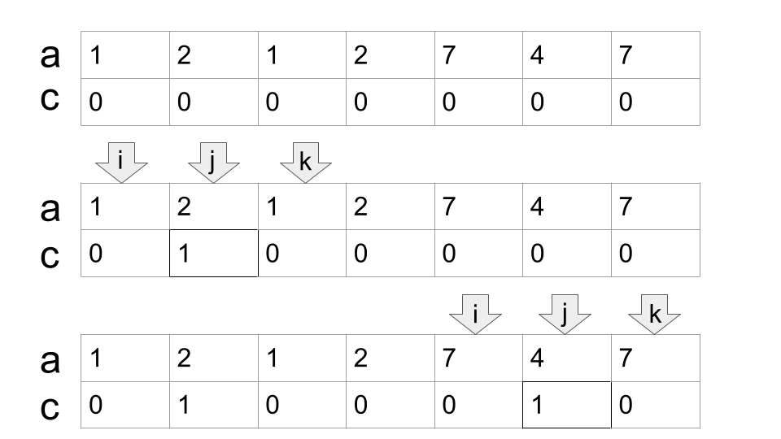

<h1 style='text-align: center;'> C. Paint the Middle</h1>

<h5 style='text-align: center;'>time limit per test: 2 seconds</h5>
<h5 style='text-align: center;'>memory limit per test: 256 megabytes</h5>

You are given $n$ elements numbered from $1$ to $n$, the element $i$ has value $a_i$ and color $c_i$, initially, $c_i = 0$ for all $i$.

The following operation can be applied:

* Select three elements $i$, $j$ and $k$ ($1 \leq i < j < k \leq n$), such that $c_i$, $c_j$ and $c_k$ are all equal to $0$ and $a_i = a_k$, then set $c_j = 1$.

Find the maximum value of $\sum\limits_{i=1}^n{c_i}$ that can be obtained after applying the given operation any number of times.

#### Input

The first line contains an integer $n$ ($3 \leq n \leq 2 \cdot 10^5$) — the number of elements.

The second line consists of $n$ integers $a_1, a_2, \dots, a_n$ ($1 \leq a_i \leq n$), where $a_i$ is the value of the $i$-th element.

#### Output

Print a single integer in a line — the maximum value of $\sum\limits_{i=1}^n{c_i}$ that can be obtained after applying the given operation any number of times.

## Examples

#### Input


```text
7
1 2 1 2 7 4 7
```
#### Output


```text
2
```
#### Input


```text
13
1 2 3 2 1 3 3 4 5 5 5 4 7
```
#### Output


```text
7
```
## Note

In the first test, it is possible to apply the following operations in order:

  

#### Tags 

#2200 #NOT OK #dp #greedy #sortings #two_pointers 

## Blogs
- [All Contest Problems](../Codeforces_Round_768_(Div._1).md)
- [Announcement (en)](../blogs/Announcement_(en).md)
- [Tutorial (en)](../blogs/Tutorial_(en).md)
