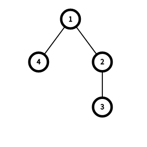

<h1 style='text-align: center;'> E2. Distance Tree (hard version)</h1>

<h5 style='text-align: center;'>time limit per test: 2 seconds</h5>
<h5 style='text-align: center;'>memory limit per test: 512 megabytes</h5>

This version of the problem differs from the previous one only in the constraint on $n$.

A tree is a connected undirected graph without cycles. A weighted tree has a weight assigned to each edge. The distance between two vertices is the minimum sum of weights on the path connecting them.

You are given a weighted tree with $n$ vertices, each edge has a weight of $1$. Denote $d(v)$ as the distance between vertex $1$ and vertex $v$.

Let $f(x)$ be the minimum possible value of $\max\limits_{1 \leq v \leq n} \ {d(v)}$ if you can temporarily add an edge with weight $x$ between any two vertices $a$ and $b$ $(1 \le a, b \le n)$. 
## Note

 that after this operation, the graph is no longer a tree.

For each integer $x$ from $1$ to $n$, find $f(x)$.

### Input

The first line contains a single integer $t$ ($1 \le t \le 10^4$) — the number of test cases.

The first line of each test case contains a single integer $n$ ($2 \le n \le 3 \cdot 10^5$).

Each of the next $n−1$ lines contains two integers $u$ and $v$ ($1 \le u,v \le n$) indicating that there is an edge between vertices $u$ and $v$. It is guaranteed that the given edges form a tree.

It is guaranteed that the sum of $n$ over all test cases doesn't exceed $3 \cdot 10^5$.

### Output

For each test case, print $n$ integers in a single line, $x$-th of which is equal to $f(x)$ for all $x$ from $1$ to $n$.

## Example

### Input


```text
341 22 31 421 271 21 33 43 53 65 7
```
### Output

```text

1 2 2 2 
1 1 
2 2 3 3 3 3 3 

```
## Note

   In the first testcase: * For $x = 1$, we can an edge between vertices $1$ and $3$, then $d(1) = 0$ and $d(2) = d(3) = d(4) = 1$, so $f(1) = 1$.
* For $x \ge 2$, no matter which edge we add, $d(1) = 0$, $d(2) = d(4) = 1$ and $d(3) = 2$, so $f(x) = 2$.


#### Tags 

#2700 #NOT OK #binary_search #dfs_and_similar #shortest_paths #trees 

## Blogs
- [All Contest Problems](../Codeforces_Round_769_(Div._2).md)
- [Announcement](../blogs/Announcement.md)
- [Tutorial](../blogs/Tutorial.md)
