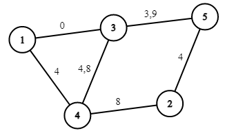
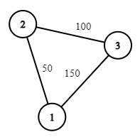

<h1 style='text-align: center;'> E. Spanning Tree Queries</h1>

<h5 style='text-align: center;'>time limit per test: 4 seconds</h5>
<h5 style='text-align: center;'>memory limit per test: 256 megabytes</h5>

You are given a connected weighted undirected graph, consisting of $n$ vertices and $m$ edges.

You are asked $k$ queries about it. Each query consists of a single integer $x$. For each query, you select a spanning tree in the graph. Let the weights of its edges be $w_1, w_2, \dots, w_{n-1}$. The cost of a spanning tree is $\sum \limits_{i=1}^{n-1} |w_i - x|$ (the sum of absolute differences between the weights and $x$). The answer to a query is the lowest cost of a spanning tree.

The queries are given in a compressed format. The first $p$ $(1 \le p \le k)$ queries $q_1, q_2, \dots, q_p$ are provided explicitly. For queries from $p+1$ to $k$, $q_j = (q_{j-1} \cdot a + b) \mod c$.

Print the xor of answers to all queries.

##### Input

The first line contains two integers $n$ and $m$ ($2 \le n \le 50$; $n - 1 \le m \le 300$) — the number of vertices and the number of edges in the graph.

Each of the next $m$ lines contains a description of an undirected edge: three integers $v$, $u$ and $w$ ($1 \le v, u \le n$; $v \neq u$; $0 \le w \le 10^8$) — the vertices the edge connects and its weight. 
## Note

 that there might be multiple edges between a pair of vertices. The edges form a connected graph.

The next line contains five integers $p, k, a, b$ and $c$ ($1 \le p \le 10^5$; $p \le k \le 10^7$; $0 \le a, b \le 10^8$; $1 \le c \le 10^8$) — the number of queries provided explicitly, the total number of queries and parameters to generate the queries.

The next line contains $p$ integers $q_1, q_2, \dots, q_p$ ($0 \le q_j < c$) — the first $p$ queries.

##### Output

Print a single integer — the xor of answers to all queries.

## Examples

##### Input


```text
5 8
4 1 4
3 1 0
3 5 3
2 5 4
3 4 8
4 3 4
4 2 8
5 3 9
3 11 1 1 10
0 1 2
```
##### Output


```text
4
```
##### Input


```text
6 7
2 4 0
5 4 7
2 4 0
2 1 7
2 6 1
3 4 4
1 4 8
4 10 3 3 7
3 0 2 1
```
##### Output


```text
5
```
##### Input


```text
3 3
1 2 50
2 3 100
1 3 150
1 10000000 0 0 100000000
75
```
##### Output


```text
164
```
## Note

The queries in the first example are $0, 1, 2, 3, 4, 5, 6, 7, 8, 9, 0$. The answers are $11, 9, 7, 3, 1, 5, 8, 7, 5, 7, 11$.

  The queries in the second example are $3, 0, 2, 1, 6, 0, 3, 5, 4, 1$. The answers are $14, 19, 15, 16, 11, 19, 14, 12, 13, 16$.

  The queries in the third example are $75, 0, 0, \dots$. The answers are $50, 150, 150, \dots$.

  

#### Tags 

#2400 #NOT OK #binary_search #data_structures #dfs_and_similar #dsu #graphs #greedy #math #sortings #trees 

## Blogs
- [All Contest Problems](../Educational_Codeforces_Round_122_(Rated_for_Div._2).md)
- [Announcement](../blogs/Announcement.md)
- [Tutorial](../blogs/Tutorial.md)
