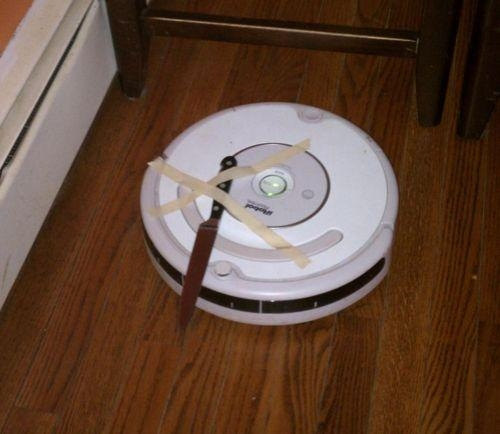

# Announcement

Greetings to all humans and robots on this site!

[sevlll777](https://codeforces.com/profile/sevlll777 "Grandmaster sevlll777"), [crazyilian](https://codeforces.com/profile/crazyilian "Master crazyilian"), [Mangooste](https://codeforces.com/profile/Mangooste "Grandmaster Mangooste"), [purplesyringa](https://codeforces.com/profile/purplesyringa "International Master purplesyringa") and me ([Alexdat2000](https://codeforces.com/profile/Alexdat2000 "International Master Alexdat2000")) invite everyone to participate in the [Codeforces Round #770 (Div. 2)](https://codeforces.com/contests/1634), which will take place this [Sunday, February 6, 2022 at 20:35UTC+6](https://codeforces.com/https://www.timeanddate.com/worldclock/fixedtime.html?day=6&month=2&year=2022&hour=17&min=35&sec=0&p1=166). **This round will be rated for all participants with a rating of strictly less than 2100.** You will have **2 hours and 30 minutes** to solve 6 problems. There will be an interactive problem in the round, so we recommend all new participants to read [Interactive Problems Guide](https://codeforces.com/blog/entry/45307).

The traditional thank-you list:

 * Thanks to [antontrygubO_o](https://codeforces.com/profile/antontrygubO_o "International Grandmaster antontrygubO_o") for coordinating us for a very long time and helping to improve one of the tasks
* Thanks to [alexxela12345](https://codeforces.com/profile/alexxela12345 "Grandmaster alexxela12345") for tasks that did not survive till the final version of the round
* Thanks to [Pechalka](https://codeforces.com/profile/Pechalka "International Master Pechalka"), [alexxela12345](https://codeforces.com/profile/alexxela12345 "Grandmaster alexxela12345"), [Kirill22](https://codeforces.com/profile/Kirill22 "International Grandmaster Kirill22"), [physics0523](https://codeforces.com/profile/physics0523 "International Grandmaster physics0523"), [PurpleCrayon](https://codeforces.com/profile/PurpleCrayon "Grandmaster PurpleCrayon"), [teraqqq](https://codeforces.com/profile/teraqqq "International Grandmaster teraqqq"), [tem_shett](https://codeforces.com/profile/tem_shett "Master tem_shett"), [FairyWinx](https://codeforces.com/profile/FairyWinx "Master FairyWinx"), [Dart-Xeyter](https://codeforces.com/profile/Dart-Xeyter "Grandmaster Dart-Xeyter"), [Vladithur](https://codeforces.com/profile/Vladithur "Master Vladithur"), [Igorfardoc](https://codeforces.com/profile/Igorfardoc "International Master Igorfardoc"), [despair_101](https://codeforces.com/profile/despair_101 "Expert despair_101"), [shishyando](https://codeforces.com/profile/shishyando "Expert shishyando"), [Brahma_tet](https://codeforces.com/profile/Brahma_tet "Expert Brahma_tet") and [kLOLik](https://codeforces.com/profile/kLOLik "Specialist kLOLik") for quality testing of the round and very helpful feedback
* Thanks to [MikeMirzayanov](https://codeforces.com/profile/MikeMirzayanov "Headquarters, MikeMirzayanov") for the Codeforces and Polygon

Scoring distribution: **500 — 1250 — 1500 — 2000 — 2500 — 3000**.

    
 Codeforces Round #770 (Div. 2) is ready to resist the rise of machines  **Do you think you are stronger than a robot or not?*** I can definitely solve more problems than AI: 

 
[*2849*](https://codeforces.com/data/like?action=like "I like this")
* I hope to solve more problems than the AI 

 
[*768*](https://codeforces.com/data/like?action=like "I like this")
* I hope to solve as many problems as the AI 

 
[*184*](https://codeforces.com/data/like?action=like "I like this")
* I think I'm weaker 

 
[*861*](https://codeforces.com/data/like?action=like "I like this")
We wish all participants high rating! Show that people are still worthy!

UPD: [Editorial](Tutorial.md)

