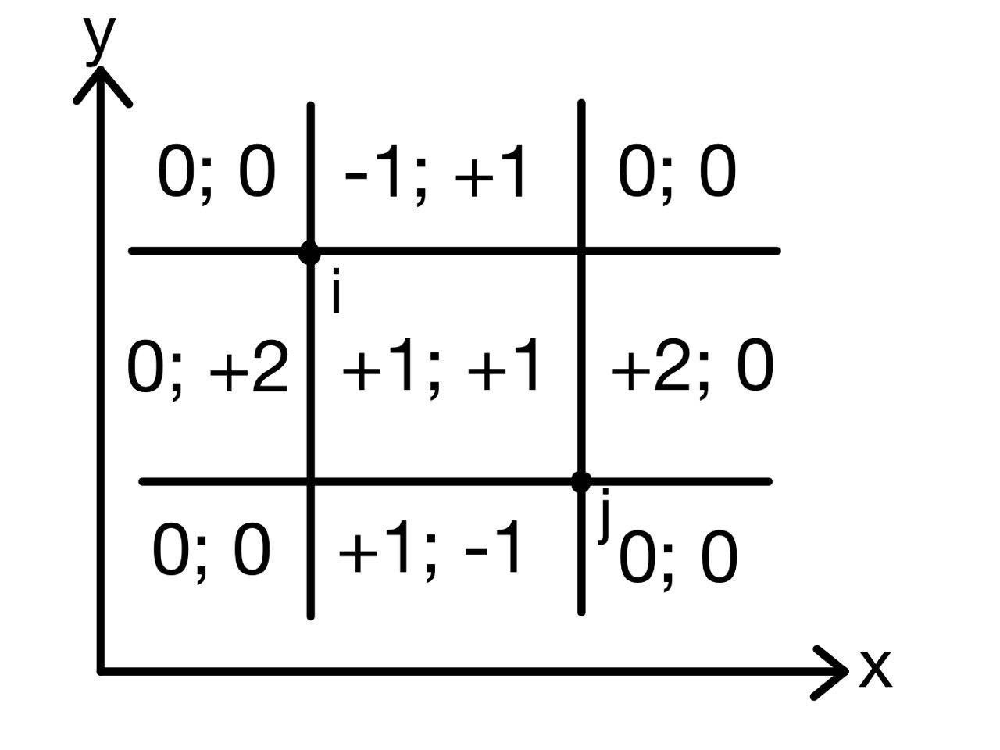

# Tutorial

We hope you enjoyed the contest! We recommend you to read all tutorials even if you solve the problem, maybe you will learn something new.

[1637A - Sorting Parts](../problems/A._Sorting_Parts.md "Codeforces Global Round 19")  
 Idea: [__JustMe__](https://codeforces.com/profile/__JustMe__ "Master __JustMe__").

 **Hint 1**What does happen if the array is already sorted?

 **Hint 2**What does happen if there are two indexes i and j, such that i<j and ai>aj?

 **Tutorial**
### [1637A - Sorting Parts](../problems/A._Sorting_Parts.md "Codeforces Global Round 19")

Consider two cases: 

1. The array is already sorted.
2. THe array is not sorted.

In the first case, sorting any prefix and any suffix does not change the array. So the array will always remain sorted so the answer is "NO".

In the second case, there are two elements with indexes i and j, such that i<j and ai>aj. So choose len so that these two elements will be in different parts. For example — len=i. Note that after operation ai will remain to the left of aj, which means the array will not be sorted. So the answer is "YES".

Then the solution is to check if the array is sorted, which can be done in O(n).

 **Solution**
```cpp
#include <bits/stdc++.h>
using namespace std;
 
int main() {
    int t;
    cin >> t;
    for (int i = 0; i < t; i++) {
        int n;
        cin >> n;
        vector<int> a(n);
        for (auto& u : a)
            cin >> u;
        if (!is_sorted(a.begin(), a.end()))
            cout << "YESn";
        else
            cout << "NOn";
    }
}
```
[1637B - MEX and Array](../problems/B._MEX_and_Array.md "Codeforces Global Round 19")  
 Idea: [__JustMe__](https://codeforces.com/profile/__JustMe__ "Master __JustMe__") and [Mangooste](https://codeforces.com/profile/Mangooste "Grandmaster Mangooste").

 **Hint 1**What does happen after replacing a segment of length greater than 1 with segments of length 1?

 **Hint 2**The cost of the array b1,b2,…,bk equals to k+∑ki=1mex({bi}).

 **Tutorial**
### [1637B - MEX and Array](../problems/B._MEX_and_Array.md "Codeforces Global Round 19")

We show, that replacing a segment of length k (k>1) with segments of length 1 does not decrease the cost of the partition. Consider two cases:

1. The segment does not contain 0.
2. The segment contains 0.

In the first case the contribution of the segment equals to 1 (because mex=0), but the contribution of k segments of length 1 equals to k. So the cost increased. In the second case the contribution of the segment equals to 1+mex<=1+k, but the contribution of the segments of length 1 would be at least 1+k, so the cost has not decreased.

Then it is possible to replace all segments of length more than 1 by segments of length 1 and not decrease the cost. So the value of the array b1,b2,…,bk equals to ∑ki=1(1+mex({bi})) = k + (the number of zeros in the array).

To calculate the total value of all subsegments, you need to calculate the total length of all subsegments and the contribution of each 0. The total length of all subsegments equals to n⋅(n+1)⋅(n+2)6. The contribution of a zero in the position i equals to i⋅(n−i+1). This solution works in O(n), but it could be implemented less efficiently.

There is also another solution, which uses dynamic programming: let dpl,r is the value of the array al,al+1,…,ar. Then dpl,r=max(1+mex({al,al+1,…,ar}),maxr−1c=l(dpl,c+dpc+1,r)). This solution can be implemented in O(n3) or in O(n4).

 **Solution**
```cpp
#include <bits/stdc++.h>
using namespace std;
 
int main() {
    int t;
    cin >> t;
    for (int i = 0; i < t; i++) {
        int n;
        cin >> n;
        vector<int> a(n);
        for (auto& u : a)
            cin >> u;
 
        int ans = 0;
        for (int i = 0; i < n; i++) {
            ans += (i + 1) * (n - i);
            if (a[i] == 0)
                ans += (i + 1) * (n - i);
        }
        cout << ans << 'n';
    }
}
```
[1637C - Andrew and Stones](../problems/C._Andrew_and_Stones.md "Codeforces Global Round 19")  
 Idea: [TeaTime](https://codeforces.com/profile/TeaTime "Master TeaTime").

 **Hint 1**The answer is −1 in two cases. If n=3 and a2 is odd. Also if for all 1<i<n: ai=1.

 **Hint 2**It is not optimal to add 1 to an odd number more than once.

 **Tutorial**
### [1637C - Andrew and Stones](../problems/C._Andrew_and_Stones.md "Codeforces Global Round 19")

Consider 2 cases when the answer is −1 for sure: 

1. For all 1<i<n: ai=1. In this case, it's not possible to make any operation and not all stones are in piles 1 or n.
2. n=3 and a2 is odd. Then after any operation this number will remain odd, so it can never become equal to 0.

Later it will become clear why these are the only cases where the answer is −1. To show it consider the following algorithm: 

1. If all stones are in piles 1 and n then the algorithm is done.
2. If there is at least one non-zero even element (piles 1 and n don't count), then subtract 2 from it, add 1 to the odd number to the left or to the pile 1 if there's no such number. Similarly add 1 to the odd number to the right or to the pile n if there's no such number. Then continue the algorithm. Note that the number of odd elements after it (piles 1 and n don't count) decreases at least by 1 (if there was any odd number). Also either a new even number has appeared, or the algorithm will be done.
3. If all remaining non-zero numbers are odd, then there is at least one odd number greater than 1. So let's subtract 2 from this element and add ones similar to the 2-nd case. In this case the number of odd elements decreases at least by 1.

From the notes written in the second and third cases, it follows that the algorithm always puts all stones to the piles 1 and n. Also note that if in the initial array the element in position i (1<i<n) was even, then the algorithm did not add any 1 to it, so the number of operations with the center in i equals to ai2. And if ai was odd, the algorithm will add 1 to this element exactly once, so the number of operations with the center in i equals to ai+12.

This algorithm is optimal because for each odd number it's necessary to add at least 1 to it and the algorithm adds exactly 1. And from even elements the algorithm can only subtract. It means that the answer to the problem equals to ∑n−1i=2⌈ai2⌉. Time complexity is O(n).

 **Solution**
```cpp
#include <bits/stdc++.h>
using namespace std;
 
void solve() {
    int n;
    cin >> n;
    vector<int> a(n);
    for (auto &x : a)
        cin >> x;
 
    if (*max_element(a.begin() + 1, a.end() - 1) == 1 || (n == 3 && a[1] % 2 == 1)) {
        cout << "-1n";
        return;
    }
 
    long long answer = 0;
    for (int i = 1; i < n - 1; i++)
        answer += (a[i] + 1) / 2;
 
    cout << answer << 'n';
}
 
int main() {
    ios::sync_with_stdio(false), cin.tie(nullptr);
    int tests;
    cin >> tests;
    while (tests--)
        solve();
}

```
[1637D - Yet Another Minimization Problem](../problems/D._Yet_Another_Minimization_Problem.md "Codeforces Global Round 19")  
 Idea: [Mangooste](https://codeforces.com/profile/Mangooste "Grandmaster Mangooste").

 **Hint 1**Try to simplify the array cost formula.

 **Hint 2**The total cost of two arrays equals to (n−2)⋅∑ni=1(a2i+b2i)+(∑ni=1ai)2+(∑ni=1bi)2.

 **Hint 3**Find all possible sums of the array a after some operations.

 **Tutorial**
### [1637D - Yet Another Minimization Problem](../problems/D._Yet_Another_Minimization_Problem.md "Codeforces Global Round 19")

The cost of the array a equals to ∑ni=1∑nj=i+1(ai+aj)2=∑ni=1∑nj=i+1(a2i+a2j+2aiaj). 

Let s=∑ni=1ai.

Then cost=(n−1)⋅∑ni=1a2i+∑ni=1(ai⋅(s−ai))=(n−1)⋅∑ni=1a2i+s2−∑ni=1a2i=(n−2)⋅∑ni=1a2i+(∑ni=1ai)2.

Then the total cost of two arrays equals to (n−2)⋅∑ni=1(a2i+b2i)+(∑ni=1ai)2+(∑ni=1bi)2. The first term is a constant ⇒ we need to minimize (∑ni=1ai)2+(∑ni=1bi)2.

There are two continuations of the solution, but the idea of both is to iterate over all possible sum of the array a, then calculate the sum of the array b and update the answer using formula written above: 

1. Let dpi,w is true if it's possible to make some operations so that the sum of first i elements in the array a equals to w, otherwise dpi,w is false. Then dp1,a1=dp1,b1= true. For i>1: dpi,w=dpi−1,w−ai or dpi−1,w−bi. Then to iterate over all possible sums of the array a you need to consider such s, that dpn,s= true.
2. Assume, that we have n items, where i-th item has a weight of |bi−ai|. By solving simple backpack problem let's find all possible sums of weights of these items. And if the sum contains i-th item, then we will assume that ai≥bi, otherwise ai≤bi. So if the sum of weights of some items equals to s, then the sum of the array a equals to ∑ni=1min(ai,bi)+s. So all possible sums of the array a can be received from all possible sums of weights of these items.

Both solutions works in O(n2⋅maxA) where maxA=100, and both solutions can be optimized with std::bitest, speeding up them by 64 times, but it wasn't necessary.

 **Solution**
```cpp
#include <bits/stdc++.h>
using namespace std;
 
constexpr int MAXSUM = 100 * 100 + 10;
 
int sqr(int x) {
    return x * x;
}
 
void solve() {
    int n;
    cin >> n;
    vector<int> a(n), b(n);
    for (auto& u : a)
        cin >> u;
 
    for (auto& u : b)
        cin >> u;
 
    int sumMin = 0, sumMax = 0, sumSq = 0;
    for (int i = 0; i < n; i++) {
        if (a[i] > b[i])
            swap(a[i], b[i]);
 
        sumSq += sqr(a[i]) + sqr(b[i]);
        sumMin += a[i];
        sumMax += b[i];
    }
 
    bitset<MAXSUM> dp;
    dp[0] = 1;
    for (int i = 0; i < n; i++)
        dp |= dp << (b[i] - a[i]);
 
    int ans = sqr(sumMin) + sqr(sumMax);
    for (int i = 0; i <= sumMax - sumMin; i++)
        if (dp[i])
            ans = min(ans, sqr(sumMin + i) + sqr(sumMax - i));
 
    cout << sumSq * (n - 2) + ans << 'n';
}
 
int main() {
    int t;
    cin >> t;
    while (t--)
        solve();
}

```
[1637E - Best Pair](../problems/E._Best_Pair.md "Codeforces Global Round 19")  
 Idea: [Mangooste](https://codeforces.com/profile/Mangooste "Grandmaster Mangooste").

 **Hint 1**Fix x and iterate over all cnty≤cntx. It works in O(n) summary.

 **Hint 2**When you fix x and cnty, interate over all y in the non increasing order while x=y or the pair (x,y) is bad.

 **Tutorial**
### [1637E - Best Pair](../problems/E._Best_Pair.md "Codeforces Global Round 19")

Let's fix x and iterate over cnty≤cntx. Then we need to find maximum y over all elements that occurs exactly cnty times, such that x≠y and pair (x,y) is not bad. To do that, we will just iterate over all elements that occurs exactly cnty times in not increasing order, while pair (x,y) is bad or x=y. If we find such y then we will update the answer.

To check if the pair is bad, just add all pairs into the set, and check is the pair is in the set. Also you can sort all bad pairs and check it using binary search. Both methods works in O(logn).

Iterating over all x and cnty≤cntx works in O(∑cntx)=O(n). And finding maximum y such that x≠y and the pair (x,y) is not bad works in O((n+m)logm) summary, because there are O(n+m) checks if the pair is bad or not. So this solution works in O((n+m)logm+nlogn).

 **Solution**
```cpp
#include <bits/stdc++.h>
using namespace std;
 
void solve() {
    int n, m;
    cin >> n >> m;
    vector<int> a(n);
    map<int, int> cnt;
    for (auto &x : a) {
        cin >> x;
        cnt[x]++;
    }
 
    vector<pair<int, int>> bad_pairs;
    bad_pairs.reserve(2 * m);
    for (int i = 0; i < m; i++) {
        int x, y;
        cin >> x >> y;
        bad_pairs.emplace_back(x, y);
        bad_pairs.emplace_back(y, x);
    }
    sort(bad_pairs.begin(), bad_pairs.end());
 
    vector<vector<int>> occ(n);
    for (auto &[x, c] : cnt)
        occ[c].push_back(x);
 
    for (auto &v : occ)
        reverse(v.begin(), v.end());
 
    long long answer = 0;
    for (int cnt_x = 1; cnt_x < n; cnt_x++)
        for (int x : occ[cnt_x])
            for (int cnt_y = 1; cnt_y <= cnt_x; cnt_y++)
                for (auto y : occ[cnt_y])
                    if (x != y && !binary_search(bad_pairs.begin(), bad_pairs.end(), pair<int, int>{x, y})) {
                        answer = max(answer, 1ll * (cnt_x + cnt_y) * (x + y));
                        break;
                    }
 
    cout << answer << 'n';
}
 
int main() {
    ios::sync_with_stdio(false), cin.tie(nullptr);
    int tests;
    cin >> tests;
    while (tests--)
        solve();
}
```
[1637F - Towers](../problems/F._Towers.md "Codeforces Global Round 19")  
 Idea: [TeaTime](https://codeforces.com/profile/TeaTime "Master TeaTime").

 **Hint 1**Find the answer when heights of all vertices are equal to 1.

 **Hint 2**Consider tree where all heights are either 1 or 0. What is the answer in this case?

 **Tutorial**
### [1637F - Towers](../problems/F._Towers.md "Codeforces Global Round 19")

Main solution:

Let's consider all leaves. If v is a leaf, then all paths, which cover v should start in v. Then let's increase heights of all towers in the leaves by 1 (it's necessary) and decrease all hv by 1. Now we should remove all leaves with hv=0 (they will be already covered). We will repeat the operation until there are covered leaves. We will continue the algorithm but instead of increasing height in new leaves of the tree we will increase height in deleted vertexes (in its subtree). If at some point we have only 1 vertex left we should increase height in 2 towers (due to the statement we should use 2 different towers to cover the vertex). To speed up the solution we will sort vertexes by hv and we will store current level of current leaves. On each iteration we will add amount of leaves multiplied by change of level.

If it is not optimal then let's consider heights of towers in the optimal answer. Let f(i) be amount of vertices in optimal answer with height larger or equal to i. It is easy to notice that f(i)−f(i−1) is at least amount of leaves in the tree on i-th iteration. If there is only one vertex left on iteration i then 2=f(i)−f(i−1). That means that the algorithm is optimal.

Alternative solution:

Let root be the vertex with the maximum height. Let's root tree at root. Now there must be two towers in the subtrees of the children of vertex root of height hroot (if there's only one child, then there must be a tower at the vertex root of height hroot). Now we need to place towers in the subtrees of the children of vertex root, such that for for every vertex v the highest tower in the subtree of vertex v (including v) must be at least hv. After it's done you need to select two highest towers in the subtrees of two different child of the vertex root and set their height to hroot.

Now we need to optimally place towers in the subtrees so that for every vertex v there must be a tower in the subtree of vertex v of height at least hv. To do that in the subtree of vertex v, let's recursively place towers in the subtrees of the children of vertex v, and then increase the height of the highest tower in the subtree of v to hv if it's necessary. If vertex v is a leaf then we need to place a tower of height hv in the vertex v.

This solutions can be implemented in O(n). For a better understanding, we recommend you to see the implementation.

 **Solution**
```cpp
#include <iostream>
#include <vector>
#include <algorithm>
#include <set>
#include <map>
 
using namespace std;
 
typedef long long ll;
 
#define fastInp cin.tie(0); cout.tie(0); ios_base::sync_with_stdio(0);
 
ll n;
vector<vector<ll>> gr;
vector<ll> vec;
 
void input() {
	cin >> n;
	vec.resize(n);
	for (auto& c : vec) cin >> c;
 
	gr.resize(n);
 
	for (int i = 0; i < n - 1; i++) {
		ll u, v;
		cin >> u >> v;
		u--; v--;
		gr[u].push_back(v);
		gr[v].push_back(u);
	}
}
 
ll sol() {
	ll ans = 0;
 
	set<pair<ll, ll>> leaves;
	vector<pair<ll, ll>> srt;
	vector<ll> degree(n);
 
	srt.push_back({ 0, -1 });
	for (int i = 0; i < n; i++) {
		degree[i] = gr[i].size();
 
		srt.push_back({ vec[i], i });
		if (gr[i].size() == 1) {
			leaves.insert({vec[i], i});
		}
	}
 
	sort(srt.begin(), srt.end());
 
	for (int i = 1; i <= n; i++) {
		while (leaves.size() > 0 && (*leaves.begin()).first < srt[i].first) {
			ll v = (*leaves.begin()).second;
			degree[v] = -2;
			leaves.erase(leaves.begin());
 
			for (auto to : gr[v]) {
				degree[to]--;
				if (degree[to] == 1 || degree[to] == 0) leaves.insert({ vec[to], to });
			}
		}
 
		ans += max(2ll, ll(leaves.size())) * (srt[i].first - srt[i - 1].first);
	}
 
	return ans;
}
 
int main() {
	fastInp;
 
	input();
	cout << sol();
 
	return 0;
}
```
 **Alternative solution**
```cpp
#include <bits/stdc++.h>
using namespace std;
 
typedef long long ll;
 
int main() {
  ios_base::sync_with_stdio(false); cin.tie(0);
  int n;
  cin >> n;
  vector<int> h(n);
  for (int i = 0; i < n; ++i) cin >> h[i];
  vector<vector<int>> g(n);
  for (int i = 0; i + 1 < n; ++i) {
    int u, v;
    cin >> u >> v;
    --u, --v;
    g[u].push_back(v);
    g[v].push_back(u);
  }
  int rt = 0;
  for (int i = 0; i < n; ++i) {
    if (h[i] > h[rt]) {
      rt = i;
    }
  }
  ll ans = 0;
  function<int(int, int)> dfs = [&](int u, int p) {
    int mx1 = 0, mx2 = 0;
    vector<int> have;
    for (auto v : g[u]) {
      if (v != p) {
        int cur = dfs(v, u);
        if (cur > mx1) swap(cur, mx1);
        if (cur > mx2) swap(cur, mx2);
      }
    }
    if (p != -1) {
      int delta = max(0, h[u] - mx1);
      ans += delta;
      mx1 += delta;
    } else {
      ans += max(0, h[u] - mx1) + max(0, h[u] - mx2);
    }
    return mx1;
  };
  dfs(rt, -1);
  cout << ans << 'n';
}
```
[1637G - Birthday](../problems/G._Birthday.md "Codeforces Global Round 19")  
 Idea: [EvgeniyPonasenkov](https://codeforces.com/profile/EvgeniyPonasenkov "Master EvgeniyPonasenkov").

 **Hint 1**It's impossible to construct a sequence of operations only when n=2.

 **Hint 2**Answer is the smallest power of two which is at least n.

 **Hint 3**Try to transform all numbers into the powers of two (maybe different).

 **Tutorial**
### [1637G - Birthday](../problems/G._Birthday.md "Codeforces Global Round 19")

The answer is −1 only if n=2. It will become clear later.

Let all numbers be equal to val after all steps. Consider the moves in reverse order: numbers x and y are obtained from x+y2 and |x−y|2. If numbers x and y are multiples of an odd number p>1, then numbers x+y2 and |x−y|2 are also multiples of p. But after all steps in reverse order, we need to get 1 ⇒ val can't be a multiple of p. It means that val is a power of two. Moreover val≥n because the maximum after all steps in direct order can't get smaller.

Let's show how to make all numbers equal to the smallest power of two which is at least n.

First of all, let's transform numbers 1,2,…,n into the n powers of two (maybe different), but not greater than the answer. Let the function solve(n) do this. It can be implemented as follows:

1. If n≤2 then all numbers are already a power of two so we can finish the function.
2. if n is a power of two, then call solve(n−1) and finish the function.
3. Otherwise let's p be the maximum power of two not exceeding n. Lets make steps by choosing pairs (p−1,p+1),(p−2,p+2),…,(p−(n−p),p+(n−p)). After that, there will be numbers that can be divided into 3 groups:
	1. Numbers that have not been changed: 1,2,…,p−(n−p)−1 and p. p is already a power of two. To transform other numbers into the powers of two let's call solve(p−(n−p)−1).
	2. Numbers that have been obtained as |x−y| after some step: 2,4,…,2⋅(n−p). To transform them into the powers of two we can take the sequence of steps that does solve(n−p) and multiply all numbers in these steps by 2.
	3. All numers that have been obtained as x+y after some step, are equal to 2p and they are already a power of two.

After this transformation, there are always two equal numbers that are smaller than the answer. Let them be equal to x. Let's make a step using them and we will get 0 and 2x.

From numbers 0 and x we can get numers 0 and 2x: (0,x)→(x,x)→(0,2x). So let's just use this 0 to transform all remaining numbers into the answer. After all, let's make a step using 0 and the answer, so 0 becomes equal to the answer.

It is obvious, that this solution works at most in O(n⋅logn). But at such limits it uses at most 7n steps.

 **Solution**
```cpp
#include <bits/stdc++.h>
using namespace std;
 
vector<pair<int, int>> ops;
vector<int> a;
 
void rec(int n, int coeff) {
    if (n <= 2) {
        for (int i = 1; i <= n; i++)
            a.push_back(i * coeff);
        return;
    }
 
    int p = 1;
    while (p * 2 <= n) p *= 2;
 
    if (p == n) {
        a.push_back(n * coeff);
        n--, p /= 2;
    }
 
    a.push_back(p * coeff);
    for (int i = p + 1; i <= n; i++) {
        a.push_back(2 * p * coeff);
        ops.emplace_back(i * coeff, (2 * p - i) * coeff);
    }
 
    rec(2 * p - n - 1, coeff);
    rec(n - p, coeff * 2);
}
 
void solve() {
    int n;
    cin >> n;
    if (n == 2) {
        cout << "-1n";
        return;
    }
 
    ops.clear();
    a.clear();
    rec(n, 1);
    sort(a.begin(), a.end());
 
    int answer = 1;
    while (answer < n)
        answer *= 2;
 
    for (int i = 0;; i++)
        if (a[i] == a[i + 1]) {
            assert(a[i] != answer);
            ops.emplace_back(a[i], a[i]);
            a[i + 1] *= 2;
            a.erase(a.begin() + i);
            break;
        }
 
    for (auto x : a)
        while (x != answer) {
            ops.emplace_back(0, x);
            ops.emplace_back(x, x);
            x *= 2;
        }
 
    ops.emplace_back(0, answer);
    cout << ops.size() << 'n';
    for (auto &[x, y] : ops)
        cout << x << ' ' << y << 'n';
}
 
int main() {
    int tests;
    cin >> tests;
    while (tests--)
        solve();
}
```
[1637H - Minimize Inversions Number](../problems/H._Minimize_Inversions_Number.md "Codeforces Global Round 19")  
 Idea: [Mangooste](https://codeforces.com/profile/Mangooste "Grandmaster Mangooste").

 **Hint 1**We have a proof that for each length, in the optimal sequence the following condition is satisfied: if the element i is selected, then all elements j>i and pj<pi are also selected.

 **Hint 2**Let di is a number by which the number of inversions will decrease after moving only the element with index i to the beginning. Then, if sequence seq is selected, then the number of inversions in a new permutation will be equal to invs−∑i∈seqdi+seqInvs−(|seq|⋅(|seq|−1)2−seqInvs)=invs−∑i∈seqdi+2⋅seqInvs−|seq|⋅(|seq|−1)2. Here invs — the number of inversions in the initial permutation, and seqInvs — the number of inversions over all elements in the seq.

 **Hint 3**Assume that the number of inversions equals to invs−∑i∈seqci−|seq|⋅(|seq|−1)2. What is ci?

 **Hint 4**If i>j and pi>pj then ci<cj. So for the length len it's optimal to choose len maxmum elements by the value of ci.

 **Tutorial**
### [1637H - Minimize Inversions Number](../problems/H._Minimize_Inversions_Number.md "Codeforces Global Round 19")

To simplify the explanation, we will represent a permutation as a set of points $(i, p_i)$.

$\bf{Lemma}$: Let's consider some selected subsequence. Then there always exists such sequence of the same length, so that if we select it instead, the number of inversions won't increase, for which the following condition is satisfied: if the point $i$ is selected, then all points to the right and below point $i$ are also selected.

$\bf{Proof}$: Let assume that it's not right, then there is a pair of points $(i, j)$ such that $i$ is selected and $j$ is not, and j is to the right and below point $i$ (the point is selected if it is in the sequence). Let's call such pair a bad pair. Divide the points into 9 regions by 4 straight lines parallel to the coordinate axes passing through the point $i$ and $j$. No for every point, considering if it is selected or not and considering the region where it is, let's determine by how many it reduces the number of inversions after replacing $i$ with $j$ (i.e. select $j$ instead of $i$). Let's call it a contribution of this point. Also note that after replacing the point $i$ with the point $j$, the inversion formed by these two points disappears.

  The first integer in each region — the contribution of the point selected there. The second integer — the contribution of unselected one. Note that negative contribution has only selected points, located between the point $i$ and $j$ (on the $Ox$ axis) above the point $i$, and unselected points located between the point $i$ and $j$ below the point $j$.

Now let's find any bad pair $(i, j)$ and do the following:

1. If there is a selected point $id$, which has negative contribution, then set $i = id$ and continue the algorithm.
2. Otherwise, if there is a unselected point $id$, which has negative contribution, then set $j = id$ and continue the algorithm.
3. Otherwise, after replacing the point $i$ with the point $j$ the number of inversions will reduce.

This algorithm always finds a bad pair such that after replacing $i$ with $j$ the number of inversions will reduce, because each time the value $j - i$ reduces. Q.E.D.

Let $d_i$ is a number by which the number of inversions will decrease after moving only the element with index $i$ to the beginning. Then $d_i =$ (the number of points to the left and above i$) - ($the number of points to the left and below i). Then, if sequence $seq$ is selected, then the number of inversions in a new permutation will be equal to $invs - \sum_{i \in seq} d_i + seqInvs - (\frac{|seq| \cdot (|seq| - 1)}{2} - seqInvs) = invs - \sum_{i \in seq} d_i + 2 \cdot seqInvs - \frac{|seq| \cdot (|seq| - 1)}{2}$. Here $invs$ — the number of inversions in the initial permutation, and $seqInvs$ — the number of inversions over all elements in the $seq$.

$seqInvs = \sum_{i \in seq}$ (the number of selected points to the right and below $i$). Due to the lemma proved above, if the sequence $seq$ is optimal, then if the point $i$ is selected, then $\Rightarrow$ all points to the right and below $i$ are selected as well, so if $s_i$ is the number of points to the right and below $i$, then $seqInvs = \sum_{i \in seq} s_i$. So the number of inversions in the new permutation equals to $invs - \sum_{i \in seq} (d_i - 2s_i) - \frac{|seq| \cdot (|seq| - 1)}{2}$. Note, that this formula can be incorrect if the sequence is not optimal. In this case point $i$ reduces the number of inversions by $c_i = d_i - 2s_i$.

Note that the number of points to the left and below $i$ equals to $p_i - 1 - s_i$, and the number of points to the left and above $i$ equals to $(i - 1) - (p_i - 1 - s_i) = i - p_i + s_i$. So $d_i = (i - p_i + s_i) - (p_i - 1 - s_i) = i - 2p_i + 2s_i + 1$. So $c_i = d_i - 2s_i = i - 2p_i + 1$.

Now it's not hard to see, that if the point $j$ is to the left and below the point $i$, then $c_j > c_i$. So if we select $len$ maximum elements by the value of $c_i$, the formula for the number of inversions written above is correct. It means that it is optimal. It can be implemented in $O(n \log{n})$.

 **Solution**
```cpp
#include <bits/stdc++.h>
using namespace std;
 
struct binary_index_tree {
    int n;
    vector<int> bit;
 
    binary_index_tree(int n) : n(n), bit(n + 1) {}
 
    void increase(int pos) {
        for (pos++; pos <= n; pos += pos & -pos)
            bit[pos]++;
    }
 
    int query(int pref) const {
        int sum = 0;
        for (; pref; pref -= pref & -pref)
            sum += bit[pref];
 
        return sum;
    }
};
 
void solve() {
    int n;
    cin >> n;
 
    vector<int> d(n);
    binary_index_tree bit(n);
    long long inversions = 0;
 
    for (int i = 0; i < n; i++) {
        int p;
        cin >> p;
        p--;
 
        d[i] = i - 2 * p;
        inversions += i - bit.query(p);
        bit.increase(p);
    }
    sort(d.rbegin(), d.rend());
 
    cout << inversions;
    long long sum = 0;
    for (int i = 0; i < n; i++) {
        sum += d[i];
        cout << ' ' << inversions - sum - 1ll * i * (i + 1) / 2;
    }
 
    cout << 'n';
}
 
int main() {
    ios::sync_with_stdio(false), cin.tie(nullptr);
 
    int tests;
    cin >> tests;
    while (tests--)
        solve();
}
```
