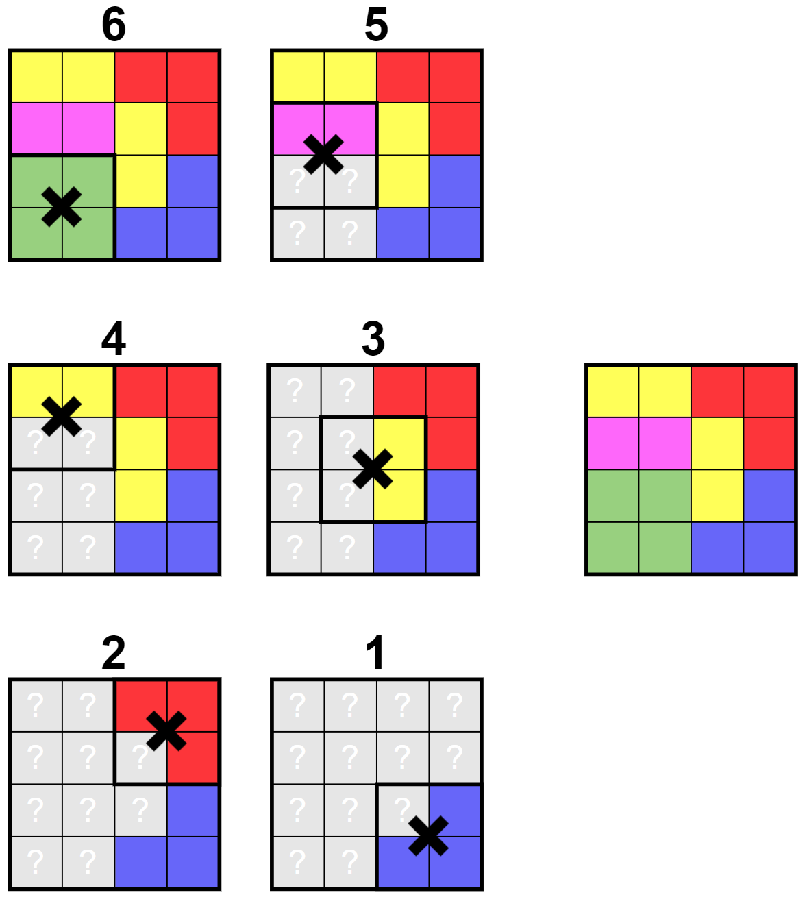
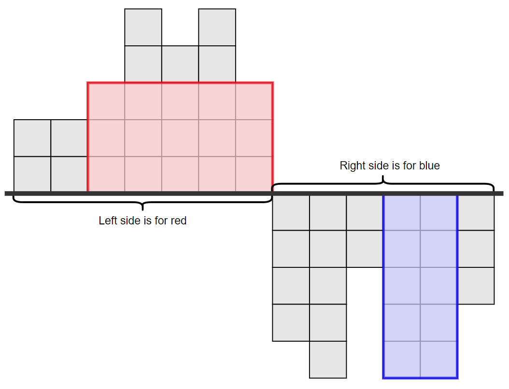
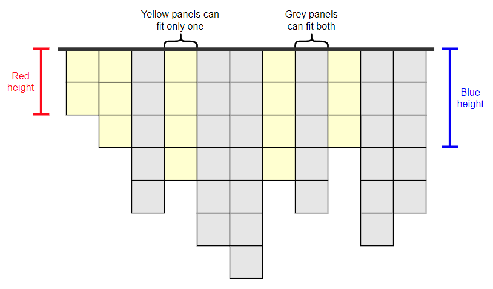
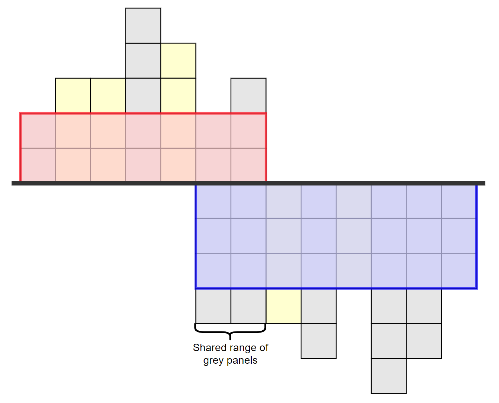
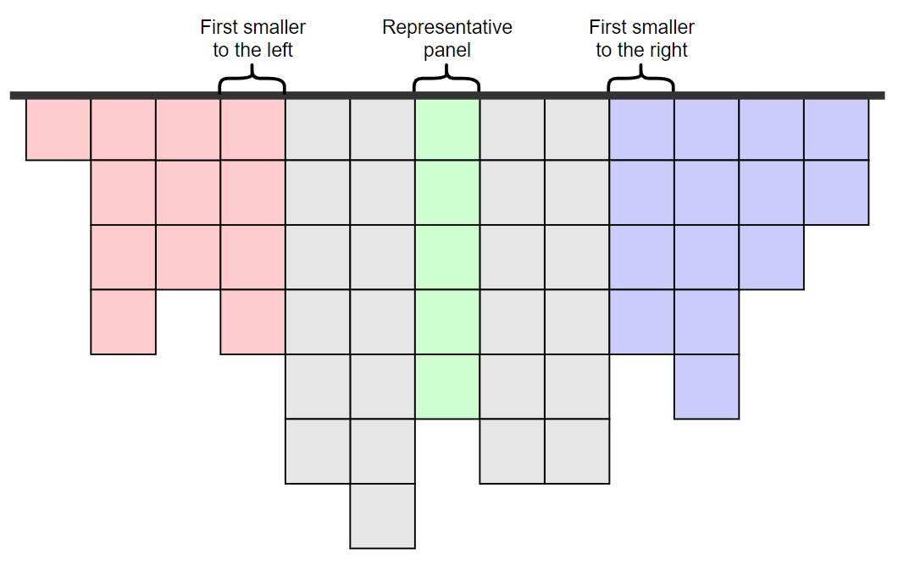
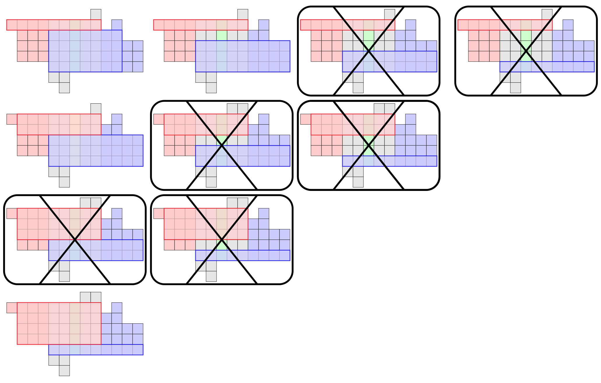
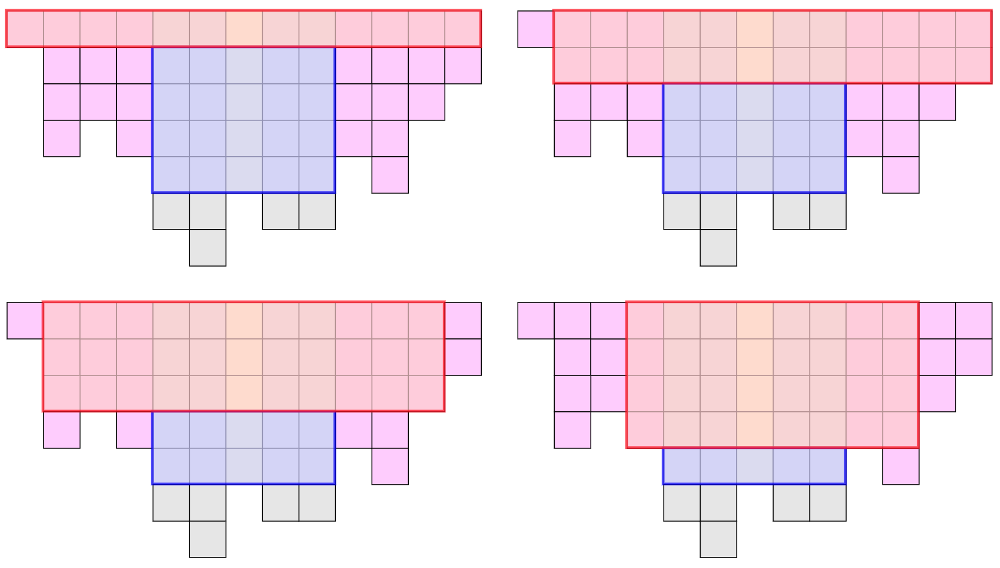

# Tutorial_(en)

I hope you enjoyed the problems! You can give feedback on each problem and also choose your favourite below. This could help me and other problemsetters understand what type of problems you want to see on Codeforces.

[1638A - Reverse](../problems/A._Reverse.md "Codeforces Round 771 (Div. 2)")  

 **Hint 1**When is it best for the permutation to remain unchanged?

 **Hint 2**What elements are obviously optimal and should remain as they are?

 **Hint 3**Find the first non-optimal element. What's the best way to fix it?

 **Tutorial**Let pi be the first element such that pi≠i. For the prefix of elements p1=1,p2=2,…,pi−1=i−1 we do not need to change anything because it is already the minimum lexicographic, but we would like to have i instead of pi on that position. The solution is to reverse segment [i,j], where pj=i.

Notice that i<j since pk=k for every k<i, so pk<pj=i for every k<i.

Time complexity: O(n).

 **Feedback*** Didn't solve 

[*135*](https://codeforces.com/data/like?action=like "I like this")
* Good problem 

 
[*804*](https://codeforces.com/data/like?action=like "I like this")
* Average problem 

 
[*213*](https://codeforces.com/data/like?action=like "I like this")
* Bad problem 

 
[*68*](https://codeforces.com/data/like?action=like "I like this")
[1638B - Odd Swap Sort](../problems/B._Odd_Swap_Sort.md "Codeforces Round 771 (Div. 2)")  

 **Hint 1**Replace the condition "ai+ai+1 is odd" with something easier to work with.

 **Hint 2**The condition means that we only swap elements of different parity. Now, make some observations.

 **Hint 3**What happens if there are some elements ai and aj (i<j) of the same parity, such that ai>aj?

 **Hint 4**If such pair exists, the answer is "NO". Now consider the array to be a merge between two increasing arrays (one with odd elements, one with even elements). Try to prove that the answer is always "YES" in this case.

 **Hint 5**What does the Bubble Sort algorithm do here? Does it ever do an illegal swap?

 **Tutorial**The condition "ai+ai+1 is odd" means that we can only swap elements of different parity. If either the order of even elements or the order of odd elements is not non-decreasing, then it is impossible to sort the sequence. Otherwise, let's prove that it is always possible to sort the sequence. We can for example perform Bubble Sort algorithm. Note that this algorithm only swaps elements ai and ai+1 if ai>ai+1, so it will never swap two elements of the same parity (given our assumption on their order).

Time complexity: O(n).

 **Feedback*** Didn't solve 

 
[*329*](https://codeforces.com/data/like?action=like "I like this")
* Good problem 

 
[*1284*](https://codeforces.com/data/like?action=like "I like this")
* Average problem 

 
[*143*](https://codeforces.com/data/like?action=like "I like this")
* Bad problem 

 
[*124*](https://codeforces.com/data/like?action=like "I like this")
[1638C - Inversion Graph](../problems/C._Inversion_Graph.md "Codeforces Round 771 (Div. 2)")  

 **Hint 1**Is there any observation you can make on the structure of the components? Ignoring values, how do they look?

 **Hint 2**Components form subsegments of the array. Don't prove this now. Instead, try to construct the solution by gradually increasing the prefix and storing components in a simple data structure.

 **Hint 3**Use a stack of pairs. For all current components, store the minimum and maximum elements inside. How do these components merge when the prefix increases?

 **Tutorial**
### [1638C - Inversion Graph](../problems/C._Inversion_Graph.md "Codeforces Round 771 (Div. 2)")

The key idea is to start merging from the beginning using a stack. Assume that the connected components are always segments in the permutation (this solution also proves this by induction).

We will iterate the prefix and maintain in our stack the minimum/maximum element of all the segments in order. When we increase the prefix adding the next position i, we add (pi,pi) to the top of the stack. Then, we merge the top two segments while we are able to. If the top two segments have their minimum/maximum elements (min1,max1) and (min2,max2), in this order from the top, we will merge them only if max2>min1, because this means that an edge exist between the two.

When we reach the end, our stack contains all connected components. Note that merging two adjacent intervals forms a new interval, so we have proven by induction that our first assumption is correct.

Time complexity: O(n).

 **Feedback*** Didn't solve 

 
[*332*](https://codeforces.com/data/like?action=like "I like this")
* Good problem 

 
[*1292*](https://codeforces.com/data/like?action=like "I like this")
* Average problem 

 
[*76*](https://codeforces.com/data/like?action=like "I like this")
* Bad problem 

 
[*109*](https://codeforces.com/data/like?action=like "I like this")
[1638D - Big Brush](../problems/D._Big_Brush.md "Codeforces Round 771 (Div. 2)")  

 **Hint 1**Solve the problem in reverse.

 **Hint 2**What are the possible final operations?

 **Hint 3**They are the 2×2 squares painted in a single color. After finding all such squares, how can you "remove" them from the painting?

 **Hint 4**When removing a square, the cells below could have been painted in any color. So, mark them as special cells. After running out of squares painted in a single color, what are the new possible last operations?

 **Hint 5**They are all the 2×2 squares whose **non-special** cells are painted in the same color. How do we keep track of those while removing squares?

 **Hint 6**Queue.

 **Tutorial**
### [1638D - Big Brush](../problems/D._Big_Brush.md "Codeforces Round 771 (Div. 2)")

Let's try to build the solution from the last operation to the first operation. The last operation can be any 2×2 square painted in a single color. If there is no such square, it is clearly impossible. Otherwise, this square being the last operation implies that we could previously color its cells in any color, multiple times, without any consequences. We will name these special cells. 

What happens when we run out of 2×2 squares painted in a single color? Well, we can use the special cells described above. The next operation considered can be any 2×2 square such that all its non-special cells are painted in the same color. If there is no such square, it is clearly impossible.

We now have a correct solution. It consists of at most nm operation because at each step we turn at least one non-special cell into a special one and there are nm cells. We can implement this solution similar to BFS. First, insert all 2×2 squares painted in a single color into a queue. Then, at each step take the square in the front of the queue, add it to the solution and make all its non-special cells special. When making a cell special, check all 2×2 squares that contain it and if some of them meet the condition after the current step, insert them into the queue. Note that there are at most 9 such squares.

  Time complexity: O(nm).

 **Feedback*** Didn't solve 

 
[*313*](https://codeforces.com/data/like?action=like "I like this")
* Good problem 

 
[*548*](https://codeforces.com/data/like?action=like "I like this")
* Average problem 

 
[*82*](https://codeforces.com/data/like?action=like "I like this")
* Bad problem 

 
[*201*](https://codeforces.com/data/like?action=like "I like this")
[1638E - Colorful Operations](../problems/E._Colorful_Operations.md "Codeforces Round 771 (Div. 2)")  

 **Hint 1**First, solve the problem for single-element updates.

 **Hint 2**Don't actually add to all elements of some color in an update. Instead, just set a reminder that you have to do so. When do you have to be careful?

 **Hint 3**When you change color, remember to do the addition. Also, don't forget about the already set reminder on the new color. This is currently wrong because you are up to date. How do you fix it?

 **Hint 4**Moving to the range update problem, use a data structure to maintain maximal ranges colored in a single color. How do these color intervals change during a color operation? What's the actual time complexity?

 **Tutorial**
### [1638E - Colorful Operations](../problems/E._Colorful_Operations.md "Codeforces Round 771 (Div. 2)")

In the first part, let's consider that for all update operations l=r. The idea is not to update each element in an Add operation and instead, keeping an array lazy[color] which stores for each color the total sum we must add to it (because we didn't do it when we had to).

Lets's discuss each operation: 

* Update l r c:We will use the notation l=r=i. In this operation we change the color of element i from c′ to c. First, remember that we have the sum lazy[c′] that we haven't added to any of the elements of color c′ (including i), so we better do it now because the color changes: a[i]:=a[i]+lazy[c′]. Now we can change the color to c.

But wait, what about lazy[c]? It says that we will need to add some value to element i, but this is obviously false, since now it is up to date. We can compensate by subtracting now lazy[c] from element i, repairing the mistake we will do later: a[i]:=a[i]−lazy[c]. Finally, don't forget to set color[i]:=c.
* Add c x:This is as simple as it gets: lazy[c]:=lazy[c]+x.
* Query i:The query operation is also not very complicated. We print the value a[i] and don't forget about lazy[color[i]]: print(a[i]+lazy[color[i]]).

The time complexity is O(1) per query.

Now we get back to the initial problem and remove the restriction l=r. Let's keep an array of maximal intervals of elements with the same color. We will name them color intervals. By doing so, we can keep the lazy value for the a whole color interval. When we change the color of all elements in [l,r], there are two kinds of color intervals that interest us in our array: 

* [l′,r′]⊆[l,r]:In this case the whole interval changes its color. First, we add the lazy values to each interval. Then, after changing the color of all these intervals into the same one, we can merge them all. Now we update the resulting interval similar to how we would update a single element.
* l∈[l′,r′] or r∈[l′,r′] (or both):These are the two (or one) intervals that contain the endpoints l and r. Here we will first split the color interval into two (or three) smaller ones: outside and inside [l,r]. Then, we just update the one inside [l,r] as before.

Notice that in contrast to the solution for l=r, here we have to add some value on a range. We can do this using a data structure such as Fenwick tree or segment tree in O(log2(n)). Also, for storing the color intervals we can use a set. This allows insertions and deletions, as well as quickly finding the range of intervals modified in a coloring.

The time complexity is a bit tricky to determine because at first it might seem like it is O(q⋅n), but if we analyze the effect each update has on the long term, it turns out to be much better.

We will further refer to the number of intervals in our array as the potential of the current state. Let's consider that in our update we found k color intervals contained in the update interval, the potential decreases by k−1 and then it grows by at most 2 (because of the two splits). The number of steps our program performs is proportional to the total changes in potential.

In one operation, the potential can decrease by a lot, but luckily, it can only grow by 2. Because the potential is always positive, it decreases in total at most as much as it increases. Thus, the total change in potential is O(q).

Although not described here, there exists another solution to this problem using only a segment tree with lazy propagation. In this solution, our data structure stops only on monochrome segments. The time complexity is the same.

Time complexity: O(n+q⋅log2(n)).

 **Feedback*** Didn't solve 

 
[*195*](https://codeforces.com/data/like?action=like "I like this")
* Good problem 

 
[*234*](https://codeforces.com/data/like?action=like "I like this")
* Average problem 

 
[*22*](https://codeforces.com/data/like?action=like "I like this")
* Bad problem 

 
[*27*](https://codeforces.com/data/like?action=like "I like this")
[1638F - Two Posters](../problems/F._Two_Posters.md "Codeforces Round 771 (Div. 2)")  

 **Hint 1**Consider the ranges of panels covered by the two posters. Split the problem into multiple cases according to how these intervals are positioned relative to eachother. Throughout the solution, consider the concept of "bottlenecks". These are panels that stop the area to be any larger.

 **Hint 2**First case: the ranges are disjoint. How do you solve this?

 **Hint 3**Now, for the other cases, make some observations when the posters share some common range of pannels. Consider the heights to be fixed and group panels into two different types.

 **Hint 4**There are panels that could fit both (let them be grey) and panels that could fit only one (let them be yellow). The shared range of pannels is between two consecutive yellow panels. Moreover, it is bounded by yellow panels in an optimal solution.

 **Hint 5**Now, consider the heights of the two posters to not be fixed anymore. How many possible maximal ranges of shared panels can there be? They seem to be O(n2), but maybe there are less.

 **Hint 6**Let the shortest panel inside a maximal shared range to be its "representative panel". Starting from such a panel, what ranges does it represent?

 **Hint 7**It can be proven that the only possible range is the one between the closest shorter panels to the left and right. Now you are able to consider all possible shared ranges because there are O(n). You can split further into two cases and solve them using two-pointers and possibly some precomputations.

 **Tutorial**
### [1638F - Two Posters](../problems/F._Two_Posters.md "Codeforces Round 771 (Div. 2)")

There are many ways in which two posters can be positioned, therefore, we split the problem into multiple sub-problems. Consider the following cases. 

1. The two posters share no common panel.
2. The two posters share a range of common panels. Here, there are two sub-cases.
	* The second poster does not share all its panels with the first.
	* The second poster shares all its panels with the first.

Let's find the maximum total area for each of these cases. The answer will be the maximum over them.

The important element to analyze in an optimal positioning of the two posters is the bottleneck. This is the panel (or one of them) which is completely covered by the posters and doesn't allow the area to be any larger.

1. The two posters share no common panel.Since the two posters cover disjoint ranges of panels, there is a left poster and a right poster. Thus, we can choose a position somewhere between the two posters and move up to the maximum all panels to the left of this position.

So, a correct solution is to consider all possible split positions. For each of them, solve the standard skyline problem for both left and right sides or, for an easier implementation, use a trivial precomputation.

  Time complexity: O(n2).
2. The two posters share a range of common panels.In the following two subcases we will deal with pairs of posters that share some panels. So, let's make some observations before going any further.

Consider the height of the first poster (red) to be h1 and the height of the second poster (blue) to be h2. Now, let's find all panels i such that hi<hl+hr. We will color these panels yellow and the rest of them gray. Because of the condition we imposed on the heights of yellow panels, they can't be shared by the two posters. On the other hand, gray panels can.

  Now we can make one more observation. The range of common panels lies between two yellow panels. Moreover, since we try to maximize the total area and the two heights are fixed, the range of common panels is one of the maximal gray ranges.

  Now comes the tricky part. We can't iterate over all the maximal gray ranges. There are O(n) such ranges for any h1 and h2. And even worse, the two heights are up to 1012. The problem is that we are looking from the wrong perspective. Instead of iterating h1 and h2 and then finding the yellow panels, let's consider some possible maximal intersection range and then find all pairs of h1 and h2 influenced by this range.

Ok, but there are O(n2) ranges to consider, right? Well, there are actually only O(n).

Please note that the yellow/gray notation only works after fixing some h1 and h2, but we refer to as a maximal intersection range to those ranges that could meet the conditions for some suitable h1 and h2.

Let the smallest panel inside a maximal intersection range be its representative (if there are multiple, take the leftmost one). Now consider some panel i. For which maximal intesrection ranges is it the representative? 

Start with the range [i,i] and extend to the left and to the right, while at least one of the bounding panels is larger or equal to hi. We are doing this because we search for maximal intersection ranges, and this means that they are contained between two yellow panels of smaller size. Now we stopped at some range [x,y], where hj>hx−1 and hj>hy+1 for any j∈[x,y]. Can we extend even more? No, we considered panel i to be the representative and thus, the smallest in the range, extending it any further would contradict this. We now have O(n) possible maximal intersection ranges, each having a unique representative.

  Let the prefix of panels before the range be colored red and the suffix of panels after the range be colored blue. Now, let's look at the two remaining cases and solve them.

	* The second poster does not share all its panels with the first.This means that the first poster covers all gray panels and some of the red ones, and the second poster covers all gray panels and some of the blue ones. Consider the following example.
	
	  These are all the ways two posters can be positioned in this case. Some of them are marked as useless because they can be transformed into better configurations. How do we tell if a configuration is useful? Well, in a useful configuration, the two posters should meet one of the following two conditions. 
	
	
		+ They touch (the representative panel being a bottleneck) and one of them also has its own bottleneck. If none of them had its own bottleneck, it would be possible to stretch the wider one, while shrinking the other, in order to increase the total area. This way, a bottleneck could be formed in a better configuration.
		+ Each of them has its own bottleneck.So, let's sum up. First, we choose a representative panel. Then, we find the range it represents. Next, solve each of the above cases separately. Some prefix/suffix precomputation and two pointers algorithm should be enough.
	
	Time complexity: O(n2).
	* The second poster shares all its panels with the first.This means that the second poster covers all gray panels and the first poster covers all gray panels, some of the red ones and some of the blue ones (here, we will replace blue and red with pink). Consider the following example.
	
	  This is obviously the simple subcase of the two. We only need to keep track on the left and right pink panels while we gradually decrease the height of the second poster. We will use the two pointers algorithm again.
	
	Note that the blue poster should touch the end of the representative panel. You might argue that braking this restriction could result in a larger total area, but don't forget that we will handle those cases using other representative panels and their respective gray ranges.
	
	Time complexity: O(n2).
 **Feedback*** Didn't solve 

 
[*133*](https://codeforces.com/data/like?action=like "I like this")
* Good problem 

 
[*32*](https://codeforces.com/data/like?action=like "I like this")
* Average problem 

 
[*6*](https://codeforces.com/data/like?action=like "I like this")
* Bad problem 

 
[*12*](https://codeforces.com/data/like?action=like "I like this")
Now you can choose your favourite problem from the ones you solved during the contest or upsolved after it.

 * Problem A 

 
[*46*](https://codeforces.com/data/like?action=like "I like this")
* Problem B 

 
[*159*](https://codeforces.com/data/like?action=like "I like this")
* Problem C 

 
[*576*](https://codeforces.com/data/like?action=like "I like this")
* Problem D 

 
[*187*](https://codeforces.com/data/like?action=like "I like this")
* Problem E 

 
[*166*](https://codeforces.com/data/like?action=like "I like this")
* Problem F 

 
[*45*](https://codeforces.com/data/like?action=like "I like this")

**UPD:** Don't forget to check out [ak2006](https://codeforces.com/profile/ak2006 "Specialist ak2006")'s video tutorials on [his channel](https://codeforces.com/https://www.youtube.com/channel/UCnZ5rC2_JY0EuYMGMiAbISg).

