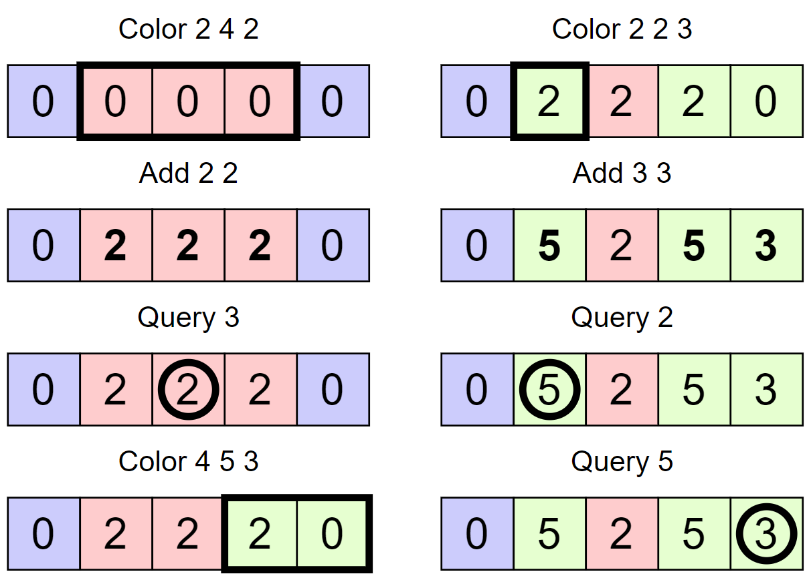

<h1 style='text-align: center;'> E. Colorful Operations</h1>

<h5 style='text-align: center;'>time limit per test: 4 seconds</h5>
<h5 style='text-align: center;'>memory limit per test: 256 megabytes</h5>

You have an array $a_1,a_2, \dots, a_n$. Each element initially has value $0$ and color $1$. You are also given $q$ queries to perform: 

* Color $l$ $r$ $c$: Change the color of elements $a_l,a_{l+1},\cdots,a_r$ to $c$ ($1 \le l \le r \le n$, $1 \le c \le n$).
* Add $c$ $x$: Add $x$ to values of all elements $a_i$ ($1 \le i \le n$) of color $c$ ($1 \le c \le n$, $-10^9 \le x \le 10^9$).
* Query $i$: Print $a_i$ ($1 \le i \le n$).
#### Input

The first line of input contains two integers $n$ and $q$ ($1 \le n,q \le 10^6$) — the length of array $a$ and the number of queries you have to perform.

Each of the next $q$ lines contains the query given in the form described in the problem statement.

#### Output

Print the answers to the queries of the third type on separate lines.

## Examples

#### Input


```text
5 8
Color 2 4 2
Add 2 2
Query 3
Color 4 5 3
Color 2 2 3
Add 3 3
Query 2
Query 5
```
#### Output


```text
2
5
3
```
#### Input


```text
2 7
Add 1 7
Query 1
Add 2 4
Query 2
Color 1 1 1
Add 1 1
Query 2
```
#### Output


```text
7
7
8
```
## Note

The first sample test is explained below. Blue, red and green represent colors $1$, $2$ and $3$ respectively.

  

#### Tags 

#2400 #NOT OK #brute_force #data_structures #implementation 

## Blogs
- [All Contest Problems](../Codeforces_Round_771_(Div._2).md)
- [Announcement (en)](../blogs/Announcement_(en).md)
- [Tutorial (en)](../blogs/Tutorial_(en).md)
