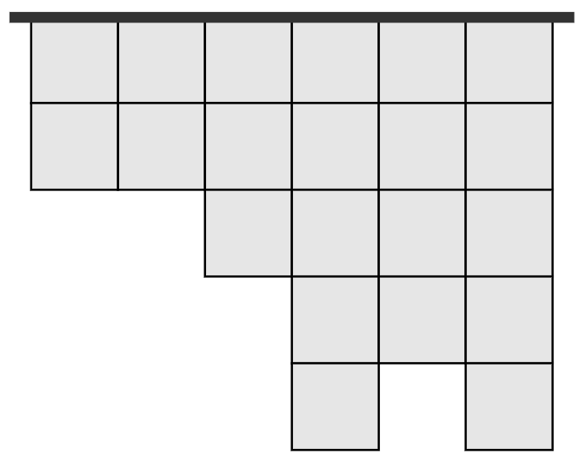
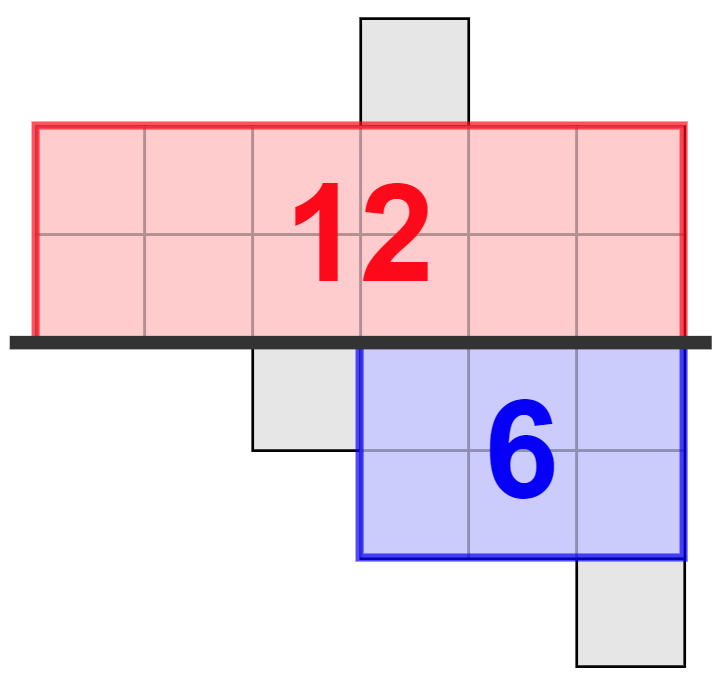

<h1 style='text-align: center;'> F. Two Posters</h1>

<h5 style='text-align: center;'>time limit per test: 2 seconds</h5>
<h5 style='text-align: center;'>memory limit per test: 1024 megabytes</h5>

You want to advertise your new business, so you are going to place two posters on a billboard in the city center. The billboard consists of $n$ vertical panels of width $1$ and varying integer heights, held together by a horizontal bar. The $i$-th of the $n$ panels has height $h_i$.

  Initially, all panels hang down from the bar (their top edges lie on it), but before placing the two posters, you are allowed to move each panel up by any integer length, as long as it is still connected to the bar (its bottom edge lies below or on it).

After the moves are done, you will place two posters: one below the bar and one above it. They are not allowed to go over the bar and they must be positioned completely inside of the panels.

What is the maximum total area the two posters can cover together if you make the optimal moves? 
## Note

 that you can also place a poster of $0$ area. This case is equivalent to placing a single poster.

#### Input

The first line of input contains one integer $n$ ($1 \le n \le 10^4$) — the number of vertical panels.

The second line of input contains $n$ integers $h_1, h_2, ..., h_n$ ($1 \le h_i \le 10^{12}$) — the heights of the $n$ vertical panels.

#### Output

Print a single integer — the maximum total area the two posters can cover together.

## Examples

#### Input


```text
6
2 2 3 5 4 5
```
#### Output


```text
18
```
#### Input


```text
1
1
```
#### Output


```text
1
```
## Note

In the first sample test, we can choose an upper poster with area $12$ and a lower poster of area $6$ as in the image below.

  In the second sample test, we can cover the whole billboard using a single poster.


#### Tags 

#3200 #NOT OK #brute_force #data_structures #greedy #two_pointers 

## Blogs
- [All Contest Problems](../Codeforces_Round_771_(Div._2).md)
- [Announcement (en)](../blogs/Announcement_(en).md)
- [Tutorial (en)](../blogs/Tutorial_(en).md)
