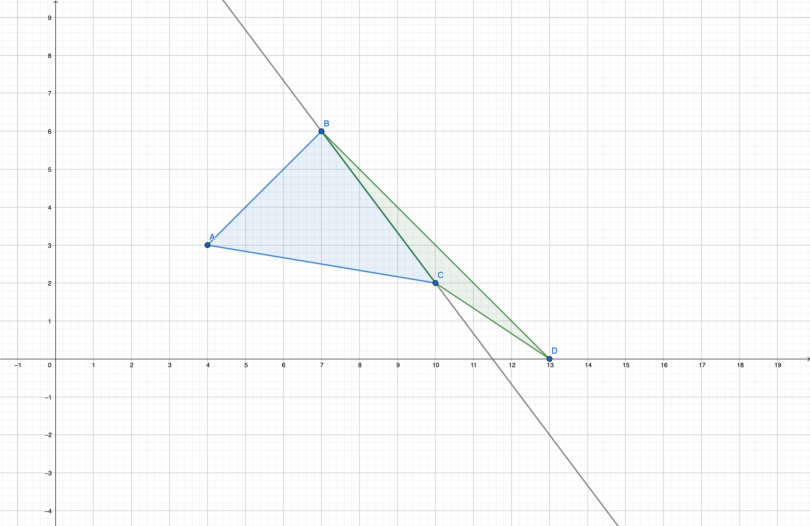
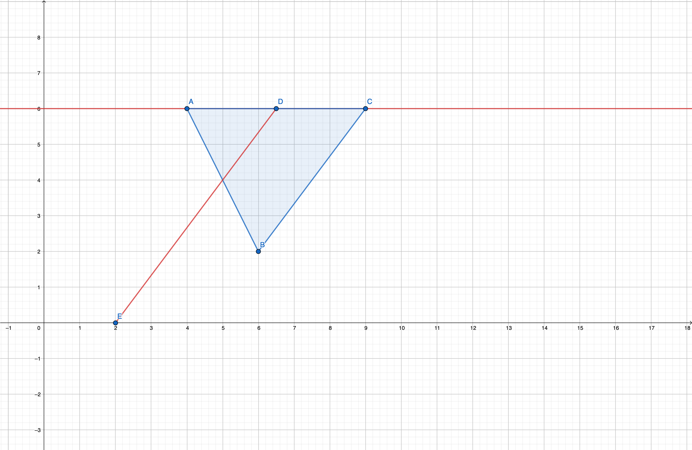

# Tutorial

Hello, codeforces!

We deeply apologize for the weak pretests in the problem [1642C - Great Sequence](https://codeforces.com/contest/1642/problem/C "Codeforces Round 773 (Div. 2)"). Anyway, we believe that you liked at least one problem from the contest :)

Thanks to [Mangooste](https://codeforces.com/profile/Mangooste "Grandmaster Mangooste") for the problem [1641E - Special Positions](../problems/E._Special_Positions.md "Codeforces Round 773 (Div. 1)")!

 
### [1642A - Hard Way](https://codeforces.com/contest/1642/problem/A "Codeforces Round 773 (Div. 2)")

If the triangle's side is not parallel with the line $y = 0$, all points on this side are safe because we can intersect it with $y = 0$ and there will be a point from which we can reach any point on this side of our triangle. 

  All points on the side, which is parallel with $y = 0$ line contains are also safe if the third point has a greater $y$: 

  Thus, a point can be unreachable if and only if it is the "upper" horizontal side of our triangle, because it is impossible to draw such line which would intersect with $y = 0$ line and would not intersect with the inner part of our triangle: 

  Solution: [147513897](https://codeforces.com/contest/1642/submission/147513897 "Submission 147513897 by ilyakrasnovv")

 
### [1642B - Power Walking](https://codeforces.com/contest/1642/problem/B "Codeforces Round 773 (Div. 2)")

It is quite easy to understand that every multiset's power is at least 1. The final answer is at east the number of distict integers in the multiset. It is possible to proof that the answer to the problem for $k$ is equal to $\max(k, cnt)$, where $cnt$ is the number of distinct integers.

$\textbf{Proof.}$

If the number of distinct interest is equal to $c \leq k$, is is obvious that we can create $c$ multisets, $i$-th multiset Will only contain integers which are equal to $i$. We can create $k - c$ multisets of size 1. The answer in this case is equal to $k$.

If the number of distinct integers is at least $k$, we can divide the integers into groups in such way that for each $x$ all occurrences of $x$ are located in the same multiset. The answer in this case is equal to $cnt$.

In the first case the answer is $k$, in the second case — $cnt$. Thus, the answer is equal to $\max(k, cnt)$.

[Video-tutorial](https://codeforces.com/https://youtu.be/OD6nZeMinl0) by [ak2006](https://codeforces.com/profile/ak2006 "Specialist ak2006")

Solution: [147513934](https://codeforces.com/contest/1642/submission/147513934 "Submission 147513934 by ilyakrasnovv")

 
### [1642C - Great Sequence](https://codeforces.com/contest/1642/problem/C "Codeforces Round 773 (Div. 2)")

Let's look at the minimal integer in our multiset. Since it can be matched with only one integer, we need to create such pair. Thus, we can maintain the current multiset. We need to take the minimal element out of it (and delete it from it), find a pair for it, and delete it from the multiset if such pair exists, or add 1 to the answer if there is no such pair.

[Video-tutorial](https://codeforces.com/https://youtu.be/iVqD9wlXn7s) by [ak2006](https://codeforces.com/profile/ak2006 "Specialist ak2006")

Solution: [147513962](https://codeforces.com/contest/1641/submission/147513962 "Submission 147513962 by ilyakrasnovv")

`Vector` solution: [147513974](https://codeforces.com/contest/1641/submission/147513974 "Submission 147513974 by ilyakrasnovv")

 
### [1642D - Repetitions Decoding](https://codeforces.com/contest/1642/problem/D "Codeforces Round 773 (Div. 2)")

Let's prove that we can turn the array into a concatenation of tandem repeats using the operations given if and only if every letter occurs an even number of times

If there is such letter $x$ that it occurs an odd number of times there is no such sequence of operations, since the parity of the number of occurrences if letter $x$ stays the same. If we insert a different letter, the number of occurrences of letter $x$ does not change, if we insert letter $x$, we add 2 occurrences of it. Thus, it will be impossible to split the array into tandem repeats.

If we have an array $s_{1}s_{2}...s_{n}$, and we want to reverse its prefix of length $k \leq n$, we can insert a pair of letters equal to $s_{1}$ after the $k$-th symbol, a pair of letters equal to $s_{2}$ after $(k+1)$-th symbol and etc.

$s_1s_2...s_ks_{k+1}...s_n$

$s_1s_2...s_ks_1s_1s_{k+1}...s_n$

$s_1s_2...s_ks_1s_2s_2s_1s_{k+1}...s_n$

$...$

$s_1s_2...s_ks_1s_2...s_ks_k...s_2s_1s_{k+1}...s_n$

It is obvious that the first $2k$ symbols of the array form a tandem repeat. We can add it to our division and cut it out from the array. The array will now have its prefix of length $k$ reversed. Thus, we can move any element to the beginning of the array, so we can simply sort it. Since every element occurs an even number of times, the resulting string will be a concatenation of tandem repeats consisting of the same letters.

O(2n2)O(2n2) insertions solution: [147514019](https://codeforces.com/contest/1641/submission/147514019 "Submission 147514019 by ilyakrasnovv")

O(n2)O(n2) insertions solution: [147514028](https://codeforces.com/contest/1641/submission/147514028 "Submission 147514028 by ilyakrasnovv")

 
### [1642E - Anonymity Is Important](https://codeforces.com/contest/1642/problem/E "Codeforces Round 773 (Div. 2)")

If $i$-th person is not ill, the following query exists: $0 \ l \ r \ 0$, such that $l \le i \le r$. 

Otherwise, the person's status is either unknown or they are ill.

If $i$-th person is ill, the following query exists:$0 \ l \ r \ 1$, such that $l \le i \le r$, and every person $i$ such that $l \leq j \leq r$ are not ill. If there is such person $j$ that they are not ill, and $j \neq i, l \le j \le r$. In this case, it is impossible to determine if $i$-th person is ill or not.

Let's maintain the indices of the people who might be ill using set. When we get a query $0 \ l \ r \ 0$, we can find the first possible ill person with an index of at least $l$ using lower_bound, after that, we need to delete this person from our set, find the next one and do the same thing until we find the first index greater than $r$. This works in $O(nlogn)$. 

If a person is not in the set, he is totally healthy. Otherwise, we can use a segment tree to store such index $j$ that there is a query $0 \ i \ j \ 1$ and store it in the $i$-th slot of our segment tree. We can update it when we get a new query. When we understand that the $i$-th person might be ill, we can find the first elements to the left ($l$) and to the right ($r$) of $i$, which might be ill using our set. The $i$-th person is ill when the minimal element on segment $[l + 1; i]$ is $< r $.

The solution works in $O(nlogn + qlogn)$.

Solution: [147514055](https://codeforces.com/contest/1641/submission/147514055 "Submission 147514055 by ilyakrasnovv")

`Set` solution: [147514064](https://codeforces.com/contest/1641/submission/147514064 "Submission 147514064 by ilyakrasnovv")

 
### [1642F - Two Arrays](https://codeforces.com/contest/1642/problem/F "Codeforces Round 773 (Div. 2)")

Let's maintain a set of arrays of length $m$, add new arrays there, delete arrays from this set and understand if the set has a suitable pair for some array. To do this, let's consider a pair of sorted arrays $a$ and $b$ of length $m$. Let's write out all subsets of the array $a$. Then we start a counter $count$, and for each subset of the array $b$ we add one to $count$, if the subset occurs in $a$ and contains an odd number of elements, and subtract one if the subset occurs in $a$ and contains an even number of elements. Note that if $a$ and $b$ have at least one element in common, then $count$ will be equal to $1$, otherwise it will be equal to $0$. Thus, we can maintain a trie that contains all the subsets of each array in the set. Now any request to this trie is trivially done for $2^m$.

Now let's sort the arrays by $w$ and use our structure to find the first array that has a suitable pair. We can simply find the pair and maintain 2 pointers, $l$ is equal to the first array in the pair, $r$ is equal to the second array in the pair. Note that now we are only interested in pairs $l_{1}, r_{1}$ such that $l < l_{1} < r_{1} < r$. Therefore, we will move $l$ to the left only. When we moved it once again, we will see if there is a pair for it among $l < i < r$. If so, then we will move $r$ to the left until there is a pair for $l$ among $l < i \leq r$. After that we can update the answer with $w_{l} + w_{r}$. The solution works in $O(n\cdot 2^m)$.

It is also possible to solve this problem in $O(\frac{n^2 \cdot m}{32})$ using std::bitset.

Solution: [147514090](https://codeforces.com/contest/1641/submission/147514090 "Submission 147514090 by ilyakrasnovv")

`Bitset` solution: [147514108](https://codeforces.com/contest/1641/submission/147514108 "Submission 147514108 by ilyakrasnovv")

 
### [1641E - Special Positions](../problems/E._Special_Positions.md "Codeforces Round 773 (Div. 1)")

First of all, calculate for each index the total sum of distances among all subsets if the closest selected position is to the left. Let $suf_i = 2^{cnt_i}$, where $cnt_i$ — the number of cpecial positions at $i$ or to the right of $i$ (if $i > n$ then $cnt_i = 0$).

Let $special_i = 1$ if position $i$ is special, otherwise $special_i = 0$.

It's not hard to see, that the value for the position $pos$ in this case equals to $\sum_{i = 1}^{pos-1} \sum_{j + i = 2 * pos} special_i \cdot suf_i \cdot (pos - i)$.

Then for each $pos$ calculate two values: 

1. $\sum_{i = 1}^{pos-1} \sum_{j + i = 2 * pos} special_i \cdot suf_i \cdot i$
2. $\sum_{i = 1}^{pos-1} \sum_{j + i = 2 * pos} special_i \cdot suf_i$

Since $j > i$ we can find first value using DNC (the second value we will find similary): we want to consider every $l \le i < j \le r$. Then halve this segment: $m = \frac{l + r}{2}$. Then create two polynomials: 

1. The polynomial $P$ of size $m - l + 1$, where $P_i = special_{l + i} \cdot (l + r)$.
2. The polynomial $Q$ of size $r - m$, where $Q_i = suf_{m + 1 + i}$.

By multiplying this two polinomials we can recalculate the values for positions from $l + m + 1$ to $m + r$ and then solve two parts recursively.

Thus we can find for each index the total sum of distances among all subsets if the closest selected position is to the left. To find for each index the total sum of distances among all subsets if the closest selected positions is to the right we can do the same stuff but in inverse order.

Note, that we need to consider the case where the closest selected position to the left and the closest selected position are at the same distance from $pos$. It can be done by changing $cnt_i$ in one of the cases by the number of special positinos strickly to the right of $i$.

It can be implemented in $O(n \log^2{n})$ using FFT.

Solution: [147514167](https://codeforces.com/contest/1641/submission/147514167 "Submission 147514167 by ilyakrasnovv")

 
### [1641F - Накрывающая окружность](../problems/F._Covering_Circle.md "Codeforces Round 773 (Div. 1)")

If the answer is $r$ let's consider $n$ circles $C_1, C_2, \ldots, C_n$ with centers $A_1, A_2, \ldots, A_n$ and radius $r$. If a required circle with radius $r$ exists it should be true, that $k$ circles $C_{i_1}, C_{i_2}, \ldots, C_{i_k}$ has non empty intersection for some $i_1 < i_2 < \ldots < i_k$ and $i_k - i_1 < l$. For some $1 \leq h \leq k$ we can find intersection point of these circles on circle $C_{i_h}$. Let's define $j = i_h$.

Let's define $f(j)$ as the minimal possible $r$, such that there exists $k$ circles $C_{i_1}, C_{i_2}, \ldots, C_{i_k}$ and $i_k - i_1 < l$, such that $j = i_h$ for some $1 \leq h \leq k$ and these circles intersect on circle $C_j$. Then the answer to the problem is $\min_{1 \leq j \leq n} f(j)$.

Let's make a procedure to check, that $f(j) \leq x$ for some $x$. To check that let's consider circles $C_{j-l+1}, \ldots, C_j, \ldots, C_{j+l-1}$ with centers $A_{j-l+1}, \ldots, A_j, \ldots, A_{j+l-1}$ and radius $x$. Each of them intersect with $C_j$ with some arc (circular segment). We can find all these arcs. Let's now make scanline and mantain all indices of arcs covering the current point. With segment tree with lazy propagation we can check if there exists $k - 1$ indices with difference at most $l - 1$. The complexity of this check is $O(s \log{n})$, where $s$ is the number of arcs.

Let's iterate $j$ from $1$ to $n$ and maintain the current answer $r$. Initially let's initialize $r$ with $\sqrt{2} \cdot 10^8 \cdot \frac{\sqrt{l-1}}{\sqrt{k-1}}$ (it's easy to prove that the answer can't be bigger than these constant for any points). Now if we have some $j$ let's firstly check, that $f(j) \leq r$ (if not — the answer won't be updated), if it is true — let's make a binary search to find a new answer. The only problem is — the number of arcs can be big. Let's note, that $C_i$ makes an arc on $C_j$ if and only if $|A_i A_j| \leq 2x$. So let's make an infinite grid with step $2r$ and maintain a set of points in each square. Also, we should maintain points from the segment $[j - l + 1, j + l - 1]$. After that, we can only check indices, that are in the same square as the point $A_j$ and in $8$ neighboring squares. It's easy to prove, that if $r \leq \sqrt{2} \cdot 10^8 \cdot \frac{\sqrt{l-1}}{\sqrt{k-1}}$ the expected number of points in each grid square is $O(k)$. In practice, the average number of points to check is around $4k \sim 5k$. So we can find these candidate points and then use in procedures to check, that $f(j) \leq x$, which will work in $O(k \log{n})$. If $r$ is changed we can reconstruct all grid in $O(l)$.

Due to all points are random the expected number of times when $r$ will change is $O(\log{n})$ (famous [Blogewoosh #6](https://codeforces.com/blog/entry/62602) idea). So the complexity of this solution is $O(n k \log{n} + k \log{n} \log{\varepsilon^{-1}})$.

Solution: [147662463](https://codeforces.com/contest/1641/submission/147662463 "Submission 147662463 by isaf27")

