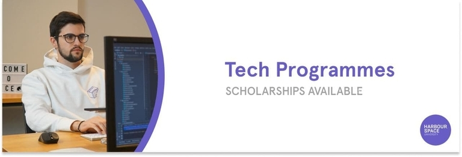

# Announcement

Hello Codeforces!

On [Tuesday, February 22, 2022 at 20:35UTC+6](https://codeforces.com/https://www.timeanddate.com/worldclock/fixedtime.html?day=22&month=2&year=2022&hour=17&min=35&sec=0&p1=166) [Educational Codeforces Round 123 (Rated for Div. 2)](https://codeforces.com/contest/1644 "Educational Codeforces Round 123 (Rated for Div. 2)") will start.

Series of Educational Rounds continue being held as [Harbour.Space University](https://codeforces.com/https://harbour.space/) initiative! You can read the details about the cooperation between [Harbour.Space University](https://codeforces.com/https://harbour.space/) and Codeforces in the [blog post](//codeforces.com/blog/entry/51208).

This round will be **rated for the participants with rating lower than 2100**. It will be held on extended ICPC rules. The penalty for each incorrect submission until the submission with a full solution is 10 minutes. After the end of the contest you will have 12 hours to hack any solution you want. You will have access to copy any solution and test it locally.

You will be given **6 or 7 problems** and **2 hours** to solve them.

The problems were invented and prepared by Adilbek [adedalic](https://codeforces.com/profile/adedalic "International Master adedalic") Dalabaev, Vladimir [vovuh](https://codeforces.com/profile/vovuh "Master vovuh") Petrov, Ivan [BledDest](https://codeforces.com/profile/BledDest "International Grandmaster BledDest") Androsov, Maksim [Neon](https://codeforces.com/profile/Neon "Candidate Master Neon") Mescheryakov and me. Also huge thanks to Mike [MikeMirzayanov](https://codeforces.com/profile/MikeMirzayanov "Headquarters, MikeMirzayanov") Mirzayanov for great systems Polygon and Codeforces.

Good luck to all the participants!

Our friends at Harbour.Space also have a message for you:

*Hey, Codeforces!*

*Once again, it is time for another exciting **scholarship opportunity** from *Harbour.Space*!*

*We have partnered with various tech companies to offer Bachelor’s or Master’s degree scholarships in Computer Science, Data Science, Cyber Security, and Front-end Development and work experience in the partnered companies.*

*We are looking for various junior to mid-level positions to fill in different fields such as:*

 * **Java Spring / Node.js Back-End Developer**
* **DevOps Engineer**
* **Kotlin Web App Developer**
* **React / React Native Front-End Developer**
* **Cyber Security Specialist**

**Requirements:**

 1. *High School Diploma for Bachelor degree applicants or **Bachelor’s degree** for Master degree applicants*
2. *Professional fluency in **English***
3. ***Previous experience** is a must for Master student applicants and a plus for Bachelor student applicants*

*Make sure to **apply before Mar 13, 2022**, to be eligible for the scholarship and reduced application fee.*

   [APPLY NOW →](https://codeforces.com/https://scholarships.harbour.space/lemon-apprenticeship) *Keep in touch and follow us on [LinkedIn](https://codeforces.com/https://www.linkedin.com/school/harbour-space/) for more scholarship opportunities. And follow us on [Instagram](https://codeforces.com/https://www.instagram.com/harbour.space/) to evidence student life, events, and success stories from students.*

*Good luck on your round, and see you next time!*

*Harbour.Space University*

**UPD:** [Editorial is out](Tutorial.md)

