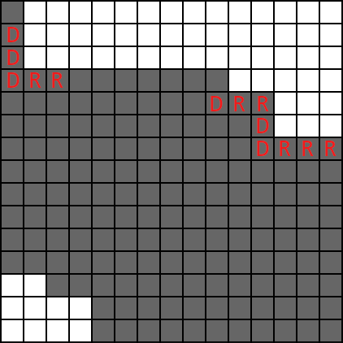

# Tutorial

[1644A - Doors and Keys](../problems/A._Doors_and_Keys.md "Educational Codeforces Round 123 (Rated for Div. 2)")

Idea: [BledDest](https://codeforces.com/profile/BledDest "International Grandmaster BledDest")

 **Tutorial**
### [1644A - Doors and Keys](../problems/A._Doors_and_Keys.md "Educational Codeforces Round 123 (Rated for Div. 2)")

The necessary and sufficient condition is the following: for each color the key should appear before the door.

Necessary is easy to show: if there is a key after a door, this door can't be opened.

Sufficient can be shown the following way. If there are no closed doors left, the knight has reached the princess. Otherwise, consider the first door the knight encounters. He has a key for this door, so he opens it. We remove both the key and the door from the string and proceed to the case with one less door.

Overall complexity: O(1).

 **Solution (awoo)**
```cpp
for _ in range(int(input())):
	s = input()
	for (d, k) in zip("RGB", "rgb"):
		if s.find(d) < s.find(k):
			print("NO")
			break
	else:
		print("YES")
```
[1644B - Anti-Fibonacci Permutation](../problems/B._Anti-Fibonacci_Permutation.md "Educational Codeforces Round 123 (Rated for Div. 2)")

Idea: [BledDest](https://codeforces.com/profile/BledDest "International Grandmaster BledDest")

 **Tutorial**
### [1644B - Anti-Fibonacci Permutation](../problems/B._Anti-Fibonacci_Permutation.md "Educational Codeforces Round 123 (Rated for Div. 2)")

Let's consider one of the possible solutions. Let's put the first element in the x-th permutation equal to x, and sort all the other elements in descending order. Thus, we get permutations of the form: [1,n,n−1,…,2], [2,n,n−1,…,1], ..., [n,n−1,n−2,…,1]. In such a construction pi−1>pi for all i (3≤i≤n), and hence pi−2+pi−1>pi.

 **Solution (Neon)**
```cpp
#include <bits/stdc++.h>

using namespace std;

int main() {
	int t;
	cin >> t;
	while (t--) {
		int n;
		cin >> n;
		for (int i = 1; i <= n; ++i) {
			cout << i;
			for (int j = n; j > 0; --j) if (i != j)
				cout << ' ' << j;
			cout << 'n';
		}
	}
}
```
[1644C - Increase Subarray Sums](../problems/C._Increase_Subarray_Sums.md "Educational Codeforces Round 123 (Rated for Div. 2)")

Idea: [BledDest](https://codeforces.com/profile/BledDest "International Grandmaster BledDest")

 **Tutorial**
### [1644C - Increase Subarray Sums](../problems/C._Increase_Subarray_Sums.md "Educational Codeforces Round 123 (Rated for Div. 2)")

Consider the naive solution.

Iterate over k. Then iterate over the segment that will have the maximum sum. Let its length be l. Since x is non-negative, it's always optimal to increase the elements inside the segment. So if k≤l, then the sum of the segment increases by k⋅x. Otherwise, only the elements inside the segment will affect the sum, thus, it will increase by l⋅x. That can be written as min(k,l)⋅x.

Notice that we only care about two parameters for each segment. Its length and its sum. Moreover, if there are several segments with the same length, we only care about the one with the greatest sum.

Thus, the idea of the solution is the following. For each length, find the segment of this length with the greatest sum. Then calculate f(k) in O(n) by iterating over the length of the segment.

Overall complexity: O(n2) per testcase.

 **Solution (awoo)**
```cpp
INF = 10**9

for _ in range(int(input())):
	n, x = map(int, input().split())
	a = list(map(int, input().split()))
	mx = [-INF for i in range(n + 1)]
	mx[0] = 0
	for l in range(n):
		s = 0
		for r in range(l, n):
			s += a[r]
			mx[r - l + 1] = max(mx[r - l + 1], s)
	ans = [0 for i in range(n + 1)]
	for k in range(n + 1):
		bst = 0
		for i in range(n + 1):
			bst = max(bst, mx[i] + min(k, i) * x)
		ans[k] = bst
	print(" ".join([str(x) for x in ans]))
```
[1644D - Cross Coloring](../problems/D._Cross_Coloring.md "Educational Codeforces Round 123 (Rated for Div. 2)")

Idea: [BledDest](https://codeforces.com/profile/BledDest "International Grandmaster BledDest")

 **Tutorial**
### [1644D - Cross Coloring](../problems/D._Cross_Coloring.md "Educational Codeforces Round 123 (Rated for Div. 2)")

Let's take a look at a final coloring. Each cell has some color. There exist cells such that there were no operation in their row and their column. They are left white, and they don't affect the answer.

All other cells are colored in one of k colors. For each cell (x,y) there is a query that has been the last one to color this cell (it covered row x, column y or both of them). So all cells that have the same query as the last one will have the same color. Since the color for each query is chosen independently, the number of colorings will be k to the power of the number of queries that have at least one cell belong to them.

How to determine if a query has at least one cell. This is true unless one of these things happen afterwards: 

* both its row and its column are recolored;
* all rows are recolored;
* all columns are recolored.

So the solution is to process the queries backwards. Maintain the set of colored rows and colored columns. For each query, check the conditions. If none hold, multiply the answer by k.

Overall complexity: O(qlog(n+m)) or O(q) per testcase.

 **Solution 1 (awoo)**
```cpp
#include <bits/stdc++.h>

#define forn(i, n) for (int i = 0; i < int(n); i++)

using namespace std;

const int MOD = 998244353;

int main() {
	int t;
	scanf("%d", &t);
	forn(_, t){
		int n, m, k, q;
		scanf("%d%d%d%d", &n, &m, &k, &q);
		vector<int> xs(q), ys(q);
		forn(i, q) scanf("%d%d", &xs[i], &ys[i]);
		int ans = 1;
		set<int> ux, uy;
		for (int i = q - 1; i >= 0; --i){
			bool fl = false;
			if (!ux.count(xs[i])){
				ux.insert(xs[i]);
				fl = true;
			}
			if (!uy.count(ys[i])){
				uy.insert(ys[i]);
				fl = true;
			}
			if (fl){
				ans = ans * 1ll * k % MOD;
			}
			if (int(ux.size()) == n || int(uy.size()) == m){
				break;
			}
		}
		printf("%dn", ans);
	}
	return 0;
}
```
 **Solution 2 (awoo)**
```cpp
from sys import stdin, stdout

MOD = 998244353

ux = []
uy = []
for _ in range(int(stdin.readline())):
	n, m, k, q = map(int, stdin.readline().split())
	while len(ux) < n:
		ux.append(False)
	while len(uy) < m:
		uy.append(False)
	xs = [-1 for i in range(q)]
	ys = [-1 for i in range(q)]
	for i in range(q):
		x, y = map(int, stdin.readline().split())
		xs[i] = x - 1
		ys[i] = y - 1
	cx = 0
	cy = 0
	ans = 1
	for i in range(q - 1, -1, -1):
		fl = False
		if not ux[xs[i]]:
			ux[xs[i]] = True
			cx += 1
			fl = True
		if not uy[ys[i]]:
			uy[ys[i]] = True
			cy += 1
			fl = True
		if fl:
			ans = ans * k % MOD
		if cx == n or cy == m:
			break
	for i in range(q):
		ux[xs[i]] = False
		uy[ys[i]] = False
	stdout.write(str(ans) + "n")
```
[1644E - Expand the Path](../problems/E._Expand_the_Path.md "Educational Codeforces Round 123 (Rated for Div. 2)")

Idea: [BledDest](https://codeforces.com/profile/BledDest "International Grandmaster BledDest")

 **Tutorial**
### [1644E - Expand the Path](../problems/E._Expand_the_Path.md "Educational Codeforces Round 123 (Rated for Div. 2)")

First, get rid of the corner cases. If the string doesn't contain either of the letters, the answer is n.

The general solution to the problem is to consider every single way to modify the path, then find the union of them. Well, every single path is too much, let's learn to reduce the number of different sequences of modifications that we have to consider.

The main observation is that all cells that the robot can visit are enclosed in the space formed by the following two paths: 

* the first 'R' is duplicated the maximum number of times, then the last 'D' is duplicated the maximum number of times;
* the first 'D' is duplicated the maximum number of times, then the last 'R' is duplicated the maximum number of times.

You can realize that by drawing the visited cells for some large test.

To show that more formally, you can consider the visited cells row by row. Let's show that for every two different visited cells in the same row, all cells in-between them can also be visited.

In general case, we want to show that we can take the prefix of the path to the left one of these cells and duplicate any 'R' on it to reach the right cell. The suffixes of the paths will remain the same as in the initial path.

If there exists an 'R' on the prefix, then we are good. Otherwise, the reason that it doesn't exist is that we duplicated 'D' too many times. Reduce that and there will be 'R' immediately after reaching the cell or earlier.

We should also show that the number of 'R's on the path to the left cell won't reach the maximum allowed amount until reaching the right cell. Use the fact that the number of 'D's on both prefixes of the paths is the same.

The other non-obvious part is that you can't reach cells outside this space. However, that can also be shown by analyzing each row independently.

Finally, about the way to calculate the area of this space. The main idea is to calculate the total number of cells outside this area and subtract it from n2.

Notice that non-visited cells form two separate parts: the one above the first path and the one to the left of the second path. These are pretty similar to each other. Moreover, you can calculate them with a same function. If we replace all 'D's in the string with 'R' and vice versa, then these parts swap places. So we can calculate the upper part, swap them and calculate it again.

I think the algorithm is best described with a picture. Consider test n=15, s= DDDRRDRRDDRRR, for example.

  First, there are some rows that only have one cell visited. Then the first 'R' in the string appears. Since we duplicate it the maximum amount of times, it produces a long row of visited cells. The remaining part of the part becomes the outline of the area.

Note that the row that marks the end of the string, always ends at the last column. Thus, only at most first |s| rows matter. To be exact, the amount of rows that matter is equal to the number of letters 'D' in the string.

For each letter 'D', let's calculate the number of non-visited cells in a row it goes down to.

I found the most convenient way is to go over the string backwards. We start from the row corresponding to the number of letters 'D' in the string. It has zero non-visited cells. We can maintain the number of non-visited cells in the current row. If we encounter an 'R' in the string, we add 1 to this number. If we encounter a 'D', we add the number to the answer.

We have to stop after the first 'R' in the string. The later (well, earlier, since we are going backwards) part corresponds to the prefix of letters 'D' — the starting column on the picture.

Each of these rows have 1 visited cell, so n−1 non-visited. So we can easily calculate this part as well.

Overall complexity: O(|s|) per testcase.

 **Solution (awoo)**
```cpp
def calc(s, n):
	ld = s.find('R')
	res = ld * (n - 1)
	y = 0
	for i in range(len(s) - 1, ld - 1, -1):
		if s[i] == 'D':
			res += y
		else:
			y += 1
	return res

for _ in range(int(input())):
	n = int(input())
	s = input()
	if s.count(s[0]) == len(s):
		print(n)
		continue
	ans = n * n
	ans -= calc(s, n)
	ans -= calc(''.join(['D' if c == 'R' else 'R' for c in s]), n)
	print(ans)
```
[1644F - Basis](../problems/F._Basis.md "Educational Codeforces Round 123 (Rated for Div. 2)")

Idea: [BledDest](https://codeforces.com/profile/BledDest "International Grandmaster BledDest")

 **Tutorial**
### [1644F - Basis](../problems/F._Basis.md "Educational Codeforces Round 123 (Rated for Div. 2)")

First of all, since the second operation changes all occurrences of some number x to other number y and vice versa, then, by using it, we can convert an array into another array if there exists a bijection between elements in the first array and elements in the second array. It can also be shown that F(G(a,x,y),m)=G(F(a,m),x,y), so we can consider that if we want to transform an array into another array, then we first apply the function F, then the function G.

Another relation that helps us is that G(G(a,x,y),x,y)=a, it means that every time we apply the function G, we can easily rollback the changes. Considering that we have already shown that a sequence of transformations can be reordered so that we apply G only after we've made all operations with the function F, let's try to "rollback" the second part of transformations, i. e. for each array, find some canonical form which can be obtained by using the function G.

Since applying the second operation several times is equal to applying some bijective function to the array, we can treat each array as a partition of the set {1,2,…,n} into several subsets. So, if we are not allowed to perform the first operation, the answer to the problem is equal to min(n,k)∑i=1S(n,i), where S(n,i) is the number of ways to partition a set of n objects into i non-empty sets (these are known as Stirling numbers of the second kind). There are many ways to calculate Stirling numbers of the second kind, but in this problem, we will have to use some FFT-related approach which allows getting all Stirling numbers for some value of n in time O(nlogn). 

For example, you can use the following relation: 

S(n,k)=1k!k∑i=0(−1)i(ki)(k−i)n

S(n,k)=k∑i=0(−1)i⋅k!⋅(k−i)nk!⋅i!⋅(k−i)!

S(n,k)=k∑i=0(−1)ii!⋅(k−i)n(k−i)!

If we substitute pi=(−1)ii! and qj=jnj!, we can see that the sequence of Stirling numbers for some fixed n is just the convolution of sequences p and q.

For simplicity in the following formulas, let's denote Ai=min(i,k)∑j=1S(i,j). We now know that this value can be calculated in O(ilogi).

Okay, now back to the original problem. Unfortunately, we didn't take the operation F into account. Let's analyze it.

The result of function F(a,m) consists of several blocks of equal elements, and it's easy to see that the lengths of these blocks (except for maybe the last one) should be divisible by m. The opposite is also true — if the lengths of all blocks (except maybe for the last one) are divisible by some integer m, then the array can be produced as F(a,m) for some array a.

What does it mean? If the greatest common divisor of the lengths of the blocks (except for the last one) is not 1, the array that we consider can be obtained by applying the function F to some other array. Otherwise, it cannot be obtained in such a way. Now, inclusion-exclusion principle comes to the rescue.

Let's define Bi as the number of arrays that we consider which have the lengths of all their blocks (except maybe for the last one) divisible by i. It's easy to see that Bi=A⌈ni⌉ (we can compress every i consecutive elements into one). Then, using inclusion exclusion principle, we can see that the answer is

n∑i=1μ(i)Bi=n∑i=1μ(i)A⌈ni⌉,

where μ(i) is the Mobius function. Using this formula, we can calculate the answer in O(nlog2n).

Note 1. This inclusion-exclusion principle handles the arrays according to the GCD of the blocks that they consist of, except for the last one. But what if the array consists only of one block? These arrays can be counted wrongly, so we should exclude them — i. e. use Ai−S(i,1) instead of just Ai and count the arrays consisting of the same element (if we need any of them in the answer separately).

Note 2. Depending on the way you implement this, n=1 or k=1 (or both) may be a corner case.

