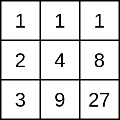
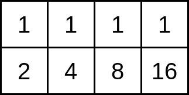

<h1 style='text-align: center;'> E. Power Board</h1>

<h5 style='text-align: center;'>time limit per test: 1.5 seconds</h5>
<h5 style='text-align: center;'>memory limit per test: 256 megabytes</h5>

You have a rectangular board of size $n\times m$ ($n$ rows, $m$ columns). The $n$ rows are numbered from $1$ to $n$ from top to bottom, and the $m$ columns are numbered from $1$ to $m$ from left to right. 

The cell at the intersection of row $i$ and column $j$ contains the number $i^j$ ($i$ raised to the power of $j$). For example, if $n=3$ and $m=3$ the board is as follows:

  Find the number of distinct integers written on the board.

##### Input

The only line contains two integers $n$ and $m$ ($1\le n,m\le 10^6$) — the number of rows and columns of the board.

##### Output

Print one integer, the number of distinct integers on the board.

## Examples

##### Input


```text
3 3
```
##### Output


```text
7
```
##### Input


```text
2 4
```
##### Output


```text
5
```
##### Input


```text
4 2
```
##### Output


```text
6
```
## Note

The statement shows the board for the first test case. In this case there are $7$ distinct integers: $1$, $2$, $3$, $4$, $8$, $9$, and $27$.

In the second test case, the board is as follows:

  There are $5$ distinct numbers: $1$, $2$, $4$, $8$ and $16$.

In the third test case, the board is as follows:

  There are $6$ distinct numbers: $1$, $2$, $3$, $4$, $9$ and $16$.


#### Tags 

#2200 #NOT OK #brute_force #dp #math #number_theory 

## Blogs
- [All Contest Problems](../Codeforces_Round_774_(Div._2).md)
- [Announcement (en)](../blogs/Announcement_(en).md)
- [Tutorial (en)](../blogs/Tutorial_(en).md)
