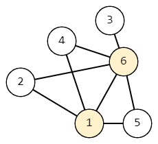

<h1 style='text-align: center;'> G. Counting Shortcuts</h1>

<h5 style='text-align: center;'>time limit per test: 2 seconds</h5>
<h5 style='text-align: center;'>memory limit per test: 256 megabytes</h5>

Given an undirected connected graph with $n$ vertices and $m$ edges. The graph contains no loops (edges from a vertex to itself) and multiple edges (i.e. no more than one edge between each pair of vertices). The vertices of the graph are numbered from $1$ to $n$. 

Find the number of paths from a vertex $s$ to $t$ whose length differs from the shortest path from $s$ to $t$ by no more than $1$. It is necessary to consider all suitable paths, even if they pass through the same vertex or edge more than once (i.e. they are not simple).

  Graph consisting of $6$ of vertices and $8$ of edges For example, let $n = 6$, $m = 8$, $s = 6$ and $t = 1$, and let the graph look like the figure above. Then the length of the shortest path from $s$ to $t$ is $1$. Consider all paths whose length is at most $1 + 1 = 2$. 

* $6 \rightarrow 1$. The length of the path is $1$.
* $6 \rightarrow 4 \rightarrow 1$. Path length is $2$.
* $6 \rightarrow 2 \rightarrow 1$. Path length is $2$.
* $6 \rightarrow 5 \rightarrow 1$. Path length is $2$.

There is a total of $4$ of matching paths.

### Input

The first line of test contains the number $t$ ($1 \le t \le 10^4$) —the number of test cases in the test.

Before each test case, there is a blank line. 

The first line of test case contains two numbers $n, m$ ($2 \le n \le 2 \cdot 10^5$, $1 \le m \le 2 \cdot 10^5$) —the number of vertices and edges in the graph. 

The second line contains two numbers $s$ and $t$ ($1 \le s, t \le n$, $s \neq t$) —the numbers of the start and end vertices of the path.

The following $m$ lines contain descriptions of edges: the $i$th line contains two integers $u_i$, $v_i$ ($1 \le u_i,v_i \le n$) — the numbers of vertices that connect the $i$th edge. It is guaranteed that the graph is connected and does not contain loops and multiple edges.

It is guaranteed that the sum of values $n$ on all test cases of input data does not exceed $2 \cdot 10^5$. Similarly, it is guaranteed that the sum of values $m$ on all test cases of input data does not exceed $2 \cdot 10^5$.

### Output

For each test case, output a single number — the number of paths from $s$ to $t$ such that their length differs from the length of the shortest path by no more than $1$.

Since this number may be too large, output it modulo $10^9 + 7$.

## Example

### Input


```text
4  
4 41 41 23 42 32 4  
6 86 11 41 61 51 25 64 66 32 6  
5 61 33 55 43 14 22 11 4  
8 185 12 13 14 25 26 57 38 46 48 71 44 71 66 73 88 54 54 38 2
```
### Output

```text

2
4
1
11

```


#### Tags 

#2100 #NOT OK #data_structures #dfs_and_similar #dp #graphs #shortest_paths 

## Blogs
- [All Contest Problems](../Codeforces_Round_776_(Div._3).md)
- [Announcement](../blogs/Announcement.md)
- [Tutorial (en)](../blogs/Tutorial_(en).md)
