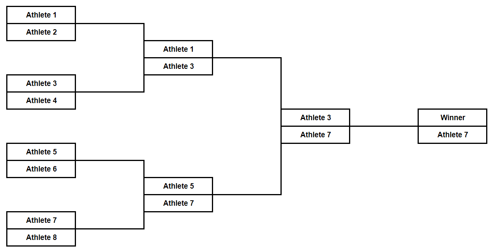

<h1 style='text-align: center;'> A. Playoff</h1>

<h5 style='text-align: center;'>time limit per test: 2 seconds</h5>
<h5 style='text-align: center;'>memory limit per test: 512 megabytes</h5>

Consider a playoff tournament where $2^n$ athletes compete. The athletes are numbered from $1$ to $2^n$.

The tournament is held in $n$ stages. In each stage, the athletes are split into pairs in such a way that each athlete belongs exactly to one pair. In each pair, the athletes compete against each other, and exactly one of them wins. The winner of each pair advances to the next stage, the athlete who was defeated gets eliminated from the tournament.

The pairs are formed as follows:

* in the first stage, athlete $1$ competes against athlete $2$; $3$ competes against $4$; $5$ competes against $6$, and so on;
* in the second stage, the winner of the match "$1$–$2$" competes against the winner of the match "$3$–$4$"; the winner of the match "$5$–$6$" competes against the winner of the match "$7$–$8$", and so on;
* the next stages are held according to the same rules.

When athletes $x$ and $y$ compete, the winner is decided as follows:

* if $x+y$ is odd, the athlete with the lower index wins (i. e. if $x < y$, then $x$ wins, otherwise $y$ wins);
* if $x+y$ is even, the athlete with the higher index wins.

The following picture describes the way the tournament with $n = 3$ goes.

  Your task is the following one: given the integer $n$, determine the index of the athlete who wins the tournament.

### Input

The first line contains one integer $t$ ($1 \le t \le 30$) — the number of test cases.

Each test case consists of one line containing one integer $n$ ($1 \le n \le 30$).

### Output

For each test case, print one integer — the index of the winner of the tournament.

## Example

### Input


```text
231
```
### Output

```text

7
1

```
## Note

The case $n = 3$ is shown in the picture from the statement.

If $n = 1$, then there's only one match between athletes $1$ and $2$. Since $1 + 2 = 3$ is an odd number, the athlete with the lower index wins. So, the athlete $1$ is the winner.


#### Tags 

#800 #NOT OK #implementation 

## Blogs
- [All Contest Problems](../Educational_Codeforces_Round_124_(Rated_for_Div._2).md)
- [Announcement](../blogs/Announcement.md)
- [Tutorial](../blogs/Tutorial.md)
