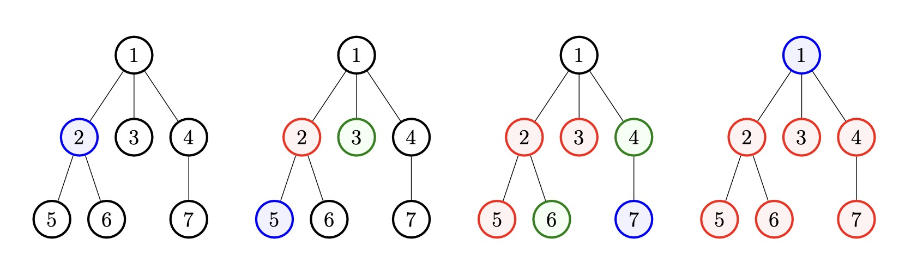

<h1 style='text-align: center;'> C. Tree Infection</h1>

<h5 style='text-align: center;'>time limit per test: 1 second</h5>
<h5 style='text-align: center;'>memory limit per test: 256 megabytes</h5>

A tree is a connected graph without cycles. A rooted tree has a special vertex called the root. The parent of a vertex $v$ (different from root) is the previous to $v$ vertex on the shortest path from the root to the vertex $v$. Children of the vertex $v$ are all vertices for which $v$ is the parent.

You are given a rooted tree with $n$ vertices. The vertex $1$ is the root. Initially, all vertices are healthy.

Each second you do two operations, the spreading operation and, after that, the injection operation: 

1. Spreading: for each vertex $v$, if at least one child of $v$ is infected, you can spread the disease by infecting at most one other child of $v$ of your choice.
2. Injection: you can choose any healthy vertex and infect it.

This process repeats each second until the whole tree is infected. You need to find the minimal number of seconds needed to infect the whole tree.

### Input

The input consists of multiple test cases. The first line contains a single integer $t$ ($1 \le t \le 10^4$) — the number of test cases. Description of the test cases follows.

The first line of each test case contains a single integer $n$ ($2 \le n \le 2 \cdot 10^5$) — the number of the vertices in the given tree.

The second line of each test case contains $n - 1$ integers $p_2, p_3, \ldots, p_n$ ($1 \le p_i \le n$), where $p_i$ is the ancestor of the $i$-th vertex in the tree.

It is guaranteed that the given graph is a tree.

It is guaranteed that the sum of $n$ over all test cases doesn't exceed $2 \cdot 10^5$.

### Output

For each test case you should output a single integer — the minimal number of seconds needed to infect the whole tree.

## Example

### Input


```text
571 1 1 2 2 455 5 1 42133 161 1 1 1 1
```
### Output

```text

4
4
2
3
4

```
## Note

The image depicts the tree from the first test case during each second.

A vertex is black if it is not infected. A vertex is blue if it is infected by injection during the previous second. A vertex is green if it is infected by spreading during the previous second. A vertex is red if it is infected earlier than the previous second.

  
## Note

 that you are able to choose which vertices are infected by spreading and by injections.


#### Tags 

#1600 #NOT OK #binary_search #greedy #sortings #trees 

## Blogs
- [All Contest Problems](../Codeforces_Round_781_(Div._2).md)
- [Announcement (en)](../blogs/Announcement_(en).md)
- [Tutorial](../blogs/Tutorial.md)
